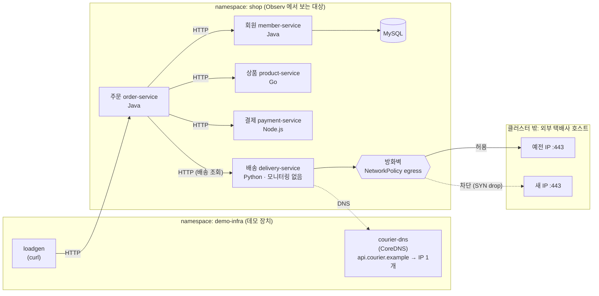

# eBPF 데모 — 쇼핑몰 배송 조회 실패 사건

> **"개발팀에 코드 수정을 요청하지 않고도 장애 원인을 찾을 수 있나?"**

앱 코드 수정도, 앱별 에이전트 설치도 하지 않은 **언어가 서로 다른 다섯 서비스**에서
문제를 발견하고, 원인을 좁히고, 해결을 확인하는 데모 환경입니다.

데모 전체가 **배송 조회 실패 사건 하나**로 이어집니다. 코드가 아니라 **네트워크**에서 생긴 문제라
eBPF 가 가장 잘 보여줄 수 있는 사건입니다. 데모 환경에는 **노드 에이전트(eBPF)만 설치**하고,
화면에 나오는 모든 데이터는 eBPF 수집 결과입니다.

- 촬영 순서·화면·멘트: **[docs/runbook.md](docs/runbook.md)**
- 이 저장소의 어떤 서비스에도 OpenTelemetry SDK, APM 에이전트, 사이드카, 모니터링 어노테이션이 없습니다.
- **OpenShift(OCP) 기준**으로 작성했습니다. 모든 앱 파드는 `restricted-v2` SCC / Pod Security `restricted` 로 동작합니다. → [보안](#보안-openshift)

---

## 목차

1. [사건 시나리오](#사건-시나리오)
2. [구성](#구성)
3. [저장소 구조](#저장소-구조)
4. [준비물](#준비물)
5. [설치](#설치)
6. [시나리오 실행](#시나리오-실행)
7. [데모 환경 조건과 구현](#데모-환경-조건과-구현)
8. [보안 (OpenShift)](#보안-openshift)
9. [로컬 스모크 테스트](#로컬-스모크-테스트)
10. [문제 해결](#문제-해결)
11. [정리](#정리)

---

## 사건 시나리오

가상 고객사 **"쇼핑몰"** 은 다섯 서비스를 운영합니다. 팀마다 언어도 모니터링 도구도 달라,
배송 서비스는 모니터링이 아예 없습니다.

| 서비스 | 언어 | 역할 |
| --- | --- | --- |
| 회원 `member-service` | Java 21 | 회원 조회 (MySQL) |
| 상품 `product-service` | Go 1.22 | 상품 조회 |
| 주문 `order-service` | Java 21 | 주문 생성, 배송 조회 — 다른 서비스를 호출하는 진입점 |
| 결제 `payment-service` | Node.js 20 | 결제 승인 |
| 배송 `delivery-service` | Python 3.12 | 외부 택배사 API(HTTPS) 호출. **모니터링 없음** |

배송 조회 흐름: `주문 서비스 → 배송 서비스 → 외부 택배사 API (HTTPS)`

| 시각 | 사건 | 데모 | 명령 |
| --- | --- | --- | --- |
| 월요일 밤 | 외부 택배사가 API 서버 주소(IP)를 바꾼다. 도메인 이름은 그대로 | — | `make incident` |
| 화요일 09:00 | "배송 조회가 자주 실패한다"는 문의. 배송팀 코드는 바뀐 것이 없다 | — | |
| 화요일 09:10 | 토폴로지 맵에서 택배사 API 로 가는 연결만 실패하는 것을 발견 | 데모 1 | |
| 화요일 09:20 | DNS 는 정상, 새 IP 로의 연결이 실패하는 것 확인 → 방화벽에 새 IP 없음 | 데모 2, 3 | `make firewall` |
| 화요일 09:40 | 방화벽 허용 후 실패 연결이 없어진 것 확인 | 데모 4 | `make fix` |
| 다음 주 | 다섯 서비스를 같은 기준으로 보는 공통 대시보드로 표준화 | 데모 4 | |

### 영상 구성

| 영상 | 내용 | 데모 |
| --- | --- | --- |
| 개념 (2분) | eBPF 란(90초) / 기존 에이전트 방식과 비교(30초) — 장표 | — |
| ① 발견 (10분) | 아무도 계측하지 않은 서비스에서 문제가 먼저 보인다 | 데모 1 |
| ② 원인 (12분) | 코드가 아니라 네트워크 구간에서 원인을 좁힌다 | 데모 2, 3 |
| ③ 해결과 표준화 (10분) | 고친 결과를 확인하고, 다섯 서비스를 같은 기준으로 묶는다 | 데모 4 |

```
  기존 방식   서비스마다 언어별 SDK·에이전트 추가 → 코드 수정, 재배포, 개발팀 일정 필요
  eBPF       리눅스 커널 안에서 안전하게 실행되는 작은 프로그램
             네트워크 호출·프로세스 동작을 커널에서 관찰 → 애플리케이션은 그대로
  도입       노드 에이전트를 클러스터에 한 번 배포. 앱 코드 수정·앱별 에이전트 설치 없음
  결과       언어·프레임워크와 무관하게 같은 기준의 지표가 한 번에 모인다
  요구 조건   리눅스 커널 4.16 이상(RHEL 8 이상), privileged 권한
```

---

## 구성



| 구성 요소 | 무엇을 흉내 내나 | 구현 |
| --- | --- | --- |
| `courier-ext/` | 외부 택배사 API 서버 | 클러스터 밖 리눅스 호스트의 nginx(HTTPS). 예전 IP·새 IP 양쪽에서 443 을 받음 |
| `courier-dns` | 택배사 도메인의 공인 DNS | CoreDNS `hosts` 한 줄. `make incident` 가 IP 를 바꿈 |
| `fw-*` NetworkPolicy | 사내 방화벽 | 배송 서비스 egress 허용 목록. 예전 IP 만 허용되어 있음 |
| `loadgen` | 쇼핑몰 사용자 트래픽 | 주문 서비스로 주문 생성·배송 조회를 1초 간격으로 호출 |

**장애가 나는 원리**: DNS 가 새 IP 를 돌려주면 배송 서비스가 새 IP 로 TCP 연결을 시도합니다.
방화벽(NetworkPolicy)이 SYN 을 조용히 버리므로 연결은 5초 뒤 타임아웃되고, 배송 서비스는 주문 서비스에
503 을, 주문 서비스는 사용자에게 502 를 돌려줍니다. eBPF 노드 에이전트는 이 과정을 커널에서
**실패한 TCP 연결(목적지 = 새 IP:443)** 과 **약 5초 걸린 5xx HTTP 요청**으로 관찰합니다.

---

## 저장소 구조

```
.
├── services/
│   ├── member-service/     Java 21 + MySQL (JDBC, useSSL=false)
│   ├── product-service/    Go 1.22 (심볼 유지 빌드)
│   ├── order-service/      Java 21 (java.net.http, HTTP/1.1 고정)
│   ├── payment-service/    Node.js 20 (node:http, 의존성 없음)
│   └── delivery-service/   Python 3.12 (표준 라이브러리만, 시스템 libssl)
├── courier-ext/            외부 택배사 호스트용 nginx + 인증서/보조 IP 스크립트
├── k8s/                    쿠버네티스 매니페스트 (__PLACEHOLDER__ 는 scripts 가 채움)
│   ├── 00-namespaces.yaml
│   ├── 10-mysql.yaml
│   ├── 20-services.yaml    회원·상품·주문·결제
│   ├── 30-delivery.yaml    배송 (택배사 전용 DNS 사용)
│   ├── 40-courier-dns.yaml
│   ├── 50-firewall.yaml    방화벽(NetworkPolicy egress) — 데모 장면용
│   ├── 55-network-isolation.yaml  서비스 간 ingress 격리 — 보안 기본값
│   └── 60-loadgen.yaml
├── scripts/
│   ├── check-prereq.sh     커널·CNI·택배사 도달 점검
│   ├── build-images.sh     이미지 빌드/push
│   ├── deploy.sh           전체 배포
│   ├── scenario.sh         baseline | incident | fix | reset | status | firewall | traffic
│   ├── security-check.sh   배포 후 SCC·securityContext·네트워크 정책 점검
│   └── cleanup.sh
├── local/docker-compose.yml  로컬 스모크 테스트 (eBPF 없이 코드만 확인)
├── docs/runbook.md         촬영 런북
├── demo.env.example
└── Makefile
```

---

## 준비물

| 항목 | 조건 |
| --- | --- |
| 클러스터 | **OpenShift 4.12 이상** 권장 (RHCOS 커널 5.14 → 4.16 조건 충족). 일반 쿠버네티스도 가능 (노드 커널 4.16 이상) |
| CNI | **NetworkPolicy 를 집행하는 CNI** — OCP 기본 OVN-Kubernetes 로 충분. (일반 쿠버네티스: Calico, Cilium 등. flannel 단독은 차단이 동작하지 않음) |
| 권한 | 배포하는 계정: 네임스페이스 생성·NetworkPolicy 생성 권한 (cluster-admin 또는 프로젝트 admin). 앱 파드는 특권 불필요 |
| Observ 노드 에이전트 | eBPF 노드 에이전트만 설치. **ClickHouse 와 노드 에이전트의 traces endpoint 설정 필수** (없으면 T-Map·트랜잭션 조회가 비어 있음) |
| 외부 택배사 호스트 | 클러스터 **밖** 리눅스 호스트 1대 (VM 가능), Docker, **IP 2개** (예전 IP, 새 IP). 클러스터 노드에서 두 IP 의 443 으로 라우팅 가능해야 함 |
| 이미지 레지스트리 | 클러스터 노드가 pull 할 수 있는 곳 |
| 작업 PC | `docker buildx`, `kubectl`(또는 `oc` — 스크립트는 `kubectl` 사용, OCP 클라이언트에 포함), `openssl`, `make` |

> OpenTelemetry 에이전트·SDK 는 **설치하지 않습니다.** 섞이면 "eBPF 만으로 보인다"는 메시지가 깨집니다.

---

## 설치

### 1. 설정 파일

```bash
cp demo.env.example demo.env
vi demo.env    # REGISTRY, COURIER_OLD_IP, COURIER_NEW_IP 등
```

| 변수 | 설명 | 예 |
| --- | --- | --- |
| `REGISTRY` / `TAG` | 이미지 위치 | `harbor.example.com/shop-demo` / `1.0.0` (OCP 내부 레지스트리 사용 시 아래 참고) |
| `PLATFORM` | 노드 아키텍처 | `linux/amd64` |
| `COURIER_DOMAIN` | 택배사 도메인 | `api.courier.example` |
| `COURIER_OLD_IP` | 방화벽에 등록된 예전 IP | `10.0.0.51` |
| `COURIER_NEW_IP` | 월요일 밤 바뀐 새 IP | `10.0.0.52` |

### 2. 외부 택배사 호스트

작업 PC 에서 인증서를 만들고:

```bash
make certs    # courier-ext/certs/{ca.crt, courier.crt, courier.key}
```

`courier-ext/` 디렉터리 전체(인증서 포함)를 택배사 호스트로 복사한 뒤, 택배사 호스트에서:

```bash
sudo ./setup-ips.sh add eth0 10.0.0.52/24    # 새 IP 를 보조 IP 로 추가 (예전 IP 는 기본 IP 사용)
docker compose up -d                          # nginx 가 두 IP 모두의 443 에서 응답
curl -sk --resolve api.courier.example:443:10.0.0.51 https://api.courier.example/v1/tracking/T1
curl -sk --resolve api.courier.example:443:10.0.0.52 https://api.courier.example/v1/tracking/T1
```

응답의 `served_by` 에 접속한 IP 가 찍힙니다. 호스트에 이미 방화벽(firewalld/ufw)이 있다면 443 을 열어 둡니다.

### 3. 이미지 빌드

```bash
make push     # 다섯 서비스 빌드 + push (PLATFORM 기준)
```

OCP 내부 이미지 레지스트리를 쓸 때(외부 레지스트리가 없을 때):

```bash
oc patch configs.imageregistry.operator.openshift.io/cluster --type merge -p '{"spec":{"defaultRoute":true}}'
HOST=$(oc get route default-route -n openshift-image-registry -o jsonpath='{.spec.host}')
oc new-project shop 2>/dev/null || true
docker login -u "$(oc whoami)" -p "$(oc whoami -t)" "$HOST"
# demo.env:  REGISTRY=$HOST/shop   → make push
# 매니페스트 이미지는 클러스터 내부 주소로 받아야 하므로 push 후 demo.env 를 다시 바꾼다:
#            REGISTRY=image-registry.openshift-image-registry.svc:5000/shop
```

`demo-infra` 네임스페이스는 `shop` 의 이미지를 쓰지 않으므로 추가 권한이 필요 없습니다.

### 4. 사전 점검 · 배포

```bash
make check    # OCP 감지, 커널 버전, NetworkPolicy CNI, OTel 흔적, 클러스터→택배사 두 IP 도달, 인증서
make deploy   # 정상 상태로 배포 (MySQL 비밀번호는 이때 무작위 생성)
make security # 파드별 SCC(restricted-v2)·securityContext·네트워크 정책 점검
make status
```

`make status` 정상 출력 예:

```
[..] 택배사 DNS 설정 (courier-hosts)
10.0.0.51 api.courier.example
[..] 배송 서비스 파드에서 본 DNS 응답과 443 연결 (3초 제한)
  DNS  api.courier.example -> 10.0.0.51
  TCP  10.0.0.51:443 연결 성공
[..] 방화벽 규칙
RULE                          DESCRIPTION
fw-allow-courier-10-0-0-51    택배사 API (api.courier.example) 10.0.0.51:443 허용
fw-delivery-default           배송 서비스 egress 기본 규칙: DNS 만 허용, 그 외 차단
[..] 주문 서비스를 거친 배송 조회 1건
  HTTP 200  0.02s
```

### 5. 정상 상태 데이터 쌓기

촬영 전 **몇 시간 이상** 정상 상태로 둡니다. 데모 3에서 조회 기간을 넓혀 예전 IP 로 정상 연결되던
모습과 비교하는 데 쓰입니다.

---

## 시나리오 실행

```bash
make incident   # 월요일 밤: 택배사가 IP 변경 (DNS → 새 IP). 방화벽은 그대로
make status     # DNS -> 새 IP, TCP 연결 실패, HTTP 502 약 5초
# ── 영상 ①, ② 촬영 ──
make firewall   # 데모 3: 방화벽에 새 IP 가 없음을 확인
make fix        # 데모 4: 방화벽에 새 IP:443 허용
make status     # TCP 연결 성공, HTTP 200
# ── 영상 ③ 촬영 ──
make reset      # 다음 테이크 준비 (새 IP 규칙 삭제, DNS → 예전 IP)
```

| 명령 | DNS 응답 | 방화벽 허용 | 배송 조회 결과 |
| --- | --- | --- | --- |
| `make baseline` / `reset` | 예전 IP | 예전 IP | 200, 수십 ms |
| `make incident` | **새 IP** | 예전 IP | **502, 약 5초** |
| `make fix` | 새 IP | 예전 IP + **새 IP** | 200, 수십 ms |

부하 발생기 로그로 실시간 확인: `make traffic`

```
09:10:21 201 0.081s POST /api/orders
09:10:21 502 5.018s GET /api/orders/1374/delivery
```

화면별 진행과 멘트는 **[docs/runbook.md](docs/runbook.md)** 를 참고하세요.

---

## 데모 환경 조건과 구현

"eBPF 만으로 화면이 나오게" 하기 위한 조건과, 이 저장소가 그것을 어떻게 지키는지입니다.

| 조건 | 이유 | 구현 위치 |
| --- | --- | --- |
| OpenTelemetry 에이전트·SDK 를 설치하지 않는다. 트랜잭션 조회 소스 토글은 eBPF | eBPF 수집만 보여주기 위해 | 모든 `services/*` — 모니터링 의존성 없음. `make check` 가 흔적 점검 |
| ClickHouse 와 노드 에이전트의 traces endpoint 설정 | 없으면 T-Map·트랜잭션 조회가 비어 있음 | Observ 설치 측 설정 (이 저장소 밖) |
| 택배사 도메인은 IP **1개**만 돌려준다 | 여러 개면 실패 목적지가 `도메인:443` 으로 합쳐져 새 IP 가 안 보임 | `k8s/40-courier-dns.yaml` — `hosts` 한 줄, `scenario.sh` 가 항상 한 줄로 교체 |
| 배송 서비스는 택배사 호출에 **5초 타임아웃**, 실패하면 **5xx** | 커널 기본 재시도에 맡기면 약 127초 뒤에야 실패 1건 기록 | `delivery-service/app.py` — `COURIER_TIMEOUT_SECONDS=5`, 실패 시 503 |
| 배송 서비스는 **주문 서비스가 호출**한다 | 브라우저가 직접 호출하면 오류·지연이 집계되지 않음 | loadgen → `order-service` → `delivery-service`. 주문 서비스의 배송 호출 타임아웃은 10초로 더 길게 |
| 외부 HTTPS 호출은 **Python(시스템 libssl)** 이 맡는다 | Java(JSSE)·Node.js(OpenSSL 정적 링크)의 HTTPS 내용은 eBPF 로 볼 수 없음 | `python:3.12-slim` — `_ssl` 이 `/lib/.../libssl.so.3` 동적 링크 (확인: `ldd .../_ssl*.so`) |
| Go 서비스는 **Go 1.17 이상, 심볼 유지** 빌드 | 그래야 언어가 Go 로 표시됨 | `product-service/Dockerfile` — Go 1.22, `-ldflags "-s -w"` 미사용 (`file` 결과 `not stripped`) |
| 방화벽 차단 전 **정상 상태 데이터**를 미리 쌓아 둔다 | 예전 IP 로 연결되던 모습과 비교 | `make deploy` 직후가 정상 상태. 몇 시간 이상 유지 |

그 밖에 화면을 깨끗하게 하려고 넣은 장치:

- **NXDOMAIN 0 유지**: 배송 서비스 파드는 `dnsPolicy: None`, `ndots:1`, search 도메인 없음 → `api.courier.example` 을 클러스터 search 도메인 붙여 조회하는 헛된 질의(NXDOMAIN)가 생기지 않습니다. AAAA 질의는 NOERROR(빈 응답)로 끝납니다.
- **매 요청 DNS 조회**: TTL 5초 + Python 은 DNS 를 캐시하지 않음 → DNS 탭에 택배사 도메인 조회가 꾸준히 보입니다.
- **평문 서비스 간 통신**: 서비스 간 호출은 HTTP/1.1 평문(Java HttpClient 는 h2c 업그레이드 없이 1.1 고정), MySQL 은 `useSSL=false` → SLO Client 표·MySQL 탭에 프로토콜이 구분되어 나옵니다.
- **프로브 잡음 제거**: readinessProbe 는 `tcpSocket` → kubelet 의 HTTP 헬스체크가 지표에 섞이지 않습니다.
- **데모 장치 분리**: 부하 발생기와 택배사 DNS 는 `demo-infra` 네임스페이스 → 서비스 목록을 `shop` 으로 필터하면 다섯 서비스(+MySQL)만 보입니다.
- **확실한 드롭**: 차단은 거부(RST)가 아니라 SYN drop 이므로 "연결 실패(타임아웃)"로 기록되고, 배송 서비스 요청은 정확히 약 5초에 끝납니다.

### eBPF 로 보이지 않는 것 (대본 주의)

| 쓰지 않는 표현 | 대신 |
| --- | --- |
| "택배사 API 호출이 5초 타임아웃" | "배송 서비스 요청이 5초 뒤 실패" — 응답 전에 끊긴 외부 호출은 기록이 남지 않음 |
| "외부 API 호출의 오류율·지연이 높다" | "연결 실패" — 연결이 막히면 HTTP 요청 자체가 없음 |
| "DNS 가 새 IP 를 돌려받고 있다 (DNS 화면에서)" | 새 IP 는 네트워크 탭의 **실패한 목적지**로 보여줌 |
| "토폴로지에서 HTTP·DNS·MySQL 이 구분되어 보인다" | SLO 탭 Client 표, DNS 탭, MySQL 탭에서 보여줌 |

촬영 전 실제 화면 확인 항목은 [docs/runbook.md](docs/runbook.md#촬영-전-확인-실제-화면에서) 에 체크리스트로 있습니다.

---

## 보안 (OpenShift)

OCP 에 그대로 올릴 수 있도록 처리한 항목입니다. 배포 후 `make security` 로 확인합니다.

### 파드 보안

| 항목 | 처리 |
| --- | --- |
| SCC | 모든 앱 파드가 **`restricted-v2`** 로 기동. `anyuid`·`privileged` 등 추가 SCC 부여 불필요 |
| Pod Security Admission | `shop`, `demo-infra` 네임스페이스에 `restricted` enforce·audit·warn 라벨 |
| 실행 사용자 | 이미지 USER 는 숫자(비 root). 매니페스트에 `runAsUser` 를 **지정하지 않아** OCP 가 네임스페이스 범위의 임의 UID(그룹 0)를 부여 |
| 컨테이너 설정 | `runAsNonRoot: true`, `allowPrivilegeEscalation: false`, `capabilities.drop: [ALL]`, `seccompProfile: RuntimeDefault` |
| 파일시스템 | `readOnlyRootFilesystem: true` (MySQL 제외 — 기동 시 설정 파일 생성). JVM 의 `/tmp` 만 emptyDir |
| ServiceAccount | `automountServiceAccountToken: false` — 쿠버네티스 API 를 쓰는 앱 없음 |
| MySQL 이미지 | 공식 `mysql:8.0` 은 root 로 시작해 사용자를 바꾸므로 restricted-v2 에서 기동 불가 → OCP 용 **`quay.io/sclorg/mysql-80-c9s`** 사용 (Red Hat 구독이 있으면 `registry.redhat.io/rhel9/mysql-80` 으로 교체 가능, 환경변수 동일) |

### 비밀 정보

| 항목 | 처리 |
| --- | --- |
| MySQL 비밀번호 | git 에 없음. `make deploy` 최초 실행 시 `openssl rand` 로 무작위 생성해 `mysql-auth` 시크릿에 저장 (재배포 시 유지) |
| 택배사 인증서 | `courier-ext/certs/` 는 `.gitignore`. 개인키 권한 600. 클러스터에는 **공개 CA 인증서(`ca.crt`)만** 시크릿으로 올림 |
| TLS 검증 | 배송 서비스는 **fail-closed** — CA 가 없으면 기동하지 않음. 검증을 끄려면 `COURIER_TLS_INSECURE=true` 를 명시해야 함(로컬 실험용). TLS 1.2 이상 |
| `demo.env` | `.gitignore` — 환경별 IP·레지스트리 주소가 저장소에 남지 않음 |

### 네트워크

| 정책 | 방향 | 허용 내용 |
| --- | --- | --- |
| `fw-delivery-default` | egress | 배송 서비스 → `courier-dns` (1053/UDP·TCP) **만**. 그 밖의 나가는 연결 전부 차단 |
| `fw-allow-courier-<예전IP>` | egress | 배송 서비스 → 택배사 예전 IP 443 |
| `default-deny-ingress` | ingress | `shop`, `demo-infra` 모두 기본 차단 |
| `allow-order-from-loadgen` | ingress | `demo-infra/loadgen` → 주문 8080 |
| `allow-backends-from-order` | ingress | 주문 → 회원·상품·결제·배송 8080 |
| `allow-mysql-from-member` | ingress | 회원 → MySQL 3306 |
| `allow-courier-dns-from-delivery` | ingress | 배송 → courier-dns 1053 |

- 서비스 간 인바운드 격리 정책(`demo.observ/policy=isolation`)은 데모 장면의 "방화벽" 규칙(`demo.observ/firewall=egress`)과 라벨이 달라 `make firewall` 화면에는 나오지 않습니다.
- eBPF 노드 에이전트는 커널에서 관찰하므로 네트워크 정책과 무관하게 수집합니다. kubelet 의 tcpSocket 프로브는 노드 트래픽으로 OVN-Kubernetes 가 허용합니다.
- 외부로 나가는 연결이 있는 파드는 배송 서비스뿐입니다. 다른 앱 파드는 egress 를 제한하지 않았습니다(내부 호출만 함). 필요하면 같은 방식으로 추가하세요.

### 의도적으로 남겨 둔 것 (eBPF 가시성 때문)

| 항목 | 이유 | 운영 환경이라면 |
| --- | --- | --- |
| 서비스 간 HTTP 평문 | eBPF 가 L7 프로토콜(HTTP)을 구분하는 장면이 필요 | mTLS (Service Mesh 등) |
| MySQL `useSSL=false` | MySQL 탭에서 쿼리를 보여주기 위해 | TLS 필수 (`require_secure_transport=ON`) |
| MySQL `emptyDir` | 데모용 휘발 데이터 | PVC + 백업 |

### Observ 노드 에이전트 (이 저장소 밖)

eBPF 노드 에이전트는 커널 기능을 쓰므로 **privileged SCC** 가 필요합니다. 특권은 에이전트 전용
서비스어카운트에만 부여하고, 앱 네임스페이스에는 부여하지 않습니다.

```bash
oc adm policy add-scc-to-user privileged -z <agent-serviceaccount> -n <agent-namespace>
```

---

## 로컬 스모크 테스트

eBPF·쿠버네티스 없이 **앱 코드와 호출 흐름만** 확인합니다 (Docker Desktop 가능).
앱 컨테이너는 **OCP restricted-v2 와 같은 조건**(임의 UID `1000680000:0`, 읽기 전용 루트 파일시스템,
capability 전부 제거, 권한 상승 금지)으로 띄우므로, 여기서 뜨면 OCP 에서도 권한 문제로 실패하지 않습니다.

```bash
make local-up
curl -s -X POST -H 'Content-Type: application/json' -d '{"memberId":7,"productId":3}' localhost:8080/api/orders
# {"orderId":1001,"memberId":7,"productId":3,"amount":4000}
curl -s localhost:8080/api/orders/1001/delivery
# {"orderId": "1001", "tracking": {..., "served_by": "172.28.0.100"}}

make local-fail     # 택배사 IP 를 응답 없는 주소로 바꿈
curl -s -w ' %{http_code} %{time_total}s\n' localhost:8080/api/orders/1001/delivery
# {"error":"delivery-service returned 503","orderId":1001} 502 5.04s

make local-heal
make local-down
```

배송 서비스 로그에 실패 단계와 목적지 IP 가 남습니다:

```
WARNING delivery-service courier call failed order=1002 tracking=DX1512686139 stage=connect host=api.courier.example ip=10.255.255.1 elapsed=5.01s err=timed out
```

---

## 문제 해결

| 증상 | 확인 |
| --- | --- |
| `make incident` 후에도 배송 조회가 200 | CNI 가 NetworkPolicy 를 집행하지 않음 (`make check` 2번). 또는 새 IP 가 이미 허용됨 (`make firewall`) |
| 장애 시 5초가 아니라 즉시 실패 | 경로 어딘가에서 RST/ICMP 로 거부 중. 택배사 호스트 방화벽이 아닌 **NetworkPolicy 에서 drop** 되는지 확인 |
| 파드가 `CreateContainerConfigError` / SCC 거부 | `oc get pod <pod> -o yaml \| grep scc`, `oc get events -n shop`. 이미지를 직접 바꿨다면 root 로 도는지 확인 (`make security`) |
| 배송 서비스가 `CrashLoopBackOff`, 로그에 `CA file ... not found` | `courier-ca` 시크릿 없음 → `make certs` 후 `make deploy` |
| 주문 → 다른 서비스 호출이 모두 타임아웃 | 인바운드 격리 정책 확인: `oc get netpol -n shop -l demo.observ/policy=isolation`. 라벨(`app=`)을 바꿨다면 정책도 맞춘다 |
| 정상 상태에서도 연결 실패 | 택배사 호스트 nginx, 예전 IP 라우팅 확인: `make check` 4번 |
| 실패 목적지가 IP 가 아니라 `도메인:443` 으로 보임 | DNS 가 IP 를 여러 개 돌려주는지 확인: `kubectl -n demo-infra get cm courier-hosts -o yaml` |
| DNS 탭에 NXDOMAIN 이 보임 | 배송 서비스 파드의 `/etc/resolv.conf` 에 search 가 없는지, `ndots:1` 인지 확인 |
| T-Map·트랜잭션 조회가 비어 있음 | ClickHouse, 노드 에이전트 traces endpoint 설정 |
| 언어가 Go 로 안 나옴 | `product-service` 이미지를 직접 빌드했는지(`-s -w` 없이), Go 1.17 이상인지 |
| `make status` 의 배송 서비스 exec 가 연결 실패를 1건 추가 | 정상. 촬영 중에는 `status` 대신 `firewall` 만 사용 권장 |

로그 보기:

```bash
kubectl -n shop logs deploy/delivery-service -f     # 실패 단계·IP·소요시간
kubectl -n shop logs deploy/order-service -f
kubectl -n demo-infra logs deploy/courier-dns -f     # DNS 질의 로그
```

---

## 정리

```bash
make cleanup                                         # shop, demo-infra 네임스페이스 삭제
# 택배사 호스트에서
docker compose down && sudo ./setup-ips.sh del eth0 10.0.0.52/24
```
