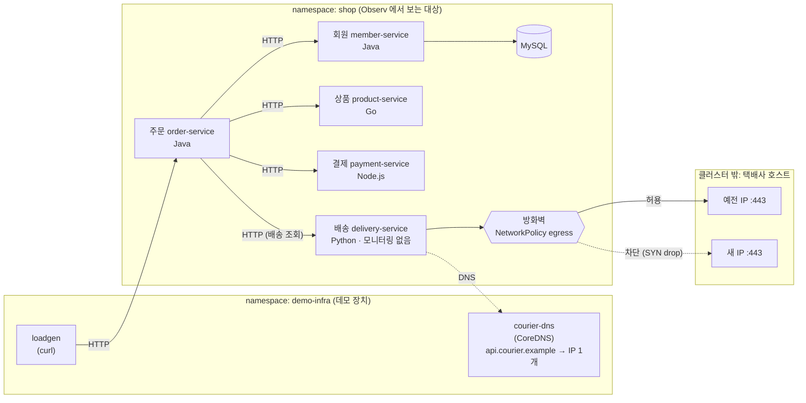

# eBPF 데모 — 쇼핑몰 배송 조회 실패 사건

> **"개발팀에 코드 수정을 요청하지 않고도 장애 원인을 찾을 수 있나?"**

앱 코드 수정도, 앱별 에이전트 설치도 하지 않은 **언어가 서로 다른 다섯 서비스**에서
문제를 발견하고, 원인을 좁히고, 해결을 확인하는 데모 환경입니다.
데모 전체가 **배송 조회 실패 사건 하나**로 이어지며, 코드가 아니라 **네트워크**에서 생긴 문제라
eBPF 가 가장 잘 보여줄 수 있는 사건입니다. 화면에 나오는 모든 데이터는 eBPF 노드 에이전트 수집 결과입니다.

- **대상 환경: OpenShift(OCP) 4.12 이상 + OCP 내부 이미지 레지스트리**
- 모든 명령은 `./demo.sh <명령>` 하나로 실행합니다 (`make` 불필요, bash 만 있으면 됨)
- 촬영 순서·화면·멘트: **[docs/runbook.md](docs/runbook.md)**

---

## 목차

1. [사건 시나리오](#1-사건-시나리오)
2. [구성](#2-구성)
3. [전체 과정 한눈에 보기](#3-전체-과정-한눈에-보기)
4. [준비물](#4-준비물)
5. [설치 — 처음부터 끝까지](#5-설치--처음부터-끝까지)
6. [촬영 진행](#6-촬영-진행)
7. [코드를 바꾼 뒤 다시 반영하기 (git pull 이후)](#7-코드를-바꾼-뒤-다시-반영하기-git-pull-이후)
8. [명령어 레퍼런스](#8-명령어-레퍼런스)
9. [이미지 레지스트리 동작 방식](#9-이미지-레지스트리-동작-방식)
10. [데모 환경 조건과 구현](#10-데모-환경-조건과-구현)
11. [보안](#11-보안)
12. [문제 해결](#12-문제-해결)
13. [정리 (삭제)](#13-정리-삭제)
14. [부록: 로컬 스모크 테스트 · 외부 레지스트리 · 일반 쿠버네티스](#14-부록)

---

## 1. 사건 시나리오

가상 고객사 **"쇼핑몰"** 은 다섯 서비스를 운영합니다. 팀마다 언어도 모니터링 도구도 달라,
배송 서비스는 모니터링이 아예 없습니다.

| 서비스 | 언어 | 역할 |
| --- | --- | --- |
| 회원 `member-service` | Java 21 | 회원 조회 (MySQL) |
| 상품 `product-service` | Go 1.22 | 상품 조회 |
| 주문 `order-service` | Java 21 | 주문 생성, 배송 조회 — 다른 서비스를 호출하는 진입점 |
| 결제 `payment-service` | Node.js 20 | 결제 승인 |
| 배송 `delivery-service` | Python 3.12 | 외부 택배사 API(HTTPS) 호출. **모니터링 없음** |

| 시각 | 사건 | 데모 | 명령 |
| --- | --- | --- | --- |
| 월요일 밤 | 외부 택배사가 API 서버 주소(IP)를 바꾼다. 도메인 이름은 그대로 | — | `./demo.sh incident` |
| 화요일 09:00 | "배송 조회가 자주 실패한다"는 문의. 배송팀 코드는 바뀐 것이 없다 | — | |
| 화요일 09:10 | 토폴로지 맵에서 택배사 API 로 가는 연결만 실패하는 것을 발견 | 데모 1 | |
| 화요일 09:20 | DNS 는 정상, 새 IP 로의 연결이 실패 → 방화벽에 새 IP 가 없음 | 데모 2, 3 | `./demo.sh firewall` |
| 화요일 09:40 | 방화벽 허용 후 실패 연결이 없어진 것 확인 | 데모 4 | `./demo.sh fix` |
| 다음 주 | 다섯 서비스를 같은 기준으로 보는 공통 대시보드로 표준화 | 데모 4 | |

---

## 2. 구성



| 구성 요소 | 무엇을 흉내 내나 | 구현 |
| --- | --- | --- |
| 다섯 서비스 + MySQL | 쇼핑몰 | `shop` 네임스페이스. 모니터링 코드·에이전트 없음 |
| `loadgen` | 사용자 트래픽 | 주문 서비스로 주문 생성·배송 조회를 1초 간격으로 호출 |
| `courier-dns` | 택배사 도메인의 DNS | CoreDNS `hosts` 한 줄. `incident` 가 IP 를 바꿈 |
| `fw-*` NetworkPolicy | 사내 방화벽 | 배송 서비스의 나가는 연결 허용 목록. 예전 IP 만 허용 |
| `courier-ext/` | 외부 택배사 API | 클러스터 **밖** 리눅스 호스트의 nginx(HTTPS). 예전 IP·새 IP 양쪽에서 443 응답 |

**장애가 나는 원리**: DNS 가 새 IP 를 돌려주면 배송 서비스가 새 IP 로 TCP 연결을 시도합니다.
방화벽(NetworkPolicy)이 SYN 을 조용히 버리므로 연결은 5초 뒤 타임아웃되고, 배송 서비스는 주문 서비스에 503,
주문 서비스는 사용자에게 502 를 돌려줍니다. eBPF 는 이것을 **실패한 TCP 연결(목적지 = 새 IP:443)** 과
**약 5초 걸린 5xx HTTP 요청**으로 봅니다.

---

## 3. 전체 과정 한눈에 보기

명령을 실행하는 곳은 두 군데입니다.

- **[작업 PC]** — `oc`, `podman`, `git` 이 있고 OCP API 와 앱 route(`*.apps.<클러스터 도메인>`)에 접속되는 리눅스 (보통 bastion)
- **[택배사 호스트]** — 클러스터 밖 리눅스 서버 1대 (VM 가능)

| 단계 | 어디서 | 명령 | 빈도 |
| --- | --- | --- | --- |
| 5-1 저장소 받기 | 작업 PC | `git clone …` / `git pull` | 처음·업데이트 때 |
| 5-2 OCP 로그인 | 작업 PC | `oc login …` | 세션마다 |
| 5-3 설정 파일 | 작업 PC | `cp demo.env.example demo.env` → IP 2개 수정 | 처음 한 번 |
| 5-4 인증서 | 작업 PC | `./demo.sh certs` | 처음 한 번 |
| 5-5 택배사 호스트 | 택배사 호스트 | 보조 IP 추가 → `sudo ./run.sh up` | 처음 한 번 |
| 5-6 레지스트리 route | 작업 PC | `./demo.sh registry-route` | 클러스터당 한 번 |
| 5-7 사전 점검 | 작업 PC | `./demo.sh check` | 배포 전 |
| 5-8 이미지 push | 작업 PC | `./demo.sh push` | 처음·코드 변경 때 |
| 5-9 배포 | 작업 PC | `./demo.sh deploy` | 처음·매니페스트 변경 때 |
| 5-10 확인 | 작업 PC | `./demo.sh security` → `./demo.sh status` | 배포 후 |
| 5-11 정상 데이터 쌓기 | — | 몇 시간 이상 그대로 둠 | 촬영 전날 |
| 6 촬영 | 작업 PC | `incident` → `firewall` → `fix` → `reset` | 테이크마다 |

---

## 4. 준비물

### 클러스터

| 항목 | 조건 |
| --- | --- |
| OpenShift | **4.12 이상** (RHCOS 커널 5.14 → eBPF 조건 "커널 4.16 이상" 충족) |
| 네트워크 | 기본 CNI **OVN-Kubernetes** (NetworkPolicy 로 방화벽 차단을 흉내 냄) |
| 내부 이미지 레지스트리 | 활성화 상태 (`oc get co image-registry` 가 Available). default route 는 5-6 에서 엽니다 |
| 외부 이미지 pull | 노드가 `docker.io`, `quay.io`, `registry.k8s.io` 에서 pull 가능해야 함 (부하 발생기·DNS·MySQL 이미지). 폐쇄망이면 [12. 문제 해결](#12-문제-해결) 참고 |
| Observ 노드 에이전트 | 설치 완료, **ClickHouse 와 노드 에이전트의 traces endpoint 설정 필수** (없으면 T-Map·트랜잭션 조회가 비어 있음). OpenTelemetry 에이전트·SDK 는 설치하지 않음 |
| 계정 권한 | **cluster-admin 권장**. 필요 권한: 네임스페이스 생성, 노드 조회(점검), 레지스트리 설정 변경(5-6, 한 번). cluster-admin 이 아니면 5-6 만 관리자에게 요청 |

### 작업 PC (bastion)

| 도구 | 확인 명령 | 설치 (RHEL 8/9) |
| --- | --- | --- |
| `oc` | `oc version --client` | OCP 콘솔 우측 상단 `?` → Command line tools, 또는 mirror.openshift.com 의 `openshift-client-linux.tar.gz` |
| `podman` 4.x 이상 | `podman --version` | `sudo dnf install -y podman` |
| `git` | `git --version` | `sudo dnf install -y git` |
| `openssl` | `openssl version` | `sudo dnf install -y openssl` |
| `bash` 4 이상 | `bash --version` | 기본 설치 |

- 작업 PC 아키텍처와 클러스터 노드 아키텍처가 같아야 빌드가 빠릅니다 (보통 둘 다 x86_64 → `PLATFORM=linux/amd64`).
- 작업 PC 는 빌드 중 `docker.io`, `gcr.io` 에서 베이스 이미지를 받습니다.

### 택배사 호스트

| 항목 | 조건 |
| --- | --- |
| 서버 | 클러스터 **밖** 리눅스 1대 (VM 가능, RHEL·Ubuntu 등) |
| IP | **2개** — 기본 IP(= 예전 IP) + 보조 IP(= 새 IP). 클러스터 노드에서 두 IP 의 443 으로 연결 가능해야 함 |
| 컨테이너 | `podman` 또는 `docker` |
| 포트 | 443/TCP 열림 |

> **예전 IP·새 IP 고르기**: 택배사 호스트의 현재 IP 를 예전 IP 로, 같은 서브넷에서 비어 있는 IP 하나를 새 IP 로
> 정하면 됩니다. 네트워크 담당자에게 사용 가능한 IP 를 확인하세요.

---

## 5. 설치 — 처음부터 끝까지

### 5-1. 저장소 받기 **[작업 PC]**

처음:

```bash
git clone https://github.com/beomzh/demo-ebpf-shop.git
cd demo-ebpf-shop
```

이미 받아 두었다면:

```bash
cd demo-ebpf-shop
git pull
```

실행 권한 확인 (zip 으로 받았거나 권한이 빠졌을 때만):

```bash
chmod +x demo.sh scripts/*.sh courier-ext/*.sh
./demo.sh help
```

### 5-2. OpenShift 로그인 **[작업 PC]**

```bash
oc login -u <사용자> https://api.<클러스터 도메인>:6443
oc whoami          # 사용자 이름이 나와야 함
oc whoami -t       # sha256~ 로 시작하는 토큰이 나와야 함 (이미지 push 에 사용)
```

- 반드시 **사용자/비밀번호(또는 토큰)로 로그인**하세요. `system:admin` kubeconfig(인증서 로그인)는 토큰이 없어 이미지 push 가 되지 않습니다.
  kubeadmin 을 쓴다면 `oc login -u kubeadmin -p <비밀번호> https://api...:6443`
- API 인증서가 사설이면 `--insecure-skip-tls-verify=true` 를 붙입니다.

### 5-3. 설정 파일 만들기 **[작업 PC]**

```bash
cp demo.env.example demo.env
vi demo.env
```

**보통은 IP 두 개만 바꾸면 됩니다.**

```bash
COURIER_OLD_IP=10.0.0.51     # 택배사 호스트의 기본 IP
COURIER_NEW_IP=10.0.0.52     # 택배사 호스트에 새로 붙일 보조 IP
```

나머지 값(기본값 그대로 두면 됨):

| 변수 | 기본값 | 설명 |
| --- | --- | --- |
| `COURIER_DOMAIN` | `api.courier.example` | 가상 택배사 도메인. **공인 DNS 등록 불필요** (클러스터 안 courier-dns 만 응답). 바꾸려면 5-4 전에 바꿀 것 |
| `CLI` | `auto` | `oc` 가 있으면 `oc`, 없으면 `kubectl` |
| `REGISTRY_MODE` | `ocp-internal` | OCP 내부 레지스트리 사용 ([9. 동작 방식](#9-이미지-레지스트리-동작-방식)) |
| `TAG` | `1.0.0` | 이미지 태그 |
| `CONTAINER_ENGINE` | `auto` | `podman` 우선, 없으면 `docker` |
| `REGISTRY_TLS_VERIFY` | `false` | default route 인증서 검증. OCP 기본 인그레스 인증서는 보통 사설이라 `false` |
| `PLATFORM` | `linux/amd64` | 클러스터 노드 아키텍처 |
| `LOADGEN_*_INTERVAL` | `1` | 부하 발생 간격(초) |

### 5-4. 택배사 인증서 만들기 **[작업 PC]**

```bash
./demo.sh certs
ls courier-ext/certs/     # ca.crt  ca.key  courier.crt  courier.key
```

- `ca.crt` 는 5-9 에서 클러스터에 시크릿으로 올라가고, 배송 서비스가 택배사 인증서를 검증하는 데 씁니다.
- `courier.crt`, `courier.key` 는 택배사 호스트의 nginx 가 씁니다.
- 이 디렉터리는 git 에 올라가지 않습니다(`.gitignore`). 개인키는 권한 600.

### 5-5. 택배사 호스트 준비 **[택배사 호스트]**

① 작업 PC 에서 `courier-ext` 디렉터리를 통째로 복사합니다 (인증서 포함):

```bash
# [작업 PC]
scp -r courier-ext <사용자>@<택배사 호스트>:~/
```

② 택배사 호스트에서:

```bash
cd ~/courier-ext
ip -4 -brief addr                                 # NIC 이름과 기본 IP(= COURIER_OLD_IP) 확인
sudo ./setup-ips.sh add <NIC> <COURIER_NEW_IP>/<prefix>   # 예) sudo ./setup-ips.sh add eth0 10.0.0.52/24
sudo ./run.sh up                                  # nginx 기동 (podman 우선, 없으면 docker)
```

③ 방화벽이 **켜져 있을 때만** 443 을 엽니다 (`systemctl is-active firewalld` 가 `active` 일 때).
꺼져(`inactive`) 있으면 **켜지 마세요** — 그 호스트에서 돌던 다른 서비스 포트가 막힐 수 있습니다.

```bash
sudo firewall-cmd --add-service=https --permanent && sudo firewall-cmd --reload   # RHEL
# sudo ufw allow 443/tcp                                                           # Ubuntu
```

④ 두 IP 모두 응답하는지 확인합니다:

```bash
curl -sk --resolve api.courier.example:443:<COURIER_OLD_IP> https://api.courier.example/v1/tracking/T1
curl -sk --resolve api.courier.example:443:<COURIER_NEW_IP> https://api.courier.example/v1/tracking/T1
# {"trackingNo":"T1",...,"served_by":"<접속한 IP>"}
```

참고:

- 443 은 특권 포트라 `sudo` 로 실행합니다 (rootless podman 은 443 바인딩 불가).
- `run.sh` 는 SELinux 라벨(`:Z`)을 붙여 볼륨을 마운트하므로 RHEL 에서도 인증서를 읽을 수 있습니다.
- `ip addr` 로 붙인 보조 IP 는 **재부팅하면 사라집니다**. 촬영 기간 동안 유지하려면 `nmcli` 로 영구 설정하세요:
  `sudo nmcli con mod <연결이름> +ipv4.addresses 10.0.0.52/24 && sudo nmcli con up <연결이름>`
- 기타: `sudo ./run.sh status | logs | down`

#### 443 을 이미 다른 프로그램이 쓰고 있을 때

택배사 호스트로 bastion 처럼 다른 서비스가 도는 서버를 쓰면, haproxy·nginx·httpd 등이 이미 443 을 쓰고 있을 수 있습니다.
택배사 nginx 는 **택배사 IP 2개의 443 만** 써야 하고, 기존 프로그램은 **자기 IP 의 443 만** 쓰도록 나눕니다.

**1. 누가 443 을 어떻게 쓰는지 확인**

```bash
sudo ss -ltnp | grep ':443 '
```

| 출력 | 의미 | 할 일 |
| --- | --- | --- |
| 아무것도 없음 | 443 이 비어 있음 | 위 ②~④ 그대로 진행 |
| `192.168.xx.50:443 … ("haproxy",…)` 처럼 **특정 IP** | 그 IP 만 쓰는 중 | 기존 프로그램은 그대로. 택배사용 IP 2개를 **새로** 붙이고 아래 3~4 진행 |
| `0.0.0.0:443` 또는 `*:443` | **모든 IP** 의 443 을 쓰는 중 → 택배사 nginx 가 뜰 수 없음 | 아래 2 로 기존 프로그램의 bind 를 자기 IP 로 좁힌 뒤 3~4 진행 |

**2. 기존 프로그램의 443 을 자기 IP 로 좁히기** (예: bastion 의 haproxy)

예시 환경:

| 항목 | 값 |
| --- | --- |
| bastion 기존 IP (`*.apps` 인그레스가 들어오는 IP) | `192.168.xx.50` |
| 택배사 예전 IP (`COURIER_OLD_IP`) — 새로 붙임 | `192.168.xx.61` |
| 택배사 새 IP (`COURIER_NEW_IP`) — 새로 붙임 | `192.168.xx.62` |
| NIC / prefix | `ens192` / `/16` |

`*.apps` 가 어느 IP 로 들어오는지 먼저 확인합니다 (그 IP 가 기존 프로그램이 계속 받아야 하는 IP):

```bash
getent hosts console-openshift-console.apps.<클러스터 도메인>
# 192.168.xx.50  console-openshift-console.apps.<클러스터 도메인> ...
```

haproxy 설정 변경 — **백업 → 수정 → 검증 → 재시작 → 확인** 순서로 합니다:

```bash
sudo cp -a /etc/haproxy/haproxy.cfg /etc/haproxy/haproxy.cfg.bak-demo
sudo grep -nE '^\s*(frontend|bind)' /etc/haproxy/haproxy.cfg      # bind *:443 위치 확인
sudo sed -i 's|^\(\s*\)bind \*:443\s*$|\1bind 192.168.xx.50:443|' /etc/haproxy/haproxy.cfg
sudo grep -n -A3 'frontend ingress-https' /etc/haproxy/haproxy.cfg   # bind 192.168.xx.50:443 로 바뀌었는지
sudo haproxy -c -f /etc/haproxy/haproxy.cfg                          # 'Configuration file is valid' 또는 Warnings 만
sudo systemctl restart haproxy                                        # 1~2초 API·콘솔 끊김
sudo ss -ltnp | grep ':443 '                                          # 192.168.xx.50:443 만 보여야 함
curl -sk -o /dev/null -w '%{http_code}\n' https://console-openshift-console.apps.<클러스터 도메인>/   # 200
oc get co ingress console                                              # AVAILABLE True
```

- 80, 6443, 22623 등 **443 외 포트는 건드리지 않습니다.**
- 문제가 생기면 즉시 되돌립니다:
  `sudo cp -a /etc/haproxy/haproxy.cfg.bak-demo /etc/haproxy/haproxy.cfg && sudo systemctl restart haproxy`

haproxy 가 아닌 경우도 같은 방식입니다:

| 프로그램 | 설정 파일 (보통) | 바꿀 줄 |
| --- | --- | --- |
| haproxy | `/etc/haproxy/haproxy.cfg` | `bind *:443` → `bind 192.168.xx.50:443` |
| nginx | `/etc/nginx/nginx.conf`, `/etc/nginx/conf.d/*.conf` | `listen 443 ssl;` → `listen 192.168.xx.50:443 ssl;` (모든 server 블록) |
| Apache httpd | `/etc/httpd/conf.d/ssl.conf` | `Listen 443 https` → `Listen 192.168.xx.50:443 https` |
| 컨테이너 (`-p 443:443`) | 실행 명령 | `-p 443:443` → `-p 192.168.xx.50:443:443` 로 다시 실행 |

변경 후 각각 설정 검증(`nginx -t`, `apachectl configtest`) → 재시작 → `ss -ltnp | grep ':443 '` 로 확인합니다.

**3. 택배사 IP 2개 붙이기**

같은 대역에서 **아무도 안 쓰는 IP** 2개를 고릅니다 (노드 IP 와 겹치지 않는지 `oc get nodes -o wide`, 응답 없는지 `ping`):

```bash
ping -c 2 -W 1 192.168.xx.61; ping -c 2 -W 1 192.168.xx.62      # 100% packet loss 여야 함
sudo ./courier-ext/setup-ips.sh add ens192 192.168.xx.61/16
sudo ./courier-ext/setup-ips.sh add ens192 192.168.xx.62/16
ip -4 -brief addr show ens192
# ens192  UP  192.168.xx.50/16 192.168.xx.61/16 192.168.xx.62/16
```

`demo.env` 에 두 IP 를 넣습니다:

```bash
COURIER_OLD_IP=192.168.xx.61
COURIER_NEW_IP=192.168.xx.62
```

**4. 택배사 nginx 를 두 IP 에서만 띄우기**

`run.sh` 는 nginx 가 받을 IP 를 이렇게 정합니다:

1. `LISTEN_IPS` 환경변수가 있으면 그 IP 들
2. 없으면 같은 저장소의 `demo.env` 에 있는 `COURIER_OLD_IP`, `COURIER_NEW_IP` (작업 PC = 택배사 호스트일 때)
3. 둘 다 없으면 모든 IP (`0.0.0.0:443`)

```bash
# 저장소 안에서 실행 (demo.env 를 읽음)
sudo ./courier-ext/run.sh up
# listen: 192.168.xx.61:443, 192.168.xx.62:443
# [podman] courier-api started.

# courier-ext 만 복사해 온 다른 서버라면 IP 를 직접 지정
sudo LISTEN_IPS="192.168.xx.61 192.168.xx.62" ./run.sh up
```

확인 — 기존 프로그램과 택배사 nginx 가 443 을 나눠 쓰는지:

```bash
sudo ss -ltnp | grep ':443 '
# 192.168.xx.50:443   haproxy
# 192.168.xx.61:443   nginx
# 192.168.xx.62:443   nginx
curl -sk --resolve api.courier.example:443:192.168.xx.61 https://api.courier.example/v1/tracking/T1   # served_by 192.168.xx.61
curl -sk --resolve api.courier.example:443:192.168.xx.62 https://api.courier.example/v1/tracking/T1   # served_by 192.168.xx.62
```

지정한 IP 가 호스트에 붙어 있지 않으면 `run.sh` 가 `ERROR: … 가 이 호스트에 없습니다` 로 멈춥니다 (3 을 먼저 할 것).

### 5-6. 내부 레지스트리 route 열기 **[작업 PC]** — 클러스터당 한 번

```bash
./demo.sh registry-route
# [..] default route: default-route-openshift-image-registry.apps.<클러스터 도메인>
```

- 내부 레지스트리 설정에 `defaultRoute: true` 를 켜서 클러스터 밖(작업 PC)에서 push 할 수 있는 주소를 만듭니다.
- **cluster-admin 권한이 필요**합니다. 권한이 없으면 관리자에게 아래 명령을 요청하세요:
  `oc patch configs.imageregistry.operator.openshift.io/cluster --type merge -p '{"spec":{"defaultRoute":true}}'`
- 이미 열려 있으면 아무것도 바꾸지 않고 주소만 보여줍니다.

### 5-7. 사전 점검 **[작업 PC]**

```bash
./demo.sh check
```

| 점검 | 통과 기준 |
| --- | --- |
| 0) 클러스터 접속 | `oc whoami` 사용자, 레지스트리 route 존재, 토큰 로그인 |
| 1) 노드 커널 | 모든 노드 4.16 이상 |
| 2) CNI | `ovnkube-node` 등 NetworkPolicy 지원 CNI 감지 |
| 3) OpenTelemetry 흔적 | 없음 |
| 4) 택배사 도달 | 클러스터 안 임시 파드에서 예전 IP·새 IP 443 모두 응답 (방화벽 적용 전 경로 확인) |
| 5) 인증서 | `courier-ext/certs/ca.crt` 있음 |

`점검 통과` 가 나오면 다음 단계로 갑니다. 4) 가 실패하면 5-5 와 노드→택배사 호스트 네트워크를 확인하세요.

### 5-8. 이미지 빌드·push **[작업 PC]**

```bash
./demo.sh push
```

이 명령이 하는 일 (5~15분, 첫 빌드는 베이스 이미지 다운로드로 더 걸림):

1. `shop` 네임스페이스 생성
2. ImageStream 5개 생성 — `shop-member-service`, `shop-product-service`, `shop-order-service`, `shop-payment-service`, `shop-delivery-service`
3. `oc whoami -t` 토큰으로 default route 에 로그인 (토큰은 표준입력으로 전달, 명령 인자에 남지 않음)
   `podman login -u <사용자> --password-stdin --tls-verify=false default-route-openshift-image-registry.apps.<도메인>`
4. 서비스마다 `podman build` → `podman push default-route-…/shop/shop-<서비스>:1.0.0`
5. ImageStream 에 `1.0.0` 태그가 들어왔는지 확인

정상이면 마지막에 이렇게 나옵니다:

```
NAME                    TAGS    PULL
shop-delivery-service   1.0.0   image-registry.openshift-image-registry.svc:5000/shop/shop-delivery-service
shop-member-service     1.0.0   image-registry.openshift-image-registry.svc:5000/shop/shop-member-service
...
[..] done
```

`PULL` 열의 주소가 클러스터가 이미지를 받아 가는 주소입니다. 언제든 `./demo.sh images` 로 다시 볼 수 있습니다.

### 5-9. 배포 **[작업 PC]**

```bash
./demo.sh deploy
```

이 명령이 하는 일:

1. `shop`, `demo-infra` 네임스페이스 (Pod Security `restricted`)
2. ImageStream 에 이미지 5개가 있는지 확인 — 없으면 "`./demo.sh push` 를 먼저 실행하세요" 로 중단
3. 시크릿: `courier-ca`(택배사 CA 공개 인증서), `mysql-auth`(**무작위 비밀번호**, 처음 한 번만 생성)
4. `courier-dns` → 택배사 도메인이 **예전 IP** 를 가리킴
5. MySQL, 다섯 서비스 (이미지: `image-registry.openshift-image-registry.svc:5000/shop/shop-*:<TAG>`)
6. 방화벽: 배송 서비스는 택배사 DNS 와 **예전 IP:443** 만 나갈 수 있음
7. 서비스 간 인바운드 격리 정책
8. 모든 파드 Ready 대기 → 부하 발생기 기동

`배포 완료` 가 나오면 끝입니다. 파드 상태: `oc get pods -n shop` (6개 Running), `oc get pods -n demo-infra` (2개 Running)

### 5-10. 확인 **[작업 PC]**

```bash
./demo.sh security   # 모든 파드가 restricted-v2 SCC, 보안 설정·네트워크 정책 점검
./demo.sh status     # 정상 상태 확인
```

`status` 정상 출력:

```
[..] 택배사 DNS 설정 (courier-hosts)
10.0.0.51 api.courier.example
[..] 배송 서비스 파드에서 본 DNS 응답과 443 연결 (3초 제한)
  DNS  api.courier.example -> 10.0.0.51
  TCP  10.0.0.51:443 연결 성공
[..] 방화벽 규칙
RULE                          DESCRIPTION
fw-allow-courier-10-0-0-51    택배사 API (api.courier.example) 10.0.0.51:443 허용
fw-delivery-default           배송 서비스 egress 기본 규칙: DNS 만 허용, 그 외 차단
[..] 주문 서비스를 거친 배송 조회 1건
  HTTP 200  0.02s
```

실시간 트래픽: `./demo.sh traffic` (`201 … POST /api/orders`, `200 … GET …/delivery` 가 1초마다. Ctrl+C 로 종료)

### 5-11. 정상 상태 데이터 쌓기

촬영 전 **몇 시간 이상(가능하면 하루)** 그대로 둡니다. 데모 3에서 조회 기간을 넓혀
예전 IP 로 정상 연결되던 모습과 비교하는 데 쓰입니다. 이 사이 Observ 화면에서 다섯 서비스가
서비스 목록에 언어 아이콘과 함께 나타나는지 확인해 두세요.

---

## 6. 촬영 진행

```bash
./demo.sh incident   # 촬영 15~30분 전: 택배사가 IP 변경 (DNS → 새 IP). 방화벽은 그대로
./demo.sh status     # DNS -> 새 IP, TCP 연결 실패, HTTP 502 약 5초
#  ── 영상 ① 발견, ② 원인 촬영 ──
./demo.sh firewall   # 데모 3: 방화벽에 새 IP 가 없음을 보여줌
./demo.sh fix        # 데모 4: 방화벽에 새 IP:443 허용 (1~2분 뒤 화면에 반영)
./demo.sh status     # TCP 연결 성공, HTTP 200
#  ── 영상 ③ 해결과 표준화 촬영 ──
./demo.sh reset      # 다음 테이크 준비 (새 IP 규칙 삭제, DNS → 예전 IP)
```

| 명령 | DNS 응답 | 방화벽 허용 | 배송 조회 결과 |
| --- | --- | --- | --- |
| 배포 직후 / `reset` | 예전 IP | 예전 IP | 200, 수십 ms |
| `incident` | **새 IP** | 예전 IP | **502, 약 5초** |
| `fix` | 새 IP | 예전 IP + **새 IP** | 200, 수십 ms |

- Observ 화면은 네임스페이스 필터를 **`shop`** 으로, 트랜잭션 조회 소스 토글은 **eBPF** 로 둡니다.
- 화면별 진행·멘트·촬영 전 체크리스트·쓰지 않는 표현: **[docs/runbook.md](docs/runbook.md)**
- 촬영 중에는 `status` 대신 `firewall` 만 쓰는 것을 권장합니다 (`status` 는 배송 서비스 파드에서 연결을 1번 시도하므로 실패 연결이 1건 늘어남).

---

## 7. 코드를 바꾼 뒤 다시 반영하기 (git pull 이후)

```bash
cd demo-ebpf-shop
git pull
oc login ...               # 세션이 만료됐다면
./demo.sh push             # 바뀐 코드로 이미지 다시 빌드·push (같은 TAG 에 덮어씀)
./demo.sh deploy           # 매니페스트 변경 반영 (바뀐 게 없으면 그대로)
./demo.sh restart          # 다섯 서비스 재시작 → 새 이미지 pull (imagePullPolicy: Always)
./demo.sh status
```

- 같은 `TAG` 로 다시 push 하면 매니페스트가 바뀌지 않아 파드가 자동으로 재시작되지 않습니다. 그래서 `restart` 를 실행합니다.
- 버전을 구분하고 싶으면 `demo.env` 의 `TAG` 를 올린 뒤 `push` → `deploy` 하면 자동으로 새 이미지로 교체됩니다.
- `demo.env` 는 git 에 없으므로 `git pull` 로 덮어써지지 않습니다. 새 버전에서 `demo.env.example` 에 항목이 추가됐다면
  `diff demo.env.example demo.env` 로 비교해 필요한 줄을 옮기세요.
- MySQL 은 emptyDir 이라 MySQL 파드가 재시작되면 회원 데이터가 초기화되고 회원 서비스가 다시 채웁니다(데모에 영향 없음).

---

## 8. 명령어 레퍼런스

`./demo.sh help` 로도 볼 수 있습니다.

| 명령 | 하는 일 | 실행 스크립트 |
| --- | --- | --- |
| `certs` | 택배사 사설 CA·서버 인증서 생성 (이미 있으면 건너뜀) | `courier-ext/gen-certs.sh` |
| `registry-route` | 내부 레지스트리 default route 열기 (cluster-admin) | `scripts/registry-route.sh` |
| `check` | 사전 점검 | `scripts/check-prereq.sh` |
| `build` | 이미지 빌드만 (`localhost/shop/...` 태그) | `scripts/build-images.sh` |
| `push` | 네임스페이스·ImageStream 생성 → 로그인 → 빌드·push → 태그 확인 | `scripts/build-images.sh --push` |
| `deploy` | 전체 배포 (정상 상태) | `scripts/deploy.sh` |
| `security` | 파드별 SCC·보안 설정·네트워크 정책 점검 | `scripts/security-check.sh` |
| `status` | DNS·연결·방화벽·배송 조회 1건 요약 | `scripts/scenario.sh status` |
| `incident` | DNS 를 새 IP 로 (사건 발생) | `scripts/scenario.sh incident` |
| `firewall` | 방화벽 규칙 목록 | `scripts/scenario.sh firewall` |
| `fix` | 방화벽에 새 IP 허용 | `scripts/scenario.sh fix` |
| `reset` / `baseline` | 새 IP 규칙 삭제, DNS 를 예전 IP 로 | `scripts/scenario.sh reset` |
| `traffic` | 부하 발생기 로그 실시간 | `scripts/scenario.sh traffic` |
| `restart` | 다섯 서비스 재시작 | `demo.sh` |
| `images` | ImageStream·태그·pull 주소 | `demo.sh` |
| `cleanup` | `shop`, `demo-infra` 삭제 (ImageStream 포함, 확인 질문 있음) | `scripts/cleanup.sh` |
| `local-up` 등 | 로컬 스모크 테스트 ([14. 부록](#14-부록)) | `demo.sh` |

모든 스크립트는 `demo.env` 를 읽고, 클러스터 명령은 `CLI` 설정에 따라 `oc` 또는 `kubectl` 로 실행합니다.

---

## 9. 이미지 레지스트리 동작 방식

OCP 내부 레지스트리는 **push 하는 주소와 pull 하는 주소가 다릅니다.**

```
[작업 PC] podman push ──▶ default-route-openshift-image-registry.apps.<도메인>/shop/shop-member-service:1.0.0
                                           │  (route → 내부 레지스트리, shop 네임스페이스의 ImageStream 에 저장)
                                           ▼
                        ImageStream  shop/shop-member-service  tag 1.0.0
                                           │
[노드] pull ◀── image-registry.openshift-image-registry.svc:5000/shop/shop-member-service:1.0.0
```

| 구분 | 주소 | 누가 쓰나 |
| --- | --- | --- |
| push | `default-route-openshift-image-registry.apps.<도메인>/shop/<이미지>:<TAG>` | 작업 PC 의 podman (`./demo.sh push`) |
| pull | `image-registry.openshift-image-registry.svc:5000/shop/<이미지>:<TAG>` | 클러스터 노드 (Deployment 의 `image:`) |

- ImageStream 은 `push` 가 미리 만들어 둡니다(`oc create imagestream`). push 하면 해당 ImageStream 에 태그가 쌓입니다.
- 파드는 `shop` 네임스페이스의 `default` 서비스어카운트로 같은 네임스페이스 ImageStream 을 pull 합니다 (OCP 가 자동으로 `system:image-puller` 권한 부여, 추가 설정 불필요).
- 매니페스트(`k8s/*.yaml`)의 `__REGISTRY__` 는 `deploy` 때 pull 주소로 바뀝니다.
- 확인: `./demo.sh images` 또는 `oc -n shop get is`, `oc -n shop get istag`

---

## 10. 데모 환경 조건과 구현

"eBPF 만으로 화면이 나오게" 하기 위한 조건과, 이 저장소가 그것을 어떻게 지키는지입니다.

| 조건 | 이유 | 구현 |
| --- | --- | --- |
| OpenTelemetry 에이전트·SDK 를 설치하지 않는다. 트랜잭션 조회 소스 토글은 eBPF | eBPF 수집만 보여주기 위해 | 모든 `services/*` 에 모니터링 의존성 없음. `check` 가 흔적 점검 |
| ClickHouse 와 노드 에이전트의 traces endpoint 설정 | 없으면 T-Map·트랜잭션 조회가 비어 있음 | Observ 설치 측 설정 (이 저장소 밖) |
| 택배사 도메인은 IP **1개**만 돌려준다 | 여러 개면 실패 목적지가 `도메인:443` 으로 합쳐져 새 IP 가 안 보임 | `k8s/40-courier-dns.yaml` — `hosts` 한 줄, `scenario.sh` 가 항상 한 줄로 교체 |
| 배송 서비스는 택배사 호출에 **5초 타임아웃**, 실패하면 **5xx** | 커널 기본 재시도에 맡기면 약 127초 뒤에야 실패 1건 기록 | `delivery-service/app.py` — `COURIER_TIMEOUT_SECONDS=5`, 실패 시 503 |
| 배송 서비스는 **주문 서비스가 호출**한다 | 브라우저가 직접 호출하면 오류·지연이 집계되지 않음 | loadgen → 주문 → 배송. 주문의 배송 호출 타임아웃은 10초로 더 길게 |
| 외부 HTTPS 호출은 **Python(시스템 libssl)** 이 맡는다 | Java(JSSE)·Node.js(OpenSSL 정적 링크)의 HTTPS 내용은 eBPF 로 볼 수 없음 | `python:3.12-slim` — `_ssl` 이 `libssl.so.3` 동적 링크 |
| Go 서비스는 **Go 1.17 이상, 심볼 유지** 빌드 | 그래야 언어가 Go 로 표시됨 | Go 1.22, `-ldflags "-s -w"` 미사용 |
| 방화벽 차단 전 **정상 상태 데이터**를 미리 쌓아 둔다 | 예전 IP 로 연결되던 모습과 비교 | `deploy` 직후가 정상 상태. 몇 시간 이상 유지 |

그 밖에 화면을 깨끗하게 하려고 넣은 장치:

- **NXDOMAIN 0 유지**: 배송 서비스 파드는 `dnsPolicy: None`, `ndots:1`, search 도메인 없음 → 클러스터 search 도메인을 붙인 헛된 질의가 생기지 않습니다. AAAA 질의는 NOERROR(빈 응답).
- **매 요청 DNS 조회**: TTL 5초 + Python 은 DNS 를 캐시하지 않음 → DNS 탭에 택배사 도메인 조회가 꾸준히 보입니다.
- **평문 서비스 간 통신**: 서비스 간 HTTP/1.1 평문, MySQL `useSSL=false` → SLO Client 표·MySQL 탭에 프로토콜이 구분되어 나옵니다.
- **프로브 잡음 제거**: readinessProbe 는 `tcpSocket` → kubelet 의 HTTP 헬스체크가 지표에 섞이지 않습니다.
- **데모 장치 분리**: 부하 발생기·택배사 DNS 는 `demo-infra` → `shop` 으로 필터하면 다섯 서비스(+MySQL)만 보입니다.
- **확실한 드롭**: 차단은 거부(RST)가 아니라 SYN drop → "연결 실패(타임아웃)"로 기록되고 배송 서비스 요청은 약 5초에 끝납니다.

### eBPF 로 보이지 않는 것 (대본 주의)

| 쓰지 않는 표현 | 대신 |
| --- | --- |
| "택배사 API 호출이 5초 타임아웃" | "배송 서비스 요청이 5초 뒤 실패" — 응답 전에 끊긴 외부 호출은 기록이 남지 않음 |
| "외부 API 호출의 오류율·지연이 높다" | "연결 실패" — 연결이 막히면 HTTP 요청 자체가 없음 |
| "DNS 가 새 IP 를 돌려받고 있다 (DNS 화면에서)" | 새 IP 는 네트워크 탭의 **실패한 목적지**로 보여줌 |
| "토폴로지에서 HTTP·DNS·MySQL 이 구분되어 보인다" | SLO 탭 Client 표, DNS 탭, MySQL 탭에서 보여줌 |

---

## 11. 보안

배포 후 `./demo.sh security` 로 확인합니다.

### 파드 보안

| 항목 | 처리 |
| --- | --- |
| SCC | 모든 앱 파드가 **`restricted-v2`** 로 기동. `anyuid`·`privileged` 등 추가 SCC 불필요 |
| Pod Security Admission | `shop`, `demo-infra` 에 `restricted` enforce·audit·warn 라벨 |
| 실행 사용자 | 이미지 USER 는 숫자(비 root). 매니페스트에 `runAsUser` 를 **지정하지 않아** OCP 가 임의 UID(그룹 0) 부여 |
| 컨테이너 설정 | `runAsNonRoot`, `allowPrivilegeEscalation: false`, `capabilities.drop: [ALL]`, `seccompProfile: RuntimeDefault` |
| 파일시스템 | `readOnlyRootFilesystem: true` (MySQL 제외 — 기동 시 설정 파일 생성). JVM `/tmp` 만 emptyDir |
| ServiceAccount | `automountServiceAccountToken: false` |
| MySQL 이미지 | 공식 `mysql:8.0` 은 restricted-v2 에서 기동 불가 → OCP 용 `quay.io/sclorg/mysql-80-c9s` (Red Hat 구독이 있으면 `registry.redhat.io/rhel9/mysql-80` 으로 교체 가능, 환경변수 동일) |
| 이미지 이름 | 모두 전체 경로(`docker.io/library/…`). RHEL podman·CRI-O 의 짧은 이름 해석 실패 방지 |

### 비밀 정보

| 항목 | 처리 |
| --- | --- |
| MySQL 비밀번호 | git 에 없음. `deploy` 최초 실행 시 무작위 생성해 `mysql-auth` 시크릿에 저장 (재배포 시 유지) |
| 레지스트리 토큰 | `oc whoami -t` 를 표준입력으로 `podman login` 에 전달 — 명령 인자·셸 기록에 남지 않음 |
| 택배사 인증서 | `courier-ext/certs/` 는 `.gitignore`, 개인키 600. 클러스터에는 공개 CA(`ca.crt`)만 올림 |
| TLS 검증 | 배송 서비스는 **fail-closed** — CA 가 없으면 기동하지 않음 (`COURIER_TLS_INSECURE=true` 명시 시에만 검증 생략). TLS 1.2 이상 |
| `demo.env` | `.gitignore` |

### 네트워크

| 정책 | 방향 | 허용 내용 |
| --- | --- | --- |
| `fw-delivery-default` | egress | 배송 → `courier-dns` (1053/UDP·TCP) **만** |
| `fw-allow-courier-<예전IP>` | egress | 배송 → 택배사 예전 IP 443 |
| `default-deny-ingress` | ingress | `shop`, `demo-infra` 기본 차단 |
| `allow-order-from-loadgen` | ingress | loadgen → 주문 8080 |
| `allow-backends-from-order` | ingress | 주문 → 회원·상품·결제·배송 8080 |
| `allow-mysql-from-member` | ingress | 회원 → MySQL 3306 |
| `allow-courier-dns-from-delivery` | ingress | 배송 → courier-dns 1053 |

- 인바운드 격리(`demo.observ/policy=isolation`)는 방화벽 장면 규칙(`demo.observ/firewall=egress`)과 라벨이 달라 `firewall` 화면에 나오지 않습니다.
- eBPF 노드 에이전트는 커널에서 관찰하므로 네트워크 정책과 무관하게 수집합니다.

### 의도적으로 남겨 둔 것 (eBPF 가시성 때문)

| 항목 | 이유 | 운영 환경이라면 |
| --- | --- | --- |
| 서비스 간 HTTP 평문 | eBPF 가 L7 프로토콜을 구분하는 장면 | mTLS (Service Mesh 등) |
| MySQL `useSSL=false` | MySQL 탭에서 쿼리 표시 | TLS 필수 |
| MySQL `emptyDir` | 데모용 휘발 데이터 | PVC + 백업 |
| `REGISTRY_TLS_VERIFY=false` | OCP 기본 인그레스 인증서가 사설인 경우가 많음 | 인그레스 CA 를 작업 PC 에 신뢰 등록 후 `true` |

### Observ 노드 에이전트 (이 저장소 밖)

eBPF 노드 에이전트는 **privileged SCC** 가 필요합니다. 에이전트 전용 서비스어카운트에만 부여하세요.

```bash
oc adm policy add-scc-to-user privileged -z <agent-serviceaccount> -n <agent-namespace>
```

---

## 12. 문제 해결

### 설치 단계

| 증상 | 원인 / 조치 |
| --- | --- |
| `./demo.sh: Permission denied` | `chmod +x demo.sh scripts/*.sh courier-ext/*.sh` |
| `demo.env 가 없습니다` | `cp demo.env.example demo.env` 후 IP 수정 (5-3) |
| `REGISTRY_MODE=ocp-internal 은 oc CLI 가 필요합니다` | 작업 PC 에 `oc` 설치 (4. 준비물) |
| `내부 레지스트리 default route 가 없습니다` | `./demo.sh registry-route` (cluster-admin) |
| `토큰이 없는 로그인입니다` | `system:admin` kubeconfig 사용 중 → `oc login -u <사용자> https://api…:6443` |
| push 중 `unauthorized` / `denied` | 토큰 만료 → `oc login` 다시. 계정에 `shop` 네임스페이스 edit 이상 권한 필요 |
| push 중 `x509: certificate signed by unknown authority` | `demo.env` 의 `REGISTRY_TLS_VERIFY=false` 확인 |
| push 중 `no such host` (route 주소) | 작업 PC 가 `*.apps.<도메인>` 을 해석하지 못함 → DNS 또는 `/etc/hosts` 에 route 주소 → 인그레스(라우터) IP 등록 |
| 빌드 중 `toomanyrequests` | Docker Hub pull 한도 → `podman login docker.io` 후 다시 |
| 빌드 중 `short-name resolution enforced` | Dockerfile `FROM` 은 전체 경로여야 함 (현재 모두 전체 경로. 직접 수정했다면 확인) |
| `deploy` 가 `ImageStream 에 없습니다` 로 중단 | `./demo.sh push` 먼저. `./demo.sh images` 로 태그 확인. `demo.env` 의 `TAG` 가 push 때와 같은지 |
| 파드 `ImagePullBackOff` (shop-* 이미지) | `oc -n shop get istag`, `oc -n shop describe pod <pod>`. push 한 네임스페이스가 `shop` 인지 |
| 파드 `ImagePullBackOff` (curl·coredns·mysql) | 노드가 docker.io·registry.k8s.io·quay.io 에 접근 불가 → 아래 "폐쇄망" |
| 파드 `CreateContainerConfigError` / SCC 거부 | `oc get pod <pod> -o yaml \| grep scc`, `oc get events -n shop`. `./demo.sh security` |
| 배송 서비스 `CrashLoopBackOff`, 로그 `CA file … not found` | `courier-ca` 시크릿 없음 → `./demo.sh certs` 후 `./demo.sh deploy` |
| `check` 4) 택배사 응답 없음 | 택배사 호스트 nginx(`sudo ./run.sh status`), 443 방화벽, 노드 → 택배사 IP 라우팅 확인 |
| 택배사 nginx `Permission denied` (인증서) | SELinux. `run.sh` 로 띄울 것 (`:Z` 라벨) |

### 시나리오 단계

| 증상 | 원인 / 조치 |
| --- | --- |
| `incident` 후에도 배송 조회가 200 | 새 IP 가 이미 허용됨 (`./demo.sh firewall` 에 새 IP 규칙이 있으면 `./demo.sh reset` 후 다시) |
| 장애 시 5초가 아니라 즉시 실패 | 경로 어딘가에서 RST/ICMP 거부 중. 택배사 호스트 방화벽이 새 IP 를 거부하고 있지 않은지 확인 |
| 정상 상태에서도 연결 실패 | 택배사 호스트 nginx, 예전 IP 라우팅 확인 (`check` 4번) |
| 실패 목적지가 IP 가 아니라 `도메인:443` 으로 보임 | DNS 가 IP 를 여러 개 돌려주는지: `oc -n demo-infra get cm courier-hosts -o yaml` |
| DNS 탭에 NXDOMAIN 이 보임 | 배송 서비스 파드 `/etc/resolv.conf` 에 search 가 없고 `ndots:1` 인지 확인 |
| T-Map·트랜잭션 조회가 비어 있음 | ClickHouse, 노드 에이전트 traces endpoint 설정 |
| 언어가 Go 로 안 나옴 | `product-service` 를 `-s -w` 없이 Go 1.17+ 로 빌드했는지 |
| 주문 → 다른 서비스 호출이 모두 타임아웃 | 인바운드 격리 정책: `oc get netpol -n shop -l demo.observ/policy=isolation` |

### 폐쇄망 (노드가 인터넷 이미지를 못 받을 때)

부하 발생기·DNS·MySQL 이미지 3개를 내부 레지스트리로 가져온 뒤 매니페스트 이미지를 바꿉니다:

```bash
oc -n demo-infra import-image curl:8.10.1   --from=docker.io/curlimages/curl:8.10.1 --confirm
oc -n demo-infra import-image coredns:v1.11.3 --from=registry.k8s.io/coredns/coredns:v1.11.3 --confirm
oc -n shop       import-image mysql-80:c9s   --from=quay.io/sclorg/mysql-80-c9s:c9s --confirm
# k8s/60-loadgen.yaml    image: image-registry.openshift-image-registry.svc:5000/demo-infra/curl:8.10.1
# k8s/40-courier-dns.yaml image: image-registry.openshift-image-registry.svc:5000/demo-infra/coredns:v1.11.3
# k8s/10-mysql.yaml      image: image-registry.openshift-image-registry.svc:5000/shop/mysql-80:c9s
```

(`import-image` 는 클러스터가 원본 레지스트리에 접근할 수 있거나 미러가 설정돼 있어야 합니다. 완전 폐쇄망이면 `oc image mirror` 로 옮깁니다.)

### 로그 보기

```bash
oc -n shop logs deploy/delivery-service -f     # 실패 단계·목적지 IP·소요시간
oc -n shop logs deploy/order-service -f
oc -n demo-infra logs deploy/courier-dns -f     # DNS 질의 로그
./demo.sh traffic                               # 부하 발생기
```

---

## 13. 정리 (삭제)

```bash
# [작업 PC]
./demo.sh cleanup          # shop, demo-infra 삭제 (ImageStream·이미지 포함). 확인 질문에 y

# [택배사 호스트]
sudo ./run.sh down
sudo ./setup-ips.sh del <NIC> <COURIER_NEW_IP>/<prefix>
```

내부 레지스트리 default route 를 다시 닫으려면(선택, cluster-admin):
`oc patch configs.imageregistry.operator.openshift.io/cluster --type merge -p '{"spec":{"defaultRoute":false}}'`

---

## 14. 부록

### 저장소 구조

```
.
├── demo.sh                   모든 명령의 진입점
├── demo.env.example          설정 예시 (→ demo.env 로 복사)
├── services/
│   ├── member-service/       Java 21 + MySQL (JDBC, useSSL=false)
│   ├── product-service/      Go 1.22 (심볼 유지 빌드)
│   ├── order-service/        Java 21 (java.net.http, HTTP/1.1 고정)
│   ├── payment-service/      Node.js 20 (node:http, 의존성 없음)
│   └── delivery-service/     Python 3.12 (표준 라이브러리만, 시스템 libssl)
├── courier-ext/              택배사 호스트용: run.sh(nginx 기동), setup-ips.sh(보조 IP), gen-certs.sh
├── k8s/                      매니페스트 (__PLACEHOLDER__ 는 scripts 가 채움)
│   ├── 00-namespaces.yaml
│   ├── 10-mysql.yaml
│   ├── 20-services.yaml      회원·상품·주문·결제
│   ├── 30-delivery.yaml      배송 (택배사 전용 DNS 사용)
│   ├── 40-courier-dns.yaml
│   ├── 50-firewall.yaml      방화벽 (데모 장면용 egress)
│   ├── 55-network-isolation.yaml  서비스 간 ingress 격리
│   └── 60-loadgen.yaml
├── scripts/                  demo.sh 가 호출하는 스크립트 (lib.sh: 공통 함수)
├── local/docker-compose.yml  로컬 스모크 테스트
└── docs/runbook.md           촬영 런북
```

### 로컬 스모크 테스트 (클러스터 없이)

eBPF·클러스터 없이 **앱 코드와 호출 흐름만** 확인합니다. podman(`podman compose`)이 있으면 podman, 없으면
Docker Compose 로 띄웁니다. 앱 컨테이너는 OCP restricted-v2 와 같은 조건(임의 UID, 그룹 0, 읽기 전용 루트,
capability 전부 제거, 권한 상승 금지)으로 뜹니다.

```bash
./demo.sh local-up
curl -s -X POST -H 'Content-Type: application/json' -d '{"memberId":7,"productId":3}' localhost:8080/api/orders
# {"orderId":1001,"memberId":7,"productId":3,"amount":4000}
curl -s localhost:8080/api/orders/1001/delivery
# {"orderId": "1001", "tracking": {..., "served_by": "172.28.0.100"}}

./demo.sh local-fail      # 택배사 IP 를 응답 없는 주소로
curl -s -w ' %{http_code} %{time_total}s\n' localhost:8080/api/orders/1001/delivery
# {"error":"delivery-service returned 503","orderId":1001} 502 5.04s

./demo.sh local-heal
./demo.sh local-down
```

### 외부 레지스트리 사용 (Harbor, Quay 등)

`demo.env`:

```bash
REGISTRY_MODE=external
REGISTRY=harbor.example.com/shop-demo     # push·pull 같은 주소
REGISTRY_TLS_VERIFY=true
```

`podman login harbor.example.com` 후 `./demo.sh push` → `./demo.sh deploy`. 사설 레지스트리 인증이 필요하면
`shop` 네임스페이스 default 서비스어카운트에 pull secret 을 연결하세요.

### 일반 쿠버네티스

`CLI=kubectl`, `REGISTRY_MODE=external` 로 두면 됩니다. NetworkPolicy 를 집행하는 CNI(Calico, Cilium 등)가 필요하고,
`curlimages/curl` 처럼 USER 가 이름인 이미지는 `runAsNonRoot` 검사에서 막힐 수 있어 `runAsUser` 지정이 필요할 수 있습니다.
빌드는 `CONTAINER_ENGINE=docker` 로 `docker buildx` 를 쓸 수 있습니다.
