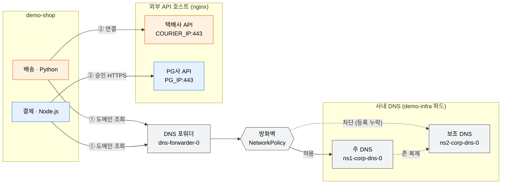

# eBPF 데모 — 쇼핑몰 배송 조회 실패 사건

> **"개발팀에 코드 수정을 요청하지 않고도 장애 원인을 찾을 수 있나?"**

앱 코드 수정도, 앱별 에이전트 설치도 하지 않은 **일곱 가지 언어로 된 여덟 서비스**에서
문제를 발견하고, 원인을 좁히고, 해결을 확인하는 데모 환경입니다.
서비스들은 실제 MSA 처럼 서로 여러 단계로 호출하며(최대 5단계), 모든 서비스가 요청을 받고 다른 서비스를 호출합니다.
본편은 **배송 조회 실패 사건 하나**로 이어지며, 코드가 아니라 **DNS·방화벽(네트워크)** 에서 생긴 문제라
eBPF 가 가장 잘 보여줄 수 있는 사건입니다. 화면에 나오는 모든 데이터는 eBPF 노드 에이전트 수집 결과입니다.

- **대상 환경** (둘 다 테스트 완료)
  - **OpenShift(OCP) 4.16 이상** + OCP 내부 이미지 레지스트리
  - **RKE2 같은 바닐라 쿠버네티스** + 외부 이미지 레지스트리(예: Harbor) — [14. 부록](#바닐라-쿠버네티스-rke2-등)
- 모든 명령은 `./demo.sh <명령>` 하나로 실행합니다 (`make` 불필요, bash 만 있으면 됨)
- 촬영 순서·화면·멘트: **[docs/runbook.md](docs/runbook.md)**

---

## 목차

1. [사건 시나리오](#1-사건-시나리오)
2. [구성](#2-구성)
3. [전체 과정 한눈에 보기](#3-전체-과정-한눈에-보기)
4. [준비물](#4-준비물)
5. [설치 — 처음부터 끝까지](#5-설치--처음부터-끝까지)
6. [촬영 진행](#6-촬영-진행)
7. [코드를 바꾼 뒤 다시 반영하기 (git pull 이후)](#7-코드를-바꾼-뒤-다시-반영하기-git-pull-이후)
8. [명령어 레퍼런스](#8-명령어-레퍼런스)
9. [이미지 레지스트리 동작 방식](#9-이미지-레지스트리-동작-방식)
10. [데모 환경 조건과 구현](#10-데모-환경-조건과-구현)
11. [보안](#11-보안)
12. [문제 해결](#12-문제-해결)
13. [정리 (삭제)](#13-정리-삭제)
14. [부록: 로컬 스모크 테스트 · 외부 레지스트리 · 바닐라 쿠버네티스(RKE2)](#14-부록)

---

## 1. 사건 시나리오

가상 고객사 **"쇼핑몰"** 은 여덟 서비스를 운영합니다. 팀마다 언어도 모니터링 도구도 달라,
배송 서비스는 모니터링이 아예 없습니다.

| 서비스 | 언어 | 받는 요청 (누가 호출) | 보내는 요청 (무엇을 호출) |
| --- | --- | --- | --- |
| 게이트웨이 `gateway-service` | C# (.NET 8) | 사용자(loadgen) | 상품, 회원, 주문 |
| 회원 `member-service` | Java 21 | 게이트웨이, 주문, 결제, 알림 | MySQL |
| 상품 `product-service` | Go 1.22 | 게이트웨이 | 재고 |
| 재고 `inventory-service` | Ruby 3.3 | 상품, 주문 | Redis |
| 주문 `order-service` | Java 21 | 게이트웨이 | 회원, 재고, 결제, 알림, 배송 |
| 결제 `payment-service` | Node.js 20 | 주문 | 회원 (VIP 할인 확인), **외부 PG사**(승인) |
| 알림 `notification-service` | PHP 8.3 | 주문 | 회원 (연락처·등급 확인) |
| 배송 `delivery-service` | Python 3.12 | 주문 | 외부 택배사 API (HTTPS). **모니터링 없음** |

| 시각 | 사건 | 데모 | 명령 |
| --- | --- | --- | --- |
| 월요일 밤 | 사내 **주 DNS 서버가 죽는다.** 보조 DNS 가 있으니 서비스는 괜찮을 줄 알았다 | — | `./demo.sh incident` |
| 화요일 09:00 | "배송 조회도 결제도 전부 실패한다"는 문의. 상품·회원 조회는 정상. 코드는 바뀐 것이 없다 | — | |
| 화요일 09:10 | eBPF: 배송·결제 서비스 구간만 5xx, **외부(택배사·PG)로 가는 연결은 아예 시도조차 없음** | 데모 1 | |
| 화요일 09:20 | DNS 탭: 택배사·PG 도메인 조회가 **응답 없이 실패**. DNS 포워더 로그: **주 DNS IP 로 질의 → 타임아웃, 보조 DNS IP 로 질의 → 타임아웃** → 방화벽에 **보조 DNS 가 등록되지 않음** | 데모 2, 3 | `./demo.sh firewall` |
| 화요일 09:40 | 방화벽에 보조 DNS 허용 → 주 DNS 가 아직 복구 중인데도 배송 조회·결제 회복 | 데모 4 | `./demo.sh fix` |
| 다음 주 | 여덟 서비스를 같은 기준으로 보는 공통 대시보드로 표준화 | 데모 4 | |

외부 택배사·PG사 도메인은 클러스터 DNS 가 아니라 **사내 DNS(주·보조)** 로 조회합니다. 데모 시나리오는 2개입니다.

| # | 시나리오 | 장애가 나는 곳 | 사건 → 해결 | 앱에 찍히는 예외 |
| --- | --- | --- | --- | --- |
| ① | **주 DNS 장애 → 보조 DNS 가 방화벽에 막힘** (본편) | DNS 포워더 → 사내 보조 DNS 구간. 그 결과 배송 (Python) → 택배사, 결제 (Node.js) → PG | 주 DNS 파드 삭제 → 포워더가 보조 DNS 로 넘어가지만 방화벽엔 주 DNS 만 등록 → **방화벽에 보조 DNS 허용** | 배송 `socket.gaierror: [Errno -3] Temporary failure in name resolution` / 결제 `Error: getaddrinfo EAI_AGAIN api.pg.example` |
| ② | **DNS 이름 변경 → 없는 이름 조회** | 결제 (Node.js) → 외부 PG사 | PG 새 도메인으로 바꿨지만 사내 DNS 에 없음 → **사내 DNS 에 등록** | `Error: getaddrinfo ENOTFOUND api-new.pg.example` |

- ① 의 고장 지점은 **DNS 포워더 → 보조 DNS 방화벽** 한 곳이고, 그 포워더를 쓰는 배송·결제가 함께 실패합니다 (상품·회원 조회는 정상).
  원인은 **DNS 포워더(CoreDNS) 로그**에 "어느 IP 로 질의했다가 실패했는지"로 남습니다.
- ② 는 [6-2](#6-2-시나리오-2--dns-이름-변경-없는-이름-조회) 에 있습니다.

---

## 2. 구성

### 그림 1. 서비스 간 호출 (클러스터 안)


```mermaid
flowchart LR
  LG["loadgen<br/>(demo-infra)"] --> GW["게이트웨이<br/>C#"]
  GW --> PRD["상품<br/>Go"] --> INV["재고<br/>Ruby"] --> RD[("Redis")]
  GW --> MEM["회원<br/>Java"] --> DB[("MySQL")]
  GW --> ORD["주문<br/>Java"]
  ORD --> MEM
  ORD --> INV
  ORD --> NOTI["알림<br/>PHP"] --> MEM
  ORD --> DLV["배송<br/>Python"]
  DLV -.-> EXT1(["외부 택배사 → 그림 2"])
  ORD --> PAY["결제<br/>Node.js"]
  PAY --> MEM
  PAY -.-> EXT2(["외부 PG사 → 그림 2"])

  classDef courier fill:#fff1e0,stroke:#e8590c,color:#000
  classDef pg fill:#e7f0ff,stroke:#1c7ed6,color:#000
  class DLV,EXT1 courier
  class PAY,EXT2 pg
```

### 그림 2. 외부 연결 — 두 시나리오의 무대


```mermaid
flowchart LR
  subgraph APP["demo-shop"]
    DLV["배송 · Python"]
    PAY["결제 · Node.js"]
  end

  FWD["DNS 포워더<br/>dns-forwarder-0"]
  FW{{"방화벽<br/>NetworkPolicy"}}

  subgraph C["사내 DNS (demo-infra 파드)"]
    D1["주 DNS<br/>ns1-corp-dns-0"]
    D2["보조 DNS<br/>ns2-corp-dns-0"]
  end

  subgraph N["외부 API 호스트 (nginx)"]
    CAPI["택배사 API<br/>COURIER_IP:443"]
    PGAPI["PG사 API<br/>PG_IP:443"]
  end

  DLV -->|"① 도메인 조회"| FWD
  PAY -->|"① 도메인 조회"| FWD
  FWD --> FW
  FW -->|"허용"| D1
  FW -.->|"차단 (등록 누락)"| D2
  D1 -.->|"존 복제"| D2

  DLV -->|"② 연결"| CAPI
  PAY -->|"② 승인 HTTPS"| PGAPI

  classDef courier fill:#fff1e0,stroke:#e8590c,color:#000
  classDef pg fill:#e7f0ff,stroke:#1c7ed6,color:#000
  classDef dns fill:#f1f3f5,stroke:#495057,color:#000
  class DLV,CAPI courier
  class PAY,PGAPI pg
  class FWD,FW,D1,D2 dns
```

주황 = 배송·택배사, 파랑 = 결제·PG, 회색 = DNS 경로 (**시나리오 ①** 의 무대).

- 결제·배송 파드의 DNS 서버는 **DNS 포워더**(`dns-forwarder`, 실제 클러스터의 CoreDNS 역할)입니다. 앱은 평범하게 OS 리졸버로 포워더에 묻습니다.
- 포워더는 외부 도메인을 사내 DNS 로 전달합니다 — **주 DNS 먼저**, 응답이 없으면 **보조 DNS** (CoreDNS `forward … { policy sequential }`).
  `cluster.local`(예: 회원 서비스)은 클러스터 DNS 로 전달합니다.
- 포워더 → 사내 DNS 구간의 방화벽에는 **주 DNS 만** 등록돼 있고 보조 DNS 는 빠져 있습니다 (평소에는 주 DNS 가 답하므로 아무도 모름).
- 택배사·PG 도메인은 모두 **사내 DNS 에 A 레코드**로 있습니다 (② 는 새 PG 도메인이 없는 경우).

| 시나리오 | 장애가 나는 서비스 | 도메인 조회 | 외부 목적지 | 장애를 만드는 장치 | 명령 |
| --- | --- | --- | --- | --- | --- |
| ① 주 DNS 장애 → 보조 DNS 방화벽 차단 | 배송·결제 | DNS 포워더 → 주 DNS 없음 → 보조 DNS 는 방화벽에 막힘 | nginx 의 택배사 API / PG사 API | 주 DNS 파드 삭제 + 방화벽에 보조 DNS 없음 | `incident` → `firewall` → `fix` |
| ② DNS 이름 변경 | 결제 (Node.js) | 사내 DNS — 새 PG 도메인 레코드 없음 | nginx 의 PG사 API (`PG_IP`) | 결제 서비스의 PG 도메인을 사내 DNS 에 없는 이름으로 교체 | `pg-missing` → `pg-register` |

### 사용자 요청별 호출 경로

loadgen 은 사용자 역할이라 게이트웨이만 호출합니다. 게이트웨이부터는 모든 서비스가 요청을 받고, 다른 서비스를 호출합니다.

| 사용자 요청 | 호출 경로 | 깊이 |
| --- | --- | --- |
| 체크아웃 `POST /api/checkout` | 게이트웨이 → 상품 → 재고 → Redis<br/>게이트웨이 → 주문 → 회원 → MySQL<br/>　　　　　　　　 → 재고 → Redis<br/>　　　　　　　　 → 결제 → 회원 → MySQL<br/>　　　　　　　　　　　 → **외부 PG사** (승인, 사내 DNS 로 조회)<br/>　　　　　　　　 → 알림 → 회원 → MySQL | 최대 5 |
| 배송 조회 `GET /api/orders/{id}/tracking` | 게이트웨이 → 주문 → 배송 → **외부 택배사 (HTTPS)** ← 데모 사건 경로 | 4 |
| 상품 보기 `GET /api/products/{id}` | 게이트웨이 → 상품 → 재고 → Redis | 4 |
| 회원 보기 `GET /api/members/{id}` | 게이트웨이 → 회원 → MySQL | 3 |

- 체크아웃 한 번에 서비스 간 HTTP 호출 8번 + 외부 PG 호출 1번 + DB 쿼리가 일어나, 연결선과 호출 수가 풍부하게 쌓입니다.
- 프로토콜도 여러 가지입니다: HTTP(서비스 간), MySQL, Redis(RESP), DNS(클러스터 DNS·사내 DNS), HTTPS(배송 → 택배사, 결제 → PG사).

### 로그 형식 — 여덟 서비스 공통 JSON

여덟 서비스는 모두 **한 줄에 JSON 하나**로 로그를 남깁니다. 언어가 달라도 필드 이름이 같아서, 로그 수집 도구(Loki, Elasticsearch,
OpenShift 로깅 등)에서 `service`·`req`·`level`·`status` 로 바로 검색·필터할 수 있습니다. 각 언어의 표준 기능만 씁니다 (외부 로깅 라이브러리 없음).

| 필드 | 뜻 |
| --- | --- |
| `ts` | 시각 (UTC, 밀리초) |
| `level` | `INFO` / `WARN` / `ERROR` |
| `service` | 서비스 이름 (`gateway-service` …) |
| `msg` | 무슨 일인지 (`checkout ok`, `upstream call failed` …) |
| `req` | 요청 ID — 같은 요청이면 모든 서비스에서 같은 값 |
| `elapsedMs`, `status`, `target`, `call`, `path` … | 상황별 필드 |
| `error`, `stack` | 예외 메시지와 스택 트레이스 (**여러 줄로 쪼개지지 않고 한 필드에**) |

`kubectl logs` 로 볼 때는 `jq` 로 보기 좋게 볼 수 있습니다:

```bash
oc -n demo-shop logs deploy/payment-service --since=1m | jq -r '[.ts, .level, .msg, .req, (.path // "")] | @tsv'
oc -n demo-shop logs deploy/delivery-service --since=1m | jq -r 'select(.level=="ERROR") | .stack'    # 스택 트레이스 펼쳐 보기
```

(알림 서비스(PHP 내장 서버)는 기동할 때 `PHP … Development Server started` 한 줄만 JSON 이 아닙니다. `jq` 로 볼 때는 `jq -R 'fromjson? // empty'` 를 쓰세요.)

**정상 처리 로그 (INFO)** — 요청을 정상 처리하면 서비스마다 한 줄. 체크아웃 1건 예:

```
{"ts":"2026-09-30T01:07:19.531Z","level":"INFO","service":"gateway-service","msg":"checkout ok","req":"lg-…","status":201,"elapsedMs":111,"memberId":10,"productId":3,"qty":2,"price":4000}
{"ts":"…","level":"INFO","service":"product-service","msg":"product ok","req":"lg-…","productId":3,"price":4000,"stock":1000,"elapsedMs":1}
{"ts":"…","level":"INFO","service":"inventory-service","msg":"stock ok","req":"lg-…","productId":3,"stock":1000,"elapsedMs":1}
{"ts":"…","level":"INFO","service":"member-service","msg":"member ok","req":"lg-…","memberId":10,"grade":"VIP","elapsedMs":2}
{"ts":"…","level":"INFO","service":"inventory-service","msg":"reserve ok","req":"lg-…","productId":3,"qty":2,"remaining":998,"elapsedMs":1}
{"ts":"…","level":"INFO","service":"payment-service","msg":"payment approved","req":"lg-…","orderId":1001,"paymentId":"…","amount":8000,"charged":7200,"grade":"VIP","pg":"api.pg.example","memberMs":12,"pgMs":22}
{"ts":"…","level":"INFO","service":"notification-service","msg":"notified","req":"lg-…","orderId":1001,"member":"member-10","channel":"sms","elapsedMs":6}
{"ts":"…","level":"INFO","service":"order-service","msg":"order created","req":"lg-…","orderId":1001,"memberId":10,"productId":3,"qty":2,"amount":8000,"memberMs":33,"stockMs":3,"paymentMs":37,"notificationMs":11}
```

배송 조회는 `gateway-service tracking ok` → `order-service tracking ok` → `delivery-service tracking ok` 순서로 남습니다.

### 애플리케이션 로그로 실패 지점 찾기

모든 서비스는 다른 곳을 호출하다 실패하면 **같은 모양의 로그 한 줄**(`msg: "upstream call failed"`)을 남기고, 에러 응답에 **실패 경로(`errorPath`)** 를 담아
위로 돌려줍니다. 위 서비스는 받은 경로 앞에 자기 구간을 붙이므로, **가장 바깥(게이트웨이) 로그의 `path` 에 실패 경로 전체가 보입니다.**

| 필드 | 뜻 |
| --- | --- |
| `target`, `call` | 호출 대상과 `<메서드> <URL>` |
| `status` | 받은 응답 코드 (`0` = 응답 없음: 연결 실패·타임아웃) |
| `elapsedMs` | 걸린 시간 |
| `path` | 실패 경로 |
| `error`, `stack` | 예외가 실제로 난 곳에서만 |

데모 사건(`incident`) 중 배송 조회 1건이 남기는 로그 (위에서 아래로 = 바깥에서 안쪽으로, `stack` 은 줄임):

```
{"ts":"…","level":"WARN","service":"gateway-service","msg":"upstream call failed","req":"lg-3fa9c1d2e8b0","target":"order-service","call":"GET http://order-service:8080/orders/1374/delivery","status":502,"elapsedMs":4052,"step":"tracking","orderId":1374,"path":"gateway-service → order-service[502] → delivery-service[503] → api.courier.example(-:443) [dns: [Errno -3] Temporary failure in name resolution after 4.01s]"}
{"ts":"…","level":"WARN","service":"order-service","msg":"upstream call failed","req":"lg-3fa9c1d2e8b0","target":"delivery-service","call":"GET http://delivery-service:8080/deliveries/1374/tracking","status":503,"elapsedMs":4031,"path":"order-service → delivery-service[503] → api.courier.example(-:443) [dns: [Errno -3] Temporary failure in name resolution after 4.01s]","orderId":1374}
{"ts":"…","level":"ERROR","service":"delivery-service","msg":"upstream call failed","req":"lg-3fa9c1d2e8b0","target":"api.courier.example","call":"GET https://api.courier.example/v1/tracking/DX1512686139","ip":"-","stage":"dns","elapsedMs":4010,"orderId":1374,"path":"delivery-service → api.courier.example(-:443) [dns: [Errno -3] Temporary failure in name resolution after 4.01s]","error":"gaierror(-3, 'Temporary failure in name resolution')","stack":"Traceback (most recent call last):\n  File \"/app/app.py\", line 96, in call_courier\n …\nsocket.gaierror: [Errno -3] Temporary failure in name resolution\n"}
```

- `ip: "-"`, `stage: "dns"` — IP 를 얻지 못해 **택배사로 연결을 시도조차 못 했다**는 뜻입니다. `elapsedMs` 약 4초 = 주 DNS 2초 + 보조 DNS 2초 타임아웃
  (CNI 가 주 DNS 서비스로 가는 패킷을 즉시 거부하면 약 2초).
- `path` 의 `서비스[코드]` 는 그 서비스가 돌려준 HTTP 응답 코드, 마지막 `[…]` 는 실제로 실패한 원인입니다.
- **예외가 실제로 난 곳**(연결 타임아웃·연결 거부·DB 오류)은 `error`·`stack` 필드에 예외와 스택 트레이스를 남깁니다: Python(배송), Java(주문·회원), C#(게이트웨이), Ruby(재고), Node.js(결제).
- 요청 ID 는 loadgen 이 `lg-…` 로 붙이고(없으면 게이트웨이가 만듦) 모든 서비스가 다음 호출에 그대로 넘깁니다. `./demo.sh traffic` 에 요청 ID 가 찍히므로, 그 ID 로 서비스 로그를 검색하면 됩니다.
- `./demo.sh status` 도 배송 조회가 실패하면 `실패 경로: …` 한 줄을 보여줍니다.

다른 장애일 때 게이트웨이 로그의 실패 경로 (로컬에서 일부러 장애를 내어 확인한 실제 출력):

| 장애 | 게이트웨이 로그의 `path` |
| --- | --- |
| 주 DNS 장애 + 보조 DNS 방화벽 차단 (데모 사건) | `gateway-service → order-service[502] → delivery-service[503] → api.courier.example(-:443) [dns: [Errno -3] Temporary failure in name resolution after 4.01s]` |
| 택배사 API 연결 실패 (방화벽에 택배사 IP 없음 등) | `gateway-service → order-service[502] → delivery-service[503] → api.courier.example(10.0.0.61:443) [connect: timed out after 5.01s]` |
| MySQL 다운 | `gateway-service → order-service[502] → member-service[500] → mysql(mysql:3306) [CommunicationsException: Communications link failure]` |
| Redis 다운 | `gateway-service → order-service[502] → inventory-service[503] → redis(redis:6379) [redis unavailable: …]` |
| 결제 서비스 다운 | `gateway-service → order-service[504] → payment-service [HttpConnectTimeoutException: HTTP connect timed out after 2004ms]` |

요청 ID 하나로 서비스별 로그 모아 보기:

```bash
ID=lg-3fa9c1d2e8b0
for d in gateway-service order-service delivery-service; do oc -n demo-shop logs deploy/$d | jq -c --arg id "$ID" 'select(.req==$id) | del(.stack)'; done
```

> **eBPF 화면과의 관계**: 실패 경로·요청 ID 는 **애플리케이션 로그**의 기능입니다. eBPF 는 각 구간(게이트웨이→주문, 주문→배송 …)의
> 요청 수·지연·오류와 실패한 TCP 연결을 보여주지만, 서비스 여러 개를 거친 **요청 1건을 끝까지 잇는 추적(분산 트레이스)** 은
> eBPF 만으로 만들지 않습니다 — 이 편의 한계 장표 내용이며, OpenTelemetry 와 함께 쓰는 EP05 에서 다룹니다.
> 이 데모 대본은 eBPF 화면만으로 원인을 찾는 흐름이므로, 로그는 "코드를 고치지 않아도 eBPF 가 먼저 보여준다"를 뒷받침하는 확인용으로 씁니다.

| 구성 요소 | 무엇을 흉내 내나 | 구현 |
| --- | --- | --- |
| 여덟 서비스 + MySQL + Redis | 쇼핑몰 | `demo-shop` 네임스페이스. 모니터링 코드·에이전트 없음 |
| `loadgen` | 사용자 트래픽 | 게이트웨이로 체크아웃·배송 조회·둘러보기를 1초 간격으로 호출 (`demo-infra`) |
| DNS 포워더 `dns-forwarder` | 클러스터 DNS (CoreDNS) | 결제·배송 파드의 DNS 서버. 외부 도메인은 사내 주 → 보조 DNS 로, `cluster.local` 은 클러스터 DNS 로 전달. 실패하면 **어느 사내 DNS IP 로 질의했다가 실패했는지** 로그에 남김 (`demo-infra`) |
| `fw-*` NetworkPolicy | 사내 방화벽 | 나가는 연결 허용 목록. DNS 포워더 → **사내 주 DNS** 만 (보조 DNS 는 등록 누락), 배송 서비스 → 포워더·택배사 API |
| 외부 API 호스트 (`courier-ext/`) | 외부 택배사 API + 외부 PG사 API | 클러스터 **밖** 리눅스 호스트의 nginx 1대(HTTPS). 요청 도메인(TLS SNI)으로 택배사·PG 를 구분해 응답. 택배사는 `COURIER_IP`, PG 는 `PG_IP`(기본: `COURIER_IP`) |
| 사내 DNS 주·보조 | 회사의 DNS 서버 2대 | 택배사 도메인(배송 서비스)과 PG 도메인(결제 서비스)을 답함. 택배사 레코드는 IP **1개**. `demo-infra` 의 CoreDNS 파드 `ns1-corp-dns-0`(주)·`ns2-corp-dns-0`(보조) — [5-5b](#5-5b-사내-dns--준비할-것-없음) |

**장애가 나는 원리 (①)**: 결제·배송 파드의 OS 리졸버는 DNS 포워더에 묻고(`timeout:3 attempts:1`), 포워더는 사내 주 DNS 에 전달합니다.
주 DNS 파드가 없어지면 포워더는 주 DNS 를 '비정상'으로 보고 보조 DNS 로 전달하는데, 포워더 → 보조 DNS 구간의 방화벽(NetworkPolicy)이
질의를 조용히 버립니다. 포워더 로그에 `read udp <포워더>-><주 DNS IP>:53: i/o timeout` → `…-><보조 DNS IP>:53: i/o timeout` 이 남고,
파드 쪽 리졸버는 `Temporary failure in name resolution`(EAI_AGAIN)으로 실패합니다.
→ 배송 503 → 주문 502 → 게이트웨이 502 (배송 조회), 결제 504 → 주문 502 → 게이트웨이 502 (체크아웃).
eBPF 는 배송·결제 서비스 **DNS 탭의 응답 없는 질의(타임아웃)** 와 5xx HTTP 요청으로 보고, 택배사·PG 로 가는 TCP 연결이 **아예 없어진 것**도 보여줍니다.
상품·회원 조회는 정상이고, 결제 서비스의 회원 서비스 조회(`cluster.local`)도 정상입니다.

**장애가 나는 원리 (②)**: 결제 서비스가 새 PG 도메인을 물으면 포워더 → 주 DNS 가 **NXDOMAIN**(확정 답)을 돌려주고,
보조로 넘어가지 않고 곧바로 실패합니다 → 결제 504 → 주문 502 → 게이트웨이 502. eBPF 는 결제 서비스 DNS 탭의 **NXDOMAIN 증가**와 체크아웃 5xx 로 봅니다.
자세한 흐름은 [6-2](#6-2-시나리오-2--dns-이름-변경-없는-이름-조회).

---

## 3. 전체 과정 한눈에 보기

명령을 실행하는 곳은 두 군데입니다.

- **[작업 PC]** — `oc`, `podman`, `git` 이 있고 OCP API 와 앱 route(`*.apps.<클러스터 도메인>`)에 접속되는 리눅스 (보통 bastion)
- **[택배사 호스트]** — 클러스터 밖 리눅스 서버 1대 (VM 가능)

| 단계 | 어디서 | 명령 | 빈도 |
| --- | --- | --- | --- |
| 5-1 저장소 받기 | 작업 PC | `git clone …` / `git pull` | 처음·업데이트 때 |
| 5-2 OCP 로그인 | 작업 PC | `oc login …` | 세션마다 |
| 5-3 설정 파일 | 작업 PC | `cp demo.env.example demo.env` → IP 2개 수정 | 처음 한 번 |
| 5-4 인증서 | 작업 PC | `./demo.sh certs` | 처음 한 번 |
| 5-5 택배사 호스트 | 택배사 호스트 | 보조 IP 추가 → `sudo ./run.sh up` | 처음 한 번 |
| 5-5b 사내 DNS | — | 준비 없음 — `deploy` 가 사내 DNS 파드(`ns1/ns2-corp-dns`)와 DNS 포워더를 만듦 | — |
| 5-6 레지스트리 route | 작업 PC | `./demo.sh registry-route` | 클러스터당 한 번 |
| 5-7 사전 점검 | 작업 PC | `./demo.sh check` | 배포 전 |
| 5-8 이미지 push | 작업 PC | `./demo.sh push` | 처음·코드 변경 때 |
| 5-9 배포 | 작업 PC | `./demo.sh deploy` | 처음·매니페스트 변경 때 |
| 5-10 확인 | 작업 PC | `./demo.sh security` → `./demo.sh status` | 배포 후 |
| 5-11 정상 데이터 쌓기 | — | 몇 시간 이상 그대로 둠 | 촬영 전날 |
| 6 촬영 | 작업 PC | ① `incident` → `firewall` → `fix` → `reset` / ② `pg-missing` → `pg-register` → `pg-reset` | 테이크마다 |

---

## 4. 준비물

### 클러스터

| 항목 | 조건 |
| --- | --- |
| 쿠버네티스 | **OpenShift 4.16 이상**, 또는 **RKE2 등 바닐라 쿠버네티스** (테스트: RKE2 + Canal + Harbor). 노드 커널 4.16 이상 (eBPF 조건) |
| 네트워크 | NetworkPolicy 를 집행하는 CNI (NetworkPolicy 로 방화벽 차단을 흉내 냄) — OCP: 기본 **OVN-Kubernetes**, RKE2: 기본 **Canal** |
| 이미지 레지스트리 | OCP: **내부 이미지 레지스트리** 활성화 상태 (`oc get co image-registry` 가 Available, default route 는 5-6 에서 엽니다)<br/>바닐라 쿠버네티스: **외부 레지스트리**(예: Harbor) — `REGISTRY_MODE=external` ([14. 부록](#바닐라-쿠버네티스-rke2-등)) |
| 외부 이미지 pull | 노드가 `docker.io`, `quay.io`, `registry.k8s.io` 에서 pull 가능해야 함 (부하 발생기·DNS·MySQL·Redis 이미지). 폐쇄망이면 [12. 문제 해결](#12-문제-해결) 참고 |
| Observ 노드 에이전트 | 설치 완료, **ClickHouse 와 노드 에이전트의 traces endpoint 설정 필수** (없으면 T-Map·트랜잭션 조회가 비어 있음). OpenTelemetry 에이전트·SDK 는 설치하지 않음 |
| 계정 권한 | **cluster-admin 권장**. 필요 권한: 네임스페이스 생성, 노드 조회(점검), 레지스트리 설정 변경(OCP 5-6, 한 번). cluster-admin 이 아니면 5-6 만 관리자에게 요청 |

### 작업 PC (bastion)

| 도구 | 확인 명령 | 설치 (RHEL 8/9) |
| --- | --- | --- |
| `oc` (OCP) | `oc version --client` | OCP 콘솔 우측 상단 `?` → Command line tools, 또는 mirror.openshift.com 의 `openshift-client-linux.tar.gz` |
| `kubectl` (바닐라 쿠버네티스) | `kubectl version --client` | RKE2 서버 노드의 `/var/lib/rancher/rke2/bin/kubectl` 과 `/etc/rancher/rke2/rke2.yaml`(kubeconfig) 사용 가능 |
| `podman` 4.x 이상 | `podman --version` | `sudo dnf install -y podman` |
| `git` | `git --version` | `sudo dnf install -y git` |
| `openssl` | `openssl version` | `sudo dnf install -y openssl` |
| `bash` 4 이상 | `bash --version` | 기본 설치 |
| `jq` (선택, JSON 로그 보기) | `jq --version` | `sudo dnf install -y jq` |

- 작업 PC 아키텍처와 클러스터 노드 아키텍처가 같아야 빌드가 빠릅니다 (보통 둘 다 x86_64 → `PLATFORM=linux/amd64`).
- 작업 PC 는 빌드 중 베이스 이미지·패키지를 받습니다: `docker.io`, `gcr.io`, `mcr.microsoft.com`(.NET), `repo.maven.apache.org`(Java), `rubygems.org`(Ruby WEBrick), `api.nuget.org`(.NET).

### 택배사 호스트

| 항목 | 조건 |
| --- | --- |
| 서버 | 클러스터 **밖** 리눅스 1대 (VM 가능, RHEL·Ubuntu 등) |
| IP | **1개** (`COURIER_IP`) — 호스트의 기본 IP, 또는 다른 서비스와 443 을 나눠 쓰면 보조 IP 1개. 클러스터 노드에서 그 IP 의 443 으로 연결 가능해야 함 |
| 컨테이너 | `podman` 또는 `docker` |
| 포트 | 443/TCP 열림 |

택배사 호스트의 nginx 는 **외부 PG사 API 도 함께 응답**합니다 (TLS SNI 로 구분). PG 도메인은 `PG_IP`(기본: `COURIER_IP`)를 가리킵니다.

### 사내 DNS

준비할 것이 없습니다. `./demo.sh deploy` 가 `demo-infra` 네임스페이스에 사내 DNS 주·보조를 **파드로** 띄웁니다
(`ns1-corp-dns-0` 주, `ns2-corp-dns-0` 보조). 존에는 PG 도메인과 택배사 도메인이 A 레코드로 들어갑니다.

---

## 5. 설치 — 처음부터 끝까지

### 5-1. 저장소 받기 **[작업 PC]**

처음:

```bash
git clone https://github.com/beomzh/demo-ebpf-shop.git
cd demo-ebpf-shop
```

이미 받아 두었다면:

```bash
cd demo-ebpf-shop
git pull
```

실행 권한 확인 (zip 으로 받았거나 권한이 빠졌을 때만):

```bash
chmod +x demo.sh scripts/*.sh courier-ext/*.sh
./demo.sh help
```

### 5-2. OpenShift 로그인 **[작업 PC]**

```bash
oc login -u <사용자> https://api.<클러스터 도메인>:6443
oc whoami          # 사용자 이름이 나와야 함
oc whoami -t       # sha256~ 로 시작하는 토큰이 나와야 함 (이미지 push 에 사용)
```

- 반드시 **사용자/비밀번호(또는 토큰)로 로그인**하세요. `system:admin` kubeconfig(인증서 로그인)는 토큰이 없어 이미지 push 가 되지 않습니다.
  kubeadmin 을 쓴다면 `oc login -u kubeadmin -p <비밀번호> https://api...:6443`
- API 인증서가 사설이면 `--insecure-skip-tls-verify=true` 를 붙입니다.

### 5-3. 설정 파일 만들기 **[작업 PC]**

```bash
cp demo.env.example demo.env
vi demo.env
```

**보통은 IP 하나만 바꾸면 됩니다.**

```bash
COURIER_IP=10.0.0.61     # 택배사 API(nginx) IP = 택배사 호스트의 IP
```

(예전 버전의 `COURIER_OLD_IP` 도 그대로 읽습니다. `COURIER_NEW_IP` 는 더 이상 쓰지 않습니다.)

나머지 값(기본값 그대로 두면 됨):

| 변수 | 기본값 | 설명 |
| --- | --- | --- |
| `COURIER_DOMAIN` | `api.courier.example` | 가상 택배사 도메인. **공인 DNS 등록 불필요** (사내 DNS 에 A 레코드로 자동 등록). 바꾸려면 5-4 전에 바꿀 것 |
| `CLI` | `auto` | `oc` 가 있으면 `oc`, 없으면 `kubectl` |
| `REGISTRY_MODE` | `ocp-internal` | OCP 내부 레지스트리 사용 ([9. 동작 방식](#9-이미지-레지스트리-동작-방식)) |
| `TAG` | `1.0.0` | 이미지 태그 |
| `CONTAINER_ENGINE` | `auto` | `podman` 우선, 없으면 `docker` |
| `REGISTRY_TLS_VERIFY` | `false` | default route 인증서 검증. OCP 기본 인그레스 인증서는 보통 사설이라 `false` |
| `PLATFORM` | `linux/amd64` | 클러스터 노드 아키텍처 |
| `PG_DOMAIN` | `api.pg.example` | 외부 PG사 도메인 (공인 DNS 등록 불필요) |
| `PG_IP` | (비움 = `COURIER_IP`) | PG 도메인이 가리킬 IP. 택배사 호스트 nginx 가 PG 도 응답 |
| `PG_UNREGISTERED_DOMAIN` | `api-new.pg.example` | 시나리오 ② 에서 결제 서비스가 바꿔 쓸 새 PG 도메인. **PG 도메인과 같은 존 안의, 처음엔 사내 DNS 에 없는 이름** |
| `LOADGEN_REPLICAS` | `1` | 부하 발생기 파드 수 (파드 1개 = 초당 체크아웃·배송 조회·둘러보기 각 1건) — [6-1](#6-1-요청량-늘리기) |
| `LOADGEN_*_INTERVAL` | `1` | 파드 하나의 요청 간격(초) |

### 5-4. 택배사 인증서 만들기 **[작업 PC]**

```bash
./demo.sh certs
ls courier-ext/certs/     # ca.crt  ca.key  courier.crt  courier.key
```

- `ca.crt` 는 5-9 에서 클러스터에 시크릿으로 올라가고, 배송 서비스가 택배사 인증서를 검증하는 데 씁니다.
- `courier.crt`, `courier.key` 는 택배사 호스트의 nginx 가 씁니다.
- 이 디렉터리는 git 에 올라가지 않습니다(`.gitignore`). 개인키는 권한 600.

### 5-5. 택배사 호스트 준비 **[택배사 호스트]**

① 작업 PC 에서 `courier-ext` 디렉터리를 통째로 복사합니다 (인증서 포함):

```bash
# [작업 PC]
scp -r courier-ext <사용자>@<택배사 호스트>:~/
```

② 택배사 호스트에서:

```bash
cd ~/courier-ext
ip -4 -brief addr                                 # NIC 이름과 기본 IP(= COURIER_IP) 확인
sudo ./run.sh up                                  # nginx 기동 (podman 우선, 없으면 docker)
```

③ 방화벽이 **켜져 있을 때만** 443 을 엽니다 (`systemctl is-active firewalld` 가 `active` 일 때).
꺼져(`inactive`) 있으면 **켜지 마세요** — 그 호스트에서 돌던 다른 서비스 포트가 막힐 수 있습니다.

```bash
sudo firewall-cmd --add-service=https --permanent && sudo firewall-cmd --reload   # RHEL
# sudo ufw allow 443/tcp                                                           # Ubuntu
```

④ 응답하는지 확인합니다:

```bash
curl -sk --resolve api.courier.example:443:<COURIER_IP> https://api.courier.example/v1/tracking/T1
# {"trackingNo":"T1",...,"served_by":"<접속한 IP>"}
```

참고:

- 443 은 특권 포트라 `sudo` 로 실행합니다 (rootless podman 은 443 바인딩 불가).
- `run.sh` 는 SELinux 라벨(`:Z`)을 붙여 볼륨을 마운트하므로 RHEL 에서도 인증서를 읽을 수 있습니다.
- `ip addr` 로 붙인 보조 IP 는 **재부팅하면 사라집니다**. 촬영 기간 동안 유지하려면 `nmcli` 로 영구 설정하세요:
  `sudo nmcli con mod <연결이름> +ipv4.addresses 10.0.0.61/24 && sudo nmcli con up <연결이름>`
- 기타: `sudo ./run.sh status | logs | down`

#### 443 을 이미 다른 프로그램이 쓰고 있을 때

택배사 호스트로 bastion 처럼 다른 서비스가 도는 서버를 쓰면, haproxy·nginx·httpd 등이 이미 443 을 쓰고 있을 수 있습니다.
택배사 nginx 는 **택배사 IP 의 443 만** 써야 하고, 기존 프로그램은 **자기 IP 의 443 만** 쓰도록 나눕니다.

**1. 누가 443 을 어떻게 쓰는지 확인**

```bash
sudo ss -ltnp | grep ':443 '
```

| 출력 | 의미 | 할 일 |
| --- | --- | --- |
| 아무것도 없음 | 443 이 비어 있음 | 위 ②~④ 그대로 진행 |
| `10.0.0.50:443 … ("haproxy",…)` 처럼 **특정 IP** | 그 IP 만 쓰는 중 | 기존 프로그램은 그대로. 택배사용 IP 1개를 **새로** 붙이고 아래 3~4 진행 |
| `0.0.0.0:443` 또는 `*:443` | **모든 IP** 의 443 을 쓰는 중 → 택배사 nginx 가 뜰 수 없음 | 아래 2 로 기존 프로그램의 bind 를 자기 IP 로 좁힌 뒤 3~4 진행 |

**2. 기존 프로그램의 443 을 자기 IP 로 좁히기** (예: bastion 의 haproxy)

예시 환경:

| 항목 | 값 |
| --- | --- |
| bastion 기존 IP (`*.apps` 인그레스가 들어오는 IP) | `10.0.0.50` |
| 택배사 IP (`COURIER_IP`) — 새로 붙임 | `10.0.0.61` |
| NIC / prefix | `ens192` / `/24` |

`*.apps` 가 어느 IP 로 들어오는지 먼저 확인합니다 (그 IP 가 기존 프로그램이 계속 받아야 하는 IP):

```bash
getent hosts console-openshift-console.apps.<클러스터 도메인>
# 10.0.0.50  console-openshift-console.apps.<클러스터 도메인> ...
```

haproxy 설정 변경 — **백업 → 수정 → 검증 → 재시작 → 확인** 순서로 합니다:

```bash
sudo cp -a /etc/haproxy/haproxy.cfg /etc/haproxy/haproxy.cfg.bak-demo
sudo grep -nE '^\s*(frontend|bind)' /etc/haproxy/haproxy.cfg      # bind *:443 위치 확인
sudo sed -i 's|^\(\s*\)bind \*:443\s*$|\1bind 10.0.0.50:443|' /etc/haproxy/haproxy.cfg
sudo grep -n -A3 'frontend ingress-https' /etc/haproxy/haproxy.cfg   # bind 10.0.0.50:443 로 바뀌었는지
sudo haproxy -c -f /etc/haproxy/haproxy.cfg                          # 'Configuration file is valid' 또는 Warnings 만
sudo systemctl restart haproxy                                        # 1~2초 API·콘솔 끊김
sudo ss -ltnp | grep ':443 '                                          # 10.0.0.50:443 만 보여야 함
curl -sk -o /dev/null -w '%{http_code}\n' https://console-openshift-console.apps.<클러스터 도메인>/   # 200
oc get co ingress console                                              # AVAILABLE True
```

- 80, 6443, 22623 등 **443 외 포트는 건드리지 않습니다.**
- 문제가 생기면 즉시 되돌립니다:
  `sudo cp -a /etc/haproxy/haproxy.cfg.bak-demo /etc/haproxy/haproxy.cfg && sudo systemctl restart haproxy`

haproxy 가 아닌 경우도 같은 방식입니다:

| 프로그램 | 설정 파일 (보통) | 바꿀 줄 |
| --- | --- | --- |
| haproxy | `/etc/haproxy/haproxy.cfg` | `bind *:443` → `bind 10.0.0.50:443` |
| nginx | `/etc/nginx/nginx.conf`, `/etc/nginx/conf.d/*.conf` | `listen 443 ssl;` → `listen 10.0.0.50:443 ssl;` (모든 server 블록) |
| Apache httpd | `/etc/httpd/conf.d/ssl.conf` | `Listen 443 https` → `Listen 10.0.0.50:443 https` |
| 컨테이너 (`-p 443:443`) | 실행 명령 | `-p 443:443` → `-p 10.0.0.50:443:443` 로 다시 실행 |

변경 후 각각 설정 검증(`nginx -t`, `apachectl configtest`) → 재시작 → `ss -ltnp | grep ':443 '` 로 확인합니다.

**3. 택배사 IP 붙이기**

같은 대역에서 **아무도 안 쓰는 IP** 1개를 고릅니다 (노드 IP 와 겹치지 않는지 `oc get nodes -o wide`, 응답 없는지 `ping`):

```bash
ping -c 2 -W 1 10.0.0.61      # 100% packet loss 여야 함
sudo ./courier-ext/setup-ips.sh add ens192 10.0.0.61/24
ip -4 -brief addr show ens192
# ens192  UP  10.0.0.50/24 10.0.0.61/24
```

`demo.env` 에 IP 를 넣습니다:

```bash
COURIER_IP=10.0.0.61
```

**4. 택배사 nginx 를 그 IP 에서만 띄우기**

`run.sh` 는 nginx 가 받을 IP 를 이렇게 정합니다:

1. `LISTEN_IPS` 환경변수가 있으면 그 IP 들
2. 없으면 같은 저장소의 `demo.env` 에 있는 `COURIER_IP` (와 다르면 `PG_IP`) (작업 PC = 택배사 호스트일 때)
3. 둘 다 없으면 모든 IP (`0.0.0.0:443`)

```bash
# 저장소 안에서 실행 (demo.env 를 읽음)
sudo ./courier-ext/run.sh up
# listen: 10.0.0.61:443
# [podman] courier-api started.

# courier-ext 만 복사해 온 다른 서버라면 IP 를 직접 지정
sudo LISTEN_IPS="10.0.0.61" ./run.sh up
```

확인 — 기존 프로그램과 택배사 nginx 가 443 을 나눠 쓰는지:

```bash
sudo ss -ltnp | grep ':443 '
# 10.0.0.50:443   haproxy
# 10.0.0.61:443   nginx
curl -sk --resolve api.courier.example:443:10.0.0.61 https://api.courier.example/v1/tracking/T1   # served_by 10.0.0.61
```

지정한 IP 가 호스트에 붙어 있지 않으면 `run.sh` 가 `ERROR: … 가 이 호스트에 없습니다` 로 멈춥니다 (3 을 먼저 할 것).

#### 주의: 같은 IP 를 두 서버에 붙이지 마세요

택배사·PG 용 IP(`COURIER_IP`)와 nginx 는 **한 서버에만** 둡니다. 두 서버에 같은 IP 가 있으면 ARP 응답이 번갈아 바뀌어 연결이 됐다 안 됐다 합니다.

```bash
ip -4 -brief addr | grep '10.0.0.6'      # 각 서버에서 — 데모용 IP 가 한 서버에만 있어야 함
```

다른 서버에 남아 있으면 그 서버에서 정리합니다:

```bash
./courier-ext/run.sh down
./courier-ext/setup-ips.sh del <NIC> 10.0.0.61/<prefix>
nmcli con mod <연결이름> -ipv4.addresses 10.0.0.61/<prefix>   # 영구 설정했다면
```

### 5-5b. 사내 DNS — 준비할 것 없음

사내 DNS 주·보조와 DNS 포워더는 `./demo.sh deploy` 가 `demo-infra` 네임스페이스에 **파드로** 띄웁니다. 결제·배송 서비스 파드의 DNS 서버
(`/etc/resolv.conf`)는 DNS 포워더이고, 포워더가 사내 DNS 주 → 보조 순으로 전달합니다. PG 용 nginx 는 5-5 에서 띄운 외부 API 호스트의 nginx 를 그대로 씁니다.

| 리소스 (`demo-infra`) | 역할 |
| --- | --- |
| 파드 `dns-forwarder-0` / 서비스 `dns-forwarder` | **DNS 포워더** — 결제·배송 파드의 DNS 서버. 외부 도메인은 주 → 보조 DNS 로, `cluster.local` 은 클러스터 DNS 로 전달. 실패한 사내 DNS IP 를 로그에 남김 |
| 파드 `ns1-corp-dns-0` / 서비스 `ns1-corp-dns` | **주 DNS** — 포워더가 먼저 묻는 서버 |
| 파드 `ns2-corp-dns-0` / 서비스 `ns2-corp-dns` | **보조 DNS** — 주 DNS 가 응답하지 않을 때 포워더가 묻는 서버 |
| ConfigMap `corp-dns-zone` | 두 서버가 함께 읽는 존 (= 주 → 보조 존 복제가 끝난 상태). 처음 레코드: PG 도메인 → `PG_IP`, 택배사 도메인 → `COURIER_IP`. 등록되지 않은 이름은 NXDOMAIN. `pg-register`·`corpdns record-add/remove` 가 바꿈 (약 3초 안에 반영) |
| NetworkPolicy `fw-*` (방화벽) | 포워더 → 사내 **주 DNS** 와 클러스터 DNS 만 허용 (**보조 DNS 는 등록 누락** — 시나리오 ①) |
| NetworkPolicy `allow-*` (인바운드) | `demo-infra` 는 인바운드 기본 차단이라 결제·배송 → 포워더, 포워더(와 점검용 결제 파드) → 사내 DNS 만 허용 |

배포 후 확인:

```bash
./demo.sh corpdns status
# POD              ROLE        STATUS    POD-IP        NODE
# dns-forwarder-0  <none>      Running   10.128.2.20   worker-1
# ns1-corp-dns-0   primary     Running   10.128.2.15   worker-1
# ns2-corp-dns-0   secondary   Running   10.131.0.22   worker-2
# 서비스: 포워더 dns-forwarder 172.30.0.12 → 주 ns1-corp-dns 172.30.0.10, 보조 ns2-corp-dns 172.30.0.11
# 등록된 레코드:
#   api.pg.example → 10.0.0.61
#   api.courier.example → 10.0.0.61

./demo.sh corpdns logs       # 포워더·주·보조 DNS 의 질의 로그를 한 화면에 (Ctrl+C 로 종료)
```

`./demo.sh check` 의 5번 항목(`[사내 DNS primary/secondary/forwarder …] … OK` ×6, `[클러스터 → PG] … OK`)이 통과해야 합니다.

### 5-6. 내부 레지스트리 route 열기 **[작업 PC]** — 클러스터당 한 번

```bash
./demo.sh registry-route
# [..] default route: default-route-openshift-image-registry.apps.<클러스터 도메인>
```

- 내부 레지스트리 설정에 `defaultRoute: true` 를 켜서 클러스터 밖(작업 PC)에서 push 할 수 있는 주소를 만듭니다.
- **cluster-admin 권한이 필요**합니다. 권한이 없으면 관리자에게 아래 명령을 요청하세요:
  `oc patch configs.imageregistry.operator.openshift.io/cluster --type merge -p '{"spec":{"defaultRoute":true}}'`
- 이미 열려 있으면 아무것도 바꾸지 않고 주소만 보여줍니다.

### 5-7. 사전 점검 **[작업 PC]**

```bash
./demo.sh check
```

| 점검 | 통과 기준 |
| --- | --- |
| 0) 클러스터 접속 | `oc whoami` 사용자, 레지스트리 route 존재, 토큰 로그인 |
| 1) 노드 커널 | 모든 노드 4.16 이상 |
| 2) CNI | `ovnkube-node` 등 NetworkPolicy 지원 CNI 감지 |
| 3) OpenTelemetry 흔적 | 없음 |
| 4) 택배사 도달 | 클러스터 안 임시 파드에서 `COURIER_IP` 443 응답 (방화벽 적용 전 경로 확인) |
| 5) 인증서 | `courier-ext/certs/ca.crt` 있음 |

`점검 통과` 가 나오면 다음 단계로 갑니다. 4) 가 실패하면 5-5 와 노드→택배사 호스트 네트워크를 확인하세요.

### 5-8. 이미지 빌드·push **[작업 PC]**

```bash
./demo.sh push
```

이 명령이 하는 일 (10~25분, 첫 빌드는 베이스 이미지 다운로드로 더 걸림):

1. `demo-shop` 네임스페이스 생성
2. ImageStream 8개 생성 — `shop-gateway-service`, `shop-member-service`, `shop-product-service`, `shop-inventory-service`, `shop-order-service`, `shop-payment-service`, `shop-notification-service`, `shop-delivery-service`
3. `oc whoami -t` 토큰으로 default route 에 로그인 (토큰은 표준입력으로 전달, 명령 인자에 남지 않음)
   `podman login -u <사용자> --password-stdin --tls-verify=false default-route-openshift-image-registry.apps.<도메인>`
4. 서비스마다 `podman build` → `podman push default-route-…/demo-shop/shop-<서비스>:1.0.0`
5. ImageStream 에 `1.0.0` 태그가 들어왔는지 확인

정상이면 마지막에 이렇게 나옵니다:

```
NAME                    TAGS    PULL
shop-delivery-service   1.0.0   image-registry.openshift-image-registry.svc:5000/demo-shop/shop-delivery-service
shop-member-service     1.0.0   image-registry.openshift-image-registry.svc:5000/demo-shop/shop-member-service
...
[..] done
```

`PULL` 열의 주소가 클러스터가 이미지를 받아 가는 주소입니다. 언제든 `./demo.sh images` 로 다시 볼 수 있습니다.

### 5-9. 배포 **[작업 PC]**

```bash
./demo.sh deploy
```

이 명령이 하는 일:

1. `demo-shop`, `demo-infra` 네임스페이스 (Pod Security `restricted`)
2. ImageStream 에 이미지 8개가 있는지 확인 — 없으면 "`./demo.sh push` 를 먼저 실행하세요" 로 중단
3. 시크릿: `courier-ca`(택배사 CA 공개 인증서), `mysql-auth`·`redis-auth`(**무작위 비밀번호**, 처음 한 번만 생성)
4. 사내 DNS(`ns1-corp-dns`·`ns2-corp-dns` 파드) → 택배사 도메인은 `COURIER_IP`, PG 도메인은 `PG_IP`
   (예전 버전의 `courier-dns` 가 남아 있으면 지움)
5. MySQL, Redis, 여덟 서비스 (이미지: `image-registry.openshift-image-registry.svc:5000/demo-shop/shop-*:<TAG>`)
6. 방화벽: 배송 서비스는 **사내 주 DNS** 와 **택배사 IP:443** 만 나갈 수 있음 (보조 DNS 는 등록 누락 — 시나리오 ①)
7. 서비스 간 인바운드 격리 정책
8. 모든 파드 Ready 대기 → 부하 발생기 기동

`배포 완료` 가 나오면 끝입니다. 파드 상태: `oc get pods -n demo-shop` (10개 Running: 서비스 8 + MySQL + Redis), `oc get pods -n demo-infra` (3개 Running: loadgen + `ns1-corp-dns-0` + `ns2-corp-dns-0`)

### 5-10. 확인 **[작업 PC]**

```bash
./demo.sh security   # 모든 파드가 restricted-v2 SCC, 보안 설정·네트워크 정책 점검
./demo.sh status     # 정상 상태 확인
```

`status` 정상 출력:

```
[..] DNS 파드 (포워더 172.30.0.12 → 주 172.30.0.10, 보조 172.30.0.11)
POD              ROLE        STATUS
dns-forwarder-0  <none>      Running
ns1-corp-dns-0   primary     Running
ns2-corp-dns-0   secondary   Running
[..] 배송 서비스 파드에서 택배사 도메인 조회와 443 연결 (OS 리졸버 → 포워더)
  DNS  api.courier.example -> 10.0.0.61 (0.0초)
  TCP  10.0.0.61:443 연결 성공
[..] DNS 포워더 최근 오류 (2분) — 어느 사내 DNS 로 질의했다가 실패했는지
  없음
[..] 방화벽 규칙
NAMESPACE    RULE                         DESCRIPTION
demo-infra   fw-allow-cluster-dns         DNS 포워더 → 클러스터 DNS (cluster.local) 허용
demo-infra   fw-allow-corp-dns-primary    DNS 포워더 → 사내 주 DNS (ns1-corp-dns 172.30.0.10) 53 허용
demo-infra   fw-dns-forwarder-default     DNS 포워더 egress 기본 규칙: 허용 목록 외 모두 차단
demo-shop    fw-allow-courier-10-0-0-61   배송 서비스 → 택배사 API (api.courier.example) 10.0.0.61:443 허용
demo-shop    fw-allow-dns-forwarder       배송 서비스 → DNS 포워더 53 허용
demo-shop    fw-delivery-default          배송 서비스 egress 기본 규칙: 허용 목록 외 모두 차단
[..] 게이트웨이 → 주문 → 배송을 거친 배송 조회 1건
  HTTP 200 0.02s
[..] 게이트웨이 → 주문 → 결제 → PG 를 거친 체크아웃 1건
  HTTP 201 0.09s
```

실시간 트래픽: `./demo.sh traffic` (`201 … POST /api/checkout`, `200 … GET …/tracking`, `200 … GET /api/products|members/…` 가 1초마다. Ctrl+C 로 종료)

### 5-11. 정상 상태 데이터 쌓기

촬영 전 **몇 시간 이상(가능하면 하루)** 그대로 둡니다. 데모 3에서 조회 기간을 넓혀
주 DNS 로 정상 조회되던 모습과 비교하는 데 쓰입니다. 이 사이 Observ 화면에서 여덟 서비스가
서비스 목록에 언어 아이콘과 함께 나타나는지 확인해 두세요.

---

## 6. 촬영 진행

```bash
./demo.sh incident   # 촬영 15~30분 전: 주 DNS 파드 삭제 → 포워더가 보조 DNS 로 넘어가지만 방화벽에 막힘
./demo.sh status     # 주 DNS 파드 없음, 포워더 오류(주·보조 DNS IP 타임아웃), 배송 조회·체크아웃 실패
#  ── 영상 ① 발견, ② 원인 촬영 ──
./demo.sh corpdns logs forwarder   # 데모 2: 어느 사내 DNS IP 로 질의했다가 실패했는지
./demo.sh firewall   # 데모 3: 방화벽에 포워더 → 주 DNS 만 있고 보조 DNS 가 없음을 보여줌
./demo.sh fix        # 데모 4: 방화벽에 포워더 → 보조 DNS 허용 (1~2분 뒤 화면에 반영). 주 DNS 는 아직 죽은 채
./demo.sh status     # 포워더 오류 멈춤, 배송 조회 200, 체크아웃 201
#  ── 영상 ③ 해결과 표준화 촬영 ──
./demo.sh reset      # 다음 테이크 준비 (보조 DNS 규칙 삭제, 주 DNS 다시 기동)
```

| 명령 | 주 DNS 파드 | 방화벽 (포워더 → 사내 DNS) | 배송 조회 | 체크아웃 |
| --- | --- | --- | --- | --- |
| 배포 직후 / `reset` | Running | 주 DNS 만 | 200, 수십 ms | 201 |
| `incident` | **없음** | 주 DNS 만 → **보조 DNS 로 가는 질의 차단** | **502** (DNS 조회 실패, 약 3초) | **502** (PG 도메인 조회 실패, 약 3초) |
| `fix` | 없음 | 주 DNS + **보조 DNS** | 200 | 201 |

- 상품·회원 조회는 사건 중에도 정상입니다 (외부 도메인을 조회하지 않음).
- `fix` 뒤에는 포워더가 주 DNS 를 '비정상'으로 표시해 두고 보조 DNS 로 바로 보내므로, 주 DNS 가 없어도 지연이 거의 없습니다.
- Observ 화면은 네임스페이스 필터를 **`demo-shop`** 으로, 트랜잭션 조회 소스 토글은 **eBPF** 로 둡니다.
- 화면별 진행·멘트·촬영 전 체크리스트·쓰지 않는 표현: **[docs/runbook.md](docs/runbook.md)**
- 촬영 중에는 `status` 대신 `firewall` 만 쓰는 것을 권장합니다 (`status` 는 배송 서비스 파드에서 연결을 1번 시도하므로 실패 연결이 1건 늘어남).

### 6-1. 요청량 늘리기

부하 발생기(`loadgen`) 파드 하나가 초당 **체크아웃 1건 + 배송 조회 1건 + 둘러보기 1건**(상품·회원 조회 번갈아)을
게이트웨이로 보냅니다. 체크아웃 1건은 안에서 서비스 간 호출 8번으로 퍼지므로, 서비스 간 호출은 파드당 초당 약 13건입니다.
파드 수를 늘리면 그만큼 늘어납니다.

```bash
# demo.env 에서 파드 수를 정하고 반영 (재배포해도 이 값이 유지됨)
sed -i 's/^LOADGEN_REPLICAS=.*/LOADGEN_REPLICAS=3/' demo.env
./demo.sh deploy

# 잠깐 바꿔 볼 때 (다음 deploy 때 demo.env 값으로 돌아감)
oc scale deploy/loadgen -n demo-infra --replicas=3
```

| 파드 수 | 체크아웃 | 배송 조회 | 둘러보기 | 서비스 간 호출 (대략) | 장애 중 주문 서비스가 동시에 붙잡는 요청 |
| --- | --- | --- | --- | --- | --- |
| 1 (기본) | 초당 1 | 초당 1 | 초당 1 | 초당 13 | 약 5 |
| 3 | 초당 3 | 초당 3 | 초당 3 | 초당 39 | 약 15 |
| 5 | 초당 5 | 초당 5 | 초당 5 | 초당 65 | 약 25 |
| 10 | 초당 10 | 초당 10 | 초당 10 | 초당 130 | 약 50 (한계 근처) |

- **배송 조회 합계 초당 10건 이하를 권장합니다.** 장애 중 배송 조회는 주문 서비스의 요청 스레드를 5초씩 붙잡습니다.
  주문 서비스 스레드 풀이 64개라 이를 넘기면 체크아웃까지 느려져 "배송만 문제"라는 데모 흐름이 흐려집니다.
- **간격(`LOADGEN_*_INTERVAL`)을 0.5초 미만으로 줄이지 마세요.** 장애 중 파드 하나 안에 대기 중인 curl 이 수십 개 쌓여
  메모리 제한(128Mi)을 넘을 수 있습니다. 늘릴 때는 파드 수로 늘립니다.
- 요청 종류별로 조절하려면 `LOADGEN_ORDER_INTERVAL`(체크아웃), `LOADGEN_TRACKING_INTERVAL`(배송 조회), `LOADGEN_BROWSE_INTERVAL`(둘러보기)을 바꿉니다.
- 멈추기: `oc scale deploy/loadgen -n demo-infra --replicas=0` / 다시 시작: `--replicas=<원래 값>`

### 6-2. 시나리오 2 — DNS 이름 변경 (없는 이름 조회)

> PG사가 API 도메인을 `api.pg.example` → `api-new.pg.example` 로 옮긴다고 공지했고, 결제팀은 새 도메인으로 설정을 바꿔 배포했다.
> 그런데 **사내 DNS 에 새 도메인 등록이 누락**돼 결제가 전부 실패한다. 코드 문제가 아니라 DNS 문제다.
> 사내 DNS 에 새 도메인을 등록하자 **앱 재시작 없이** 바로 회복된다.

- 외부 PG 를 부르는 서비스는 **결제 서비스(Node.js) 하나**라 장애는 결제에서만 납니다 (주문은 실패를 위로 전달할 뿐).
- 결제 서비스는 평범하게 OS 리졸버로 PG 도메인을 조회합니다 (파드의 DNS 서버 = DNS 포워더 → 사내 주 DNS).
- **NXDOMAIN(그런 이름 없음)은 확정 답**이라 포워더가 보조 DNS 로 넘어가지 않고 그대로 돌려줍니다.

```bash
./demo.sh pg-status     # 정상: 주·보조 DNS·포워더 모두 api.pg.example → PG_IP, 체크아웃 201
./demo.sh pg-missing    # 사건: 결제 서비스 PG_DOMAIN=api-new.pg.example 로 재시작 (사내 DNS 에 없음)
./demo.sh pg-status     # NXDOMAIN, 체크아웃 502
./demo.sh pg-register   # 해결: 사내 DNS 에 api-new.pg.example → PG_IP 등록 (재시작 없음)
./demo.sh pg-reset      # 다음 테이크 준비: 원래 도메인으로, 새 도메인 레코드 삭제
```

사건 뒤 `pg-status`:

```
[..] 사내 DNS 서버별 api-new.pg.example 조회 (결제 서비스가 쓰는 도메인)
  primary   ns1-corp-dns(172.30.0.10)  api-new.pg.example → NXDOMAIN(ENOTFOUND) (1ms)
  secondary ns2-corp-dns(172.30.0.11)  api-new.pg.example → NXDOMAIN(ENOTFOUND) (0ms)
  forwarder dns-forwarder(172.30.0.12)  api-new.pg.example → NXDOMAIN(ENOTFOUND) (1ms)
[..] 게이트웨이 → 주문 → 결제 → PG 를 거친 체크아웃 1건
  HTTP 502 0.05s
  실패 경로: gateway-service → order-service[502] → payment-service[504] → pg(api-new.pg.example) [ENOTFOUND: getaddrinfo ENOTFOUND api-new.pg.example after 16ms]
```

**원인 확인 — 어디를 보나**

1. **eBPF 화면 (먼저)**: 게이트웨이 → 주문 → 결제 구간의 오류율 상승 / **결제 서비스 DNS 탭**: `api-new.pg.example` 조회의 **NXDOMAIN 증가**
2. **결제 서비스 로그 (Node.js)** — 평범한 예외와 스택 트레이스:

   ```bash
   oc -n demo-shop logs deploy/payment-service --since=1m | jq -c 'select(.msg=="upstream call failed")' | tail -1
   ```

   ```
   {"ts":"…","level":"ERROR","service":"payment-service","msg":"upstream call failed","req":"lg-…","target":"pg(api-new.pg.example)","call":"POST https://api-new.pg.example/v1/payments/approve","status":0,"elapsedMs":16,"orderId":1006,"path":"payment-service → pg(api-new.pg.example) [ENOTFOUND: getaddrinfo ENOTFOUND api-new.pg.example after 16ms]","error":"ENOTFOUND: getaddrinfo ENOTFOUND api-new.pg.example","stack":"Error: getaddrinfo ENOTFOUND api-new.pg.example\n    at GetAddrInfoReqWrap.onlookupall [as oncomplete] (node:dns:120:26)"}
   ```

3. **포워더·사내 DNS 로그**: `./demo.sh corpdns logs` → `… → dns-forwarder A api-new.pg.example. NXDOMAIN …`, `… → ns1-corp-dns(primary) A api-new.pg.example. NXDOMAIN …`

해결(`pg-register`) 뒤에는 결제 서비스가 다음 요청부터 새 레코드를 받아 체크아웃이 201 로 돌아오고, DNS 탭의 NXDOMAIN 이 멈춥니다
(PG 인증서에 새 도메인도 들어 있어 **등록만으로 회복**).

### 6-3. 시나리오 1 자세히 보기 — 포워더 로그로 원인 찾기

> 월요일 밤 사내 주 DNS 서버가 죽었다. 보조 DNS 가 있으니 괜찮을 줄 알았는데, 배송 조회도 결제도 전부 실패한다.
> DNS 포워더 → 사내 DNS 방화벽 신청 때 **주 DNS 만** 넣고 보조 DNS 를 빠뜨렸던 것. 평소에는 주 DNS 가 답해서 아무도 몰랐다.

`incident` 는 주 DNS 파드(`ns1-corp-dns-0`)를 지웁니다 (StatefulSet 을 0 개로 줄여 다시 뜨지 않게).
결제·배송 파드는 DNS 포워더에 묻고, 포워더는 주 DNS → 보조 DNS 순서로 전달합니다.

**포워더 로그 — "어느 IP 로 질의했는데 실패했는지"** (핵심 장면)

```bash
./demo.sh corpdns logs forwarder
```

```
[INFO] 10.128.2.40 → dns-forwarder A api.courier.example. NOERROR 0.0003s                                   ← 평소: 주 DNS 가 답함
[INFO] 10.128.2.40 → dns-forwarder A api.courier.example. - 3.004s                                         ← incident 뒤
[ERROR] plugin/errors: 2 api.courier.example. A: read udp 10.128.2.20:41173->172.30.0.10:53: i/o timeout    ← 주 DNS(ns1) 로 질의 → 응답 없음
[INFO] 10.128.2.31 → dns-forwarder A api.pg.example. - 3.002s
[ERROR] plugin/errors: 2 api.pg.example. A: read udp 10.128.2.20:50976->172.30.0.11:53: i/o timeout         ← 다음 서버 보조 DNS(ns2) 로 넘어감 → 역시 응답 없음
```

- `->172.30.0.10:53` 이 주 DNS(`ns1-corp-dns`), `->172.30.0.11:53` 이 보조 DNS(`ns2-corp-dns`) 의 서비스 IP 입니다 (`./demo.sh corpdns status`).
  `./demo.sh status` 는 이 줄에 `(ns1-corp-dns 주)`·`(ns2-corp-dns 보조)` 를 붙여 보여줍니다.
- 처음에는 주 DNS 로 가다가 실패하고, 주 DNS 가 '비정상'으로 표시된 뒤로는 **보조 DNS 로 넘어가 거기서도 타임아웃**이 납니다 → 보조 DNS 로 가는 길이 막혔다.
- CNI 가 "파드 없는 서비스"로 가는 패킷을 거부하면 주 DNS 줄은 `i/o timeout` 대신 `connection refused` 로 나옵니다.

**보조 DNS 는 살아 있는데 질의가 도착하지 않는다** — 보조 DNS 로그와 비교:

```bash
./demo.sh corpdns logs secondary     # incident 중: 포워더의 질의가 한 줄도 없음 → 중간(방화벽)에서 버려짐
./demo.sh firewall                   # 포워더 → 주 DNS 규칙만 있고 보조 DNS 규칙이 없음
```

**`fix` 뒤** — 보조 DNS 로그에 포워더의 질의가 찍히기 시작하고, 포워더 오류가 멈춥니다 (주 DNS 는 여전히 없음):

```
[pod/ns2-corp-dns-0/coredns] [INFO] 10.128.2.20 → ns2-corp-dns(secondary) A api.courier.example. NOERROR 0.0001s
```

- 앱 로그 (JSON): 배송 `"stage":"dns","ip":"-","error":"gaierror(-3, 'Temporary failure in name resolution')"`,
  결제 `"error":"EAI_AGAIN: getaddrinfo EAI_AGAIN api.pg.example"` — 앱은 "이름 조회가 일시적으로 실패했다"는 것만 압니다. **어느 DNS 서버가 왜** 는 포워더 로그에 있습니다.
- eBPF: 배송·결제 서비스 **DNS 탭**에서 조회가 응답 없이 실패(약 3초), 택배사·PG 로 가는 TCP 연결은 **사라짐**.

---

## 7. 코드를 바꾼 뒤 다시 반영하기 (git pull 이후)

```bash
cd demo-ebpf-shop
git pull
oc login ...               # 세션이 만료됐다면
./demo.sh push             # 바뀐 코드로 이미지 다시 빌드·push (같은 TAG 에 덮어씀)
./demo.sh deploy           # 매니페스트 변경 반영 (바뀐 게 없으면 그대로)
./demo.sh restart          # 여덟 서비스 재시작 → 새 이미지 pull (imagePullPolicy: Always)
./demo.sh status
```

- **사내 DNS 가 파드(`ns1/ns2-corp-dns`)로 바뀐 버전으로 업데이트할 때**: `demo.env` 의 `CORP_DNS_MODE`·`CORP_DNS_PRIMARY`·`CORP_DNS_SECONDARY` 는
  지워도 됩니다(무시됨). `./demo.sh push` → `./demo.sh deploy` 하면 사내 DNS 파드가 생기고 예전 `courier-dns` 는 지워집니다.
  bastion 에 띄웠던 사내 DNS 컨테이너와 IP(`.63`·`.64`)는 더 이상 필요 없습니다 (`sudo podman rm -f corp-dns-primary corp-dns-secondary`).
- **시나리오 ① 이 "주 DNS 장애 → 보조 DNS 방화벽 차단"으로 바뀐 버전으로 업데이트할 때**: `./demo.sh deploy` 한 번이면 방화벽 규칙이
  새 구성(주 DNS 만 허용)으로 다시 만들어지고, 예전 "택배사 새 IP" 규칙은 지워집니다. `demo.env` 의 `COURIER_OLD_IP` 는 그대로 읽히고
  (`COURIER_IP` 로 바꿔도 됨) `COURIER_NEW_IP` 는 무시됩니다. 택배사 호스트의 새 IP(`.62`)는 더 이상 필요 없습니다.
- **네임스페이스 이름이 `shop` → `demo-shop` 으로 바뀐 버전으로 업데이트할 때**: 이전 `shop` 네임스페이스(파드·ImageStream 포함)는
  자동으로 지워지지 않습니다. 새 버전을 `push` → `deploy` 한 뒤 옛 네임스페이스를 지우세요:
  `oc delete namespace shop` (demo-infra 는 그대로 씁니다)
- 같은 `TAG` 로 다시 push 하면 매니페스트가 바뀌지 않아 파드가 자동으로 재시작되지 않습니다. 그래서 `restart` 를 실행합니다.
- 버전을 구분하고 싶으면 `demo.env` 의 `TAG` 를 올린 뒤 `push` → `deploy` 하면 자동으로 새 이미지로 교체됩니다.
- `demo.env` 는 git 에 없으므로 `git pull` 로 덮어써지지 않습니다. 새 버전에서 `demo.env.example` 에 항목이 추가됐다면
  `diff demo.env.example demo.env` 로 비교해 필요한 줄을 옮기세요.
- MySQL 은 emptyDir 이라 MySQL 파드가 재시작되면 회원 데이터가 초기화되고 회원 서비스가 다시 채웁니다(데모에 영향 없음).

---

## 8. 명령어 레퍼런스

`./demo.sh help` 로도 볼 수 있습니다.

| 명령 | 하는 일 | 실행 스크립트 |
| --- | --- | --- |
| `certs` | 택배사 사설 CA·서버 인증서 생성 (이미 있으면 건너뜀) | `courier-ext/gen-certs.sh` |
| `registry-route` | 내부 레지스트리 default route 열기 (cluster-admin) | `scripts/registry-route.sh` |
| `check` | 사전 점검 | `scripts/check-prereq.sh` |
| `build` | 이미지 빌드만 (`localhost/demo-shop/...` 태그) | `scripts/build-images.sh` |
| `push` | 네임스페이스·ImageStream 생성 → 로그인 → 빌드·push → 태그 확인 | `scripts/build-images.sh --push` |
| `deploy` | 전체 배포 (정상 상태) | `scripts/deploy.sh` |
| `security` | 파드별 SCC·보안 설정·네트워크 정책 점검 | `scripts/security-check.sh` |
| `status` | 사내 DNS 파드·배송 파드의 DNS 조회와 연결·방화벽·배송 조회·체크아웃 1건씩 | `scripts/scenario.sh status` |
| `incident` | ① 사건: 주 DNS 파드 삭제 → 배송 서비스는 보조 DNS 가 방화벽에 막혀 실패 | `scripts/scenario.sh incident` |
| `firewall` | 방화벽 규칙 목록 (주 DNS 만 있고 보조 DNS 없음) | `scripts/scenario.sh firewall` |
| `fix` | ① 해결: 방화벽에 보조 DNS 허용 | `scripts/scenario.sh fix` |
| `reset` / `baseline` | ① 되돌리기: 보조 DNS 규칙 삭제, 주 DNS 다시 기동 | `scripts/scenario.sh reset` |
| `traffic` | 부하 발생기 로그 실시간 | `scripts/scenario.sh traffic` |
| `pg-missing` | ② 사건: 결제 서비스 PG 도메인을 사내 DNS 에 없는 새 도메인으로 | `scripts/scenario.sh pg-missing` |
| `pg-register` | ② 해결: 사내 DNS 에 새 도메인 등록 | `scripts/scenario.sh pg-register` |
| `pg-reset` | ② 되돌리기 | `scripts/scenario.sh pg-reset` |
| `pg-status` | 사내 DNS 서버별 조회 + 체크아웃 1건 | `scripts/scenario.sh pg-status` |
| `corpdns <명령>` | 사내 DNS 조작: `status`·`logs [primary\|secondary\|all]`·`records`·`record-add [도메인] [IP]`·`record-remove [도메인]`·`primary-down`·`primary-up`·`up`·`down` | `scripts/corpdns.sh` |
| `restart` | 여덟 서비스 재시작 | `demo.sh` |
| `images` | ImageStream·태그·pull 주소 | `demo.sh` |
| `cleanup` | `demo-shop`, `demo-infra` 삭제 (ImageStream 포함, 확인 질문 있음) | `scripts/cleanup.sh` |
| `local-up` 등 | 로컬 스모크 테스트 ([14. 부록](#14-부록)) | `demo.sh` |

모든 스크립트는 `demo.env` 를 읽고, 클러스터 명령은 `CLI` 설정에 따라 `oc` 또는 `kubectl` 로 실행합니다.

---

## 9. 이미지 레지스트리 동작 방식

OCP 내부 레지스트리는 **push 하는 주소와 pull 하는 주소가 다릅니다.**

```
[작업 PC] podman push ──▶ default-route-openshift-image-registry.apps.<도메인>/demo-shop/shop-member-service:1.0.0
                                           │  (route → 내부 레지스트리, demo-shop 네임스페이스의 ImageStream 에 저장)
                                           ▼
                        ImageStream  demo-shop/shop-member-service  tag 1.0.0
                                           │
[노드] pull ◀── image-registry.openshift-image-registry.svc:5000/demo-shop/shop-member-service:1.0.0
```

| 구분 | 주소 | 누가 쓰나 |
| --- | --- | --- |
| push | `default-route-openshift-image-registry.apps.<도메인>/demo-shop/<이미지>:<TAG>` | 작업 PC 의 podman (`./demo.sh push`) |
| pull | `image-registry.openshift-image-registry.svc:5000/demo-shop/<이미지>:<TAG>` | 클러스터 노드 (Deployment 의 `image:`) |

- ImageStream 은 `push` 가 미리 만들어 둡니다(`oc create imagestream`). push 하면 해당 ImageStream 에 태그가 쌓입니다.
- 파드는 `demo-shop` 네임스페이스의 `default` 서비스어카운트로 같은 네임스페이스 ImageStream 을 pull 합니다 (OCP 가 자동으로 `system:image-puller` 권한 부여, 추가 설정 불필요).
- 매니페스트(`k8s/*.yaml`)의 `__REGISTRY__` 는 `deploy` 때 pull 주소로 바뀝니다.
- 확인: `./demo.sh images` 또는 `oc -n demo-shop get is`, `oc -n demo-shop get istag`

---

## 10. 데모 환경 조건과 구현

"eBPF 만으로 화면이 나오게" 하기 위한 조건과, 이 저장소가 그것을 어떻게 지키는지입니다.

| 조건 | 이유 | 구현 |
| --- | --- | --- |
| OpenTelemetry 에이전트·SDK 를 설치하지 않는다. 트랜잭션 조회 소스 토글은 eBPF | eBPF 수집만 보여주기 위해 | 모든 `services/*` 에 모니터링 의존성 없음. `check` 가 흔적 점검 |
| ClickHouse 와 노드 에이전트의 traces endpoint 설정 | 없으면 T-Map·트랜잭션 조회가 비어 있음 | Observ 설치 측 설정 (이 저장소 밖) |
| 택배사 도메인은 IP **1개**만 돌려준다 | 여러 개면 연결 목적지가 `도메인:443` 으로 합쳐져 IP 가 안 보임 | 사내 DNS 존에 A 레코드 한 줄 (`corp-dns-zone`) |
| DNS 조회는 **3초 타임아웃, 재시도 1번** (`timeout:3 attempts:1`) | glibc 기본값(5초×2회)이면 DNS 실패가 수십 초 뒤에야 기록됨. 결제 실패가 주문의 결제 호출 제한(6초) 안에 끝나야 함 | 결제·배송 파드 `dnsConfig.options` |
| 배송 서비스는 택배사 호출에 **5초 타임아웃**, 실패하면 **5xx** | 커널 기본 재시도에 맡기면 약 127초 뒤에야 실패 1건 기록 | `delivery-service/app.py` — `COURIER_TIMEOUT_SECONDS=5`, 실패 시 503 |
| 배송 서비스는 **주문 서비스가 호출**한다 | 브라우저가 직접 호출하면 오류·지연이 집계되지 않음 | loadgen → 게이트웨이 → 주문 → 배송. 타임아웃은 바깥쪽일수록 길게 (배송→택배사 5초 < 주문→배송 10초 < 게이트웨이→주문 15초 < loadgen 20초) |
| 외부 HTTPS 호출은 **Python(시스템 libssl)** 이 맡는다 (다른 서비스는 외부 호출 없음) | Java(JSSE)·Node.js(OpenSSL 정적 링크)의 HTTPS 내용은 eBPF 로 볼 수 없음 | `python:3.12-slim` — `_ssl` 이 `libssl.so.3` 동적 링크 |
| Go 서비스는 **Go 1.17 이상, 심볼 유지** 빌드 | 그래야 언어가 Go 로 표시됨 | Go 1.22, `-ldflags "-s -w"` 미사용 |
| 사건 전 **정상 상태 데이터**를 미리 쌓아 둔다 | 주 DNS 로 정상 조회·연결되던 모습과 비교 | `deploy` 직후가 정상 상태. 몇 시간 이상 유지 |

그 밖에 화면을 깨끗하게 하려고 넣은 장치:

- **NXDOMAIN 0 유지**: 배송 서비스 파드는 `dnsPolicy: None`, `ndots:1`, search 도메인 없음 → 클러스터 search 도메인을 붙인 헛된 질의가 생기지 않습니다. AAAA 질의는 NOERROR(빈 응답).
- **매 요청 DNS 조회**: TTL 5초 + Python 은 DNS 를 캐시하지 않음 → DNS 탭에 택배사 도메인 조회가 꾸준히 보입니다.
- **평문 서비스 간 통신**: 서비스 간 HTTP/1.1 평문, MySQL `useSSL=false` → SLO Client 표·MySQL 탭에 프로토콜이 구분되어 나옵니다.
- **프로브 잡음 제거**: readinessProbe 는 `tcpSocket` → kubelet 의 HTTP 헬스체크가 지표에 섞이지 않습니다.
- **데모 장치 분리**: 부하 발생기·사내 DNS 는 `demo-infra` → `demo-shop` 으로 필터하면 여덟 서비스(+MySQL·Redis)만 보입니다.
- **평문 Redis**: 재고 서비스는 외부 라이브러리 없이 RESP 로 Redis 와 평문 통신 → Redis 명령이 보입니다.
- **확실한 드롭**: 방화벽(NetworkPolicy)은 거부가 아니라 조용히 버림 → 보조 DNS 로 간 질의는 응답 없이 2초 뒤 타임아웃됩니다.

### eBPF 로 보이지 않는 것 (대본 주의)

| 쓰지 않는 표현 | 대신 |
| --- | --- |
| "택배사 API 호출이 실패했다" | "택배사 도메인을 찾지 못해 연결을 시도조차 못 했다" — 시나리오 ① 에서는 택배사로 가는 연결 자체가 없음 |
| "외부 API 호출의 오류율·지연이 높다" | "연결 실패" — 연결이 막히면 HTTP 요청 자체가 없음 |
| "방화벽이 보조 DNS 를 막았다 (화면에서)" | 방화벽은 eBPF 화면에 따로 보이지 않음 — DNS 탭의 **응답 없는 조회**와 `./demo.sh firewall` 규칙 목록으로 보여줌 |
| "토폴로지에서 HTTP·DNS·MySQL 이 구분되어 보인다" | SLO 탭 Client 표, DNS 탭, MySQL 탭에서 보여줌 |

---

## 11. 보안

배포 후 `./demo.sh security` 로 확인합니다.

### 파드 보안

| 항목 | 처리 |
| --- | --- |
| SCC | 모든 앱 파드가 **`restricted-v2`** 로 기동. `anyuid`·`privileged` 등 추가 SCC 불필요 |
| Pod Security Admission | `demo-shop`, `demo-infra` 에 `restricted` enforce·audit·warn 라벨 |
| 실행 사용자 | 이미지 USER 는 숫자(비 root). 매니페스트에 `runAsUser` 를 **지정하지 않아** OCP 가 임의 UID(그룹 0) 부여 |
| 컨테이너 설정 | `runAsNonRoot`, `allowPrivilegeEscalation: false`, `capabilities.drop: [ALL]`, `seccompProfile: RuntimeDefault` |
| capability 예외 | 사내 DNS(`ns1/ns2-corp-dns`, CoreDNS) 만 `NET_BIND_SERVICE` 추가 — coredns 1.11+ 바이너리에 파일 capability 가 붙어 있어 없으면 `exec /coredns: operation not permitted`. restricted-v2 가 허용하는 유일한 추가 capability |
| 파일시스템 | `readOnlyRootFilesystem: true` (MySQL·Redis 제외 — 기동 시 설정 파일 생성). 런타임 임시파일용 `/tmp` 만 emptyDir |
| ServiceAccount | `automountServiceAccountToken: false` |
| MySQL 이미지 | 공식 `mysql:8.0` 은 restricted-v2 에서 기동 불가 → OCP 용 `quay.io/sclorg/mysql-80-c9s` (Red Hat 구독이 있으면 `registry.redhat.io/rhel9/mysql-80` 으로 교체 가능, 환경변수 동일) |
| 이미지 이름 | 모두 전체 경로(`docker.io/library/…`). RHEL podman·CRI-O 의 짧은 이름 해석 실패 방지 |

### 비밀 정보

| 항목 | 처리 |
| --- | --- |
| MySQL·Redis 비밀번호 | git 에 없음. `deploy` 최초 실행 시 무작위 생성해 `mysql-auth`·`redis-auth` 시크릿에 저장 (재배포 시 유지) |
| 레지스트리 토큰 | `oc whoami -t` 를 표준입력으로 `podman login` 에 전달 — 명령 인자·셸 기록에 남지 않음 |
| 택배사 인증서 | `courier-ext/certs/` 는 `.gitignore`, 개인키 600. 클러스터에는 공개 CA(`ca.crt`)만 올림 |
| TLS 검증 | 배송 서비스는 **fail-closed** — CA 가 없으면 기동하지 않음 (`COURIER_TLS_INSECURE=true` 명시 시에만 검증 생략). TLS 1.2 이상 |
| `demo.env` | `.gitignore` |

### 네트워크

| 정책 | 방향 | 허용 내용 |
| --- | --- | --- |
| `fw-dns-forwarder-default` (demo-infra) | egress | DNS 포워더의 나가는 연결 기본 차단 (아래 허용 규칙만 통과) |
| `fw-allow-corp-dns-primary` (demo-infra) | egress | 포워더 → 사내 **주** DNS(`ns1-corp-dns` 파드) 1053/UDP·TCP |
| `fw-allow-cluster-dns` (demo-infra) | egress | 포워더 → 클러스터 DNS 53·5353 (`cluster.local`) |
| `fw-allow-corp-dns-secondary` (demo-infra) | egress | 포워더 → 사내 **보조** DNS — `fix` 가 추가, `reset` 이 삭제 (평소에는 없음 = 시나리오 ① 의 원인) |
| `fw-delivery-default` | egress | 배송 서비스의 나가는 연결 기본 차단 (아래 허용 규칙만 통과) |
| `fw-allow-dns-forwarder` | egress | 배송 → DNS 포워더 1053/UDP·TCP |
| `fw-allow-courier-<택배사IP>` | egress | 배송 → 택배사 IP 443 |
| `default-deny-ingress` | ingress | `demo-shop`, `demo-infra` 기본 차단 |
| `allow-gateway-from-loadgen` | ingress | loadgen → 게이트웨이 8080 |
| `allow-order-from-gateway` | ingress | 게이트웨이 → 주문 8080 |
| `allow-product-from-gateway` | ingress | 게이트웨이 → 상품 8080 |
| `allow-member-from-callers` | ingress | 게이트웨이·주문·결제·알림 → 회원 8080 |
| `allow-inventory-from-callers` | ingress | 상품·주문 → 재고 8080 |
| `allow-order-backends-from-order` | ingress | 주문 → 결제·알림·배송 8080 |
| `allow-mysql-from-member` | ingress | 회원 → MySQL 3306 |
| `allow-redis-from-inventory` | ingress | 재고 → Redis 6379 |
| `allow-dns-forwarder-from-clients` | ingress | 결제·배송 → DNS 포워더 1053 |
| `allow-corp-dns-from-clients` | ingress | DNS 포워더(와 점검용 결제 파드) → 사내 DNS 주·보조 1053 |

- 인바운드 격리(`demo.observ/policy=isolation`)는 방화벽 장면 규칙(`demo.observ/firewall=egress`)과 라벨이 달라 `firewall` 화면에 나오지 않습니다.
- eBPF 노드 에이전트는 커널에서 관찰하므로 네트워크 정책과 무관하게 수집합니다.

### 의도적으로 남겨 둔 것 (eBPF 가시성 때문)

| 항목 | 이유 | 운영 환경이라면 |
| --- | --- | --- |
| 서비스 간 HTTP 평문 | eBPF 가 L7 프로토콜을 구분하는 장면 | mTLS (Service Mesh 등) |
| MySQL `useSSL=false`, Redis 평문 | MySQL 탭·Redis 명령 표시 | TLS 필수 |
| MySQL `emptyDir` | 데모용 휘발 데이터 | PVC + 백업 |
| `REGISTRY_TLS_VERIFY=false` | OCP 기본 인그레스 인증서가 사설인 경우가 많음 | 인그레스 CA 를 작업 PC 에 신뢰 등록 후 `true` |

### Observ 노드 에이전트 (이 저장소 밖)

eBPF 노드 에이전트는 **privileged SCC** 가 필요합니다. 에이전트 전용 서비스어카운트에만 부여하세요.

```bash
oc adm policy add-scc-to-user privileged -z <agent-serviceaccount> -n <agent-namespace>
```

---

## 12. 문제 해결

### 설치 단계

| 증상 | 원인 / 조치 |
| --- | --- |
| `./demo.sh: Permission denied` | `chmod +x demo.sh scripts/*.sh courier-ext/*.sh` |
| `demo.env 가 없습니다` | `cp demo.env.example demo.env` 후 IP 수정 (5-3) |
| `REGISTRY_MODE=ocp-internal 은 oc CLI 가 필요합니다` | 작업 PC 에 `oc` 설치 (4. 준비물) |
| `내부 레지스트리 default route 가 없습니다` | `./demo.sh registry-route` (cluster-admin) |
| `토큰이 없는 로그인입니다` | `system:admin` kubeconfig 사용 중 → `oc login -u <사용자> https://api…:6443` |
| push 중 `unauthorized` / `denied` | 토큰 만료 → `oc login` 다시. 계정에 `demo-shop` 네임스페이스 edit 이상 권한 필요 |
| push 중 `x509: certificate signed by unknown authority` | `demo.env` 의 `REGISTRY_TLS_VERIFY=false` 확인 |
| push 중 `no such host` (route 주소) | 작업 PC 가 `*.apps.<도메인>` 을 해석하지 못함 → DNS 또는 `/etc/hosts` 에 route 주소 → 인그레스(라우터) IP 등록 |
| 빌드 중 `toomanyrequests` | Docker Hub pull 한도 → `podman login docker.io` 후 다시 |
| gateway 빌드 중 `NU1301` / `Unable to load the service index` | 작업 PC 가 `api.nuget.org` 에 접속 불가 (프록시 설정 확인) |
| inventory 빌드 중 `Could not find a valid gem 'webrick'` | 작업 PC 가 `rubygems.org` 에 접속 불가 (프록시 설정 확인) |
| 재고 서비스 로그 `redis error … NOAUTH` / `WRONGPASS` | `redis-auth` 시크릿과 Redis 비밀번호 불일치 → `oc -n demo-shop rollout restart deploy/redis deploy/inventory-service` |
| 빌드 중 `short-name resolution enforced` | Dockerfile `FROM` 은 전체 경로여야 함 (현재 모두 전체 경로. 직접 수정했다면 확인) |
| `deploy` 가 `ImageStream 에 없습니다` 로 중단 | `./demo.sh push` 먼저. `./demo.sh images` 로 태그 확인. `demo.env` 의 `TAG` 가 push 때와 같은지 |
| 파드 `ImagePullBackOff` (shop-* 이미지) | `oc -n demo-shop get istag`, `oc -n demo-shop describe pod <pod>`. push 한 네임스페이스가 `demo-shop` 인지 |
| 파드 `ImagePullBackOff` (curl·coredns·mysql) | 노드가 docker.io·registry.k8s.io·quay.io 에 접근 불가 → 아래 "폐쇄망" |
| 파드 `CreateContainerConfigError` / SCC 거부 | `oc get pod <pod> -o yaml \| grep scc`, `oc get events -n demo-shop`. `./demo.sh security` |
| 사내 DNS·포워더 파드 `exec /coredns: operation not permitted` | `NET_BIND_SERVICE` capability 누락. `k8s/45-corp-dns.yaml`·`47-dns-forwarder.yaml` 에 `add: ["NET_BIND_SERVICE"]` 가 있는지 확인 후 `./demo.sh deploy` |
| 배송 서비스 `CrashLoopBackOff`, 로그 `CA file … not found` | `courier-ca` 시크릿 없음 → `./demo.sh certs` 후 `./demo.sh deploy` |
| `check` 4) 택배사 응답 없음 | 택배사 호스트 nginx(`sudo ./run.sh status`), 443 방화벽, 노드 → 택배사 IP 라우팅 확인 |
| 택배사 nginx `Permission denied` (인증서) | SELinux. `run.sh` 로 띄울 것 (`:Z` 라벨) |

### 시나리오 단계

| 증상 | 원인 / 조치 |
| --- | --- |
| 경로 끝이 `pg(…) [… SSLHandshakeException …]` / `unable to verify the first certificate` | PG 인증서를 데모 CA 로 검증하지 못함 — `./demo.sh certs` 후 `sudo ./courier-ext/run.sh up`, `courier-ca` 시크릿이 같은 CA 인지 (`./demo.sh deploy`) |
| 배포 후 체크아웃이 전부 502, 경로 끝이 `pg(api.pg.example) [ENOTFOUND …]` | 사내 DNS 에 PG 도메인이 없음 — `pg-missing` 을 켜 둔 상태인지(`./demo.sh pg-reset`), `./demo.sh corpdns records` |
| 체크아웃이 전부 502, 경로 끝이 `member-service [ENOTFOUND …]` | 포워더의 `cluster.local` 전달이 안 됨 — 클러스터 도메인이 `cluster.local` 인지, 방화벽 `fw-allow-cluster-dns` 가 있는지(`./demo.sh firewall`), 포워더 파드 → 클러스터 DNS 통신 확인 |
| 요청이 항상 2초씩 느림 | 주 DNS 가 없고 CNI 가 질의를 버리는 중 — `incident`/`fix` 상태인지 (`./demo.sh reset`) |
| 택배사·PG 연결이 됐다 안 됐다 함 | 같은 데모용 IP 가 두 서버에 붙어 있음 → ['주의'](#주의-같은-ip-를-두-서버에-붙이지-마세요) |
| `check` 의 `[클러스터 → PG] … HTTP 404` | `PG_IP` 가 nginx 가 듣는 IP 가 아님 (다른 웹서버가 응답) → `PG_IP=` 로 비우기 |
| `check` 의 점검 파드가 `violates PodSecurity "restricted:latest"` | 이전 버전 스크립트. `git pull` (점검 파드에 restricted 보안 설정이 들어간 버전) |
| 어디서 실패하는지 모르겠음 | `./demo.sh status` 의 `실패 경로`, 또는 `oc -n demo-shop logs deploy/gateway-service \| jq -r 'select(.msg=="upstream call failed") \| .path'` 를 보면 끝까지 보입니다 ([2. 구성](#애플리케이션-로그로-실패-지점-찾기)) |
| `incident` 후에도 배송 조회·체크아웃이 성공 | 보조 DNS 가 이미 허용됨 (`./demo.sh firewall` 에 `fw-allow-corp-dns-secondary` 가 있으면 `./demo.sh reset` 후 다시) |
| `incident` 후 포워더 로그에 오류가 없음 | 배송·결제 파드의 DNS 서버가 포워더인지(`oc -n demo-shop exec deploy/delivery-service -- cat /etc/resolv.conf`), CNI 가 NetworkPolicy 를 집행하는지(`check` 2번) |
| 정상 상태에서도 연결 실패 | 택배사 호스트 nginx, 택배사 IP 라우팅 확인 (`check` 4번) |
| 실패 목적지가 IP 가 아니라 `도메인:443` 으로 보임 | 사내 DNS 가 택배사 도메인에 IP 를 여러 개 돌려주는지: `./demo.sh corpdns records` |
| DNS 탭에 NXDOMAIN 이 보임 | 배송 서비스 파드 `/etc/resolv.conf` 에 search 가 없고 `ndots:1` 인지 확인 |
| T-Map·트랜잭션 조회가 비어 있음 | ClickHouse, 노드 에이전트 traces endpoint 설정 |
| 언어가 Go 로 안 나옴 | `product-service` 를 `-s -w` 없이 Go 1.17+ 로 빌드했는지 |
| 주문 → 다른 서비스 호출이 모두 타임아웃 | 인바운드 격리 정책: `oc get netpol -n demo-shop -l demo.observ/policy=isolation` |

### 폐쇄망 (노드가 인터넷 이미지를 못 받을 때)

부하 발생기·DNS·MySQL·Redis 이미지 4개를 내부 레지스트리로 가져온 뒤 매니페스트 이미지를 바꿉니다:

```bash
oc -n demo-infra import-image curl:8.10.1   --from=docker.io/curlimages/curl:8.10.1 --confirm
oc -n demo-infra import-image coredns:v1.11.3 --from=registry.k8s.io/coredns/coredns:v1.11.3 --confirm
oc -n demo-shop       import-image mysql-80:c9s   --from=quay.io/sclorg/mysql-80-c9s:c9s --confirm
oc -n demo-shop       import-image redis-7:c9s    --from=quay.io/sclorg/redis-7-c9s:c9s --confirm
# k8s/60-loadgen.yaml    image: image-registry.openshift-image-registry.svc:5000/demo-infra/curl:8.10.1
# k8s/45-corp-dns.yaml  image: image-registry.openshift-image-registry.svc:5000/demo-infra/coredns:v1.11.3
# k8s/10-mysql.yaml      image: image-registry.openshift-image-registry.svc:5000/demo-shop/mysql-80:c9s
# k8s/15-redis.yaml      image: image-registry.openshift-image-registry.svc:5000/demo-shop/redis-7:c9s
```

(`import-image` 는 클러스터가 원본 레지스트리에 접근할 수 있거나 미러가 설정돼 있어야 합니다. 완전 폐쇄망이면 `oc image mirror` 로 옮깁니다.)

### 로그 보기

```bash
oc -n demo-shop logs deploy/delivery-service -f     # 실패 단계·목적지 IP·소요시간
oc -n demo-shop logs deploy/order-service -f
./demo.sh corpdns logs                          # DNS 포워더·사내 DNS 주·보조 질의 로그 (택배사·PG 도메인)
./demo.sh corpdns logs forwarder                # 포워더만 — [ERROR] 줄에 실패한 사내 DNS IP
./demo.sh traffic                               # 부하 발생기
```

---

## 13. 정리 (삭제)

```bash
# [작업 PC]
./demo.sh cleanup          # demo-shop, demo-infra 삭제 (ImageStream·이미지 포함). 확인 질문에 y

# [택배사 호스트]
sudo ./run.sh down
sudo ./setup-ips.sh del <NIC> <COURIER_IP>/<prefix>    # 택배사용 IP 를 따로 붙였을 때만
```

내부 레지스트리 default route 를 다시 닫으려면(선택, cluster-admin):
`oc patch configs.imageregistry.operator.openshift.io/cluster --type merge -p '{"spec":{"defaultRoute":false}}'`

---

## 14. 부록

### 저장소 구조

```
.
├── demo.sh                   모든 명령의 진입점
├── demo.env.example          설정 예시 (→ demo.env 로 복사)
├── services/
│   ├── gateway-service/      C# .NET 8 (minimal API) — 입구
│   ├── member-service/       Java 21 + MySQL (JDBC, useSSL=false)
│   ├── product-service/      Go 1.22 (심볼 유지 빌드) → 재고
│   ├── inventory-service/    Ruby 3.3 (WEBrick) + Redis (RESP 직접 구현)
│   ├── order-service/        Java 21 (java.net.http, HTTP/1.1 고정) → 회원·재고·결제·알림·배송
│   ├── payment-service/      Node.js 20 (node:http, 의존성 없음) → 회원
│   ├── notification-service/ PHP 8.3 (내장 웹서버) → 회원
│   └── delivery-service/     Python 3.12 (표준 라이브러리만, 시스템 libssl) → 외부 택배사
├── courier-ext/              외부 API 호스트용 (택배사·PG사 nginx): run.sh, setup-ips.sh(보조 IP), gen-certs.sh
├── k8s/                      매니페스트 (__PLACEHOLDER__ 는 scripts 가 채움)
│   ├── 00-namespaces.yaml
│   ├── 10-mysql.yaml
│   ├── 15-redis.yaml
│   ├── 20-services.yaml      게이트웨이·회원·상품·재고·주문·결제·알림
│   ├── 30-delivery.yaml      배송 (사내 DNS 로 택배사 도메인 조회)
│   ├── 45-corp-dns.yaml      사내 DNS 주·보조 (ns1/ns2-corp-dns)
│   ├── 47-dns-forwarder.yaml DNS 포워더 (결제·배송 파드의 DNS 서버 → 사내 DNS)
│   ├── 50-firewall.yaml      방화벽 (데모 장면용 egress)
│   ├── 55-network-isolation.yaml  서비스 간 ingress 격리
│   └── 60-loadgen.yaml
├── scripts/                  demo.sh 가 호출하는 스크립트 (lib.sh: 공통 함수)
├── local/docker-compose.yml  로컬 스모크 테스트
└── docs/runbook.md           촬영 런북
```

### 로컬 스모크 테스트 (클러스터 없이)

eBPF·클러스터 없이 **앱 코드와 호출 흐름만** 확인합니다. podman(`podman compose`)이 있으면 podman, 없으면
Docker Compose 로 띄웁니다. 앱 컨테이너는 OCP restricted-v2 와 같은 조건(임의 UID, 그룹 0, 읽기 전용 루트,
capability 전부 제거, 권한 상승 금지)으로 뜹니다.

```bash
./demo.sh local-up
curl -s localhost:8080/api/products/3
# {"id":3,"name":"product-03","price":4000,"stock":1000}
curl -s -X POST -H 'Content-Type: application/json' -d '{"memberId":10,"productId":3,"qty":2}' localhost:8080/api/checkout
# {"orderId":1001,"memberId":10,"productId":3,"qty":2,"amount":8000}
curl -s localhost:8080/api/orders/1001/tracking
# {"orderId": "1001", "tracking": {..., "served_by": "172.28.0.100"}}

./demo.sh local-fail      # 택배사 IP 를 응답 없는 주소로
curl -s -w ' %{http_code} %{time_total}s\n' localhost:8080/api/orders/1001/tracking
# {"error":"order-service returned 502"} 502 5.04s

./demo.sh local-heal
./demo.sh local-down
```

### 외부 레지스트리 사용 (Harbor, Quay 등)

`demo.env`:

```bash
REGISTRY_MODE=external
REGISTRY=harbor.example.com/shop-demo     # push·pull 같은 주소
REGISTRY_TLS_VERIFY=true
```

`podman login harbor.example.com` 후 `./demo.sh push` → `./demo.sh deploy`. 사설 레지스트리 인증이 필요하면
`demo-shop` 네임스페이스 default 서비스어카운트에 pull secret 을 연결하세요.

### 바닐라 쿠버네티스 (RKE2 등)

RKE2 같은 바닐라 쿠버네티스도 지원합니다 (**RKE2 + Canal + Harbor 로 테스트 완료**). OCP 와 다른 점은 CLI 와 이미지 레지스트리뿐이고,
세 시나리오·명령은 똑같습니다. NetworkPolicy 를 집행하는 CNI(Canal, Calico, Cilium, OVN-Kubernetes 등)가 필요합니다.

`demo.env` (Harbor 예시):

```bash
CLI=kubectl                                   # oc 가 없으면 CLI=auto 도 kubectl 을 고름
REGISTRY_MODE=external
REGISTRY=harbor.example.com/demo-shop         # Harbor 프로젝트. push·pull 같은 주소
REGISTRY_TLS_VERIFY=true                      # Harbor 인증서가 사설이면 false
```

```bash
podman login harbor.example.com               # 작업 PC 에서 push 권한 있는 계정으로
./demo.sh check
./demo.sh push                                # 빌드 → Harbor 로 push
./demo.sh deploy
```

- Harbor 프로젝트가 **비공개**면 노드가 pull 할 수 있도록 `demo-shop` 네임스페이스에 pull secret 을 만들어 default 서비스어카운트에 연결합니다:

  ```bash
  kubectl -n demo-shop create secret docker-registry harbor-pull \
    --docker-server=harbor.example.com --docker-username=<계정> --docker-password=<비밀번호>
  kubectl -n demo-shop patch serviceaccount default -p '{"imagePullSecrets":[{"name":"harbor-pull"}]}'
  ```

  (공개 프로젝트면 필요 없습니다.) Harbor 인증서가 사설이면 RKE2 노드의 `/etc/rancher/rke2/registries.yaml` 에 CA 를 등록하세요.
- OCP 전용 단계(5-6 레지스트리 route, `oc` 로그인)는 건너뜁니다. `./demo.sh images` 는 ImageStream 이 없으므로 쓰지 않습니다.
- OpenShift 가 아니면(SCC API 없음) 스크립트가 자동으로: loadgen·사내 DNS(이미지 USER 가 이름)와 `check` 의 점검 파드에
  `runAsUser: 65532` 를 넣습니다. 나머지 이미지는 USER 가 숫자라 그대로 됩니다.
- Pod Security `restricted` 가 네임스페이스에 강제돼 있어도 모든 파드가 뜹니다.
빌드는 `CONTAINER_ENGINE=docker` 로 `docker buildx` 를 쓸 수 있습니다.
