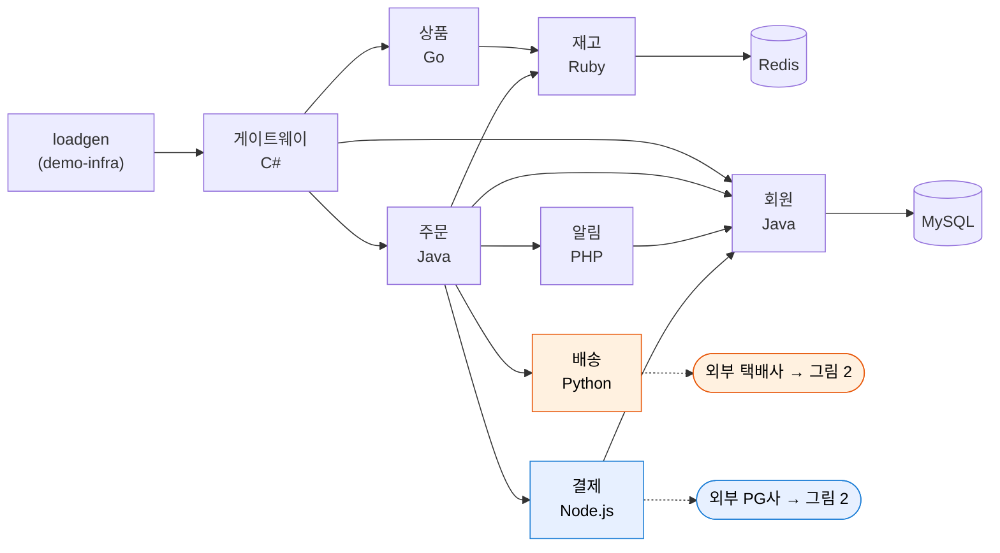
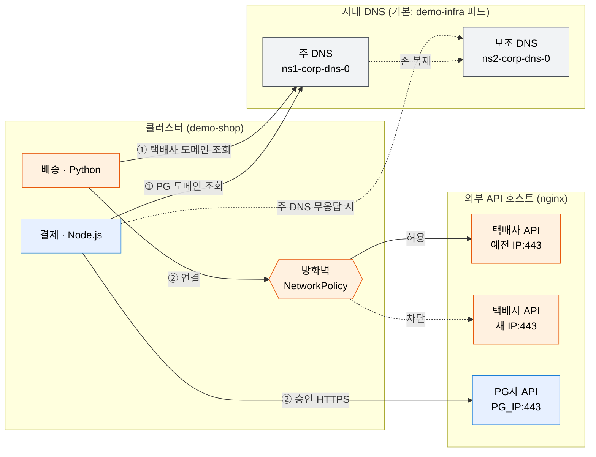
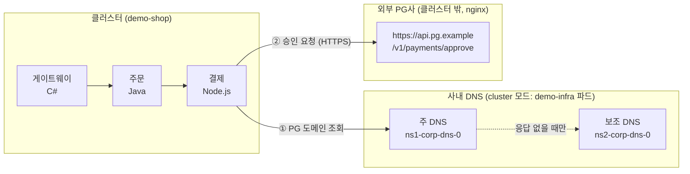

# eBPF 데모 — 쇼핑몰 배송 조회 실패 사건

> **"개발팀에 코드 수정을 요청하지 않고도 장애 원인을 찾을 수 있나?"**

앱 코드 수정도, 앱별 에이전트 설치도 하지 않은 **일곱 가지 언어로 된 여덟 서비스**에서
문제를 발견하고, 원인을 좁히고, 해결을 확인하는 데모 환경입니다.
서비스들은 실제 MSA 처럼 서로 여러 단계로 호출하며(최대 5단계), 모든 서비스가 요청을 받고 다른 서비스를 호출합니다.
데모 전체가 **배송 조회 실패 사건 하나**로 이어지며, 코드가 아니라 **네트워크**에서 생긴 문제라
eBPF 가 가장 잘 보여줄 수 있는 사건입니다. 화면에 나오는 모든 데이터는 eBPF 노드 에이전트 수집 결과입니다.

- **대상 환경: OpenShift(OCP) 4.12 이상 + OCP 내부 이미지 레지스트리**
- 모든 명령은 `./demo.sh <명령>` 하나로 실행합니다 (`make` 불필요, bash 만 있으면 됨)
- 촬영 순서·화면·멘트: **[docs/runbook.md](docs/runbook.md)**

---

## 목차

1. [사건 시나리오](#1-사건-시나리오)
2. [구성](#2-구성)
3. [전체 과정 한눈에 보기](#3-전체-과정-한눈에-보기)
4. [준비물](#4-준비물)
5. [설치 — 처음부터 끝까지](#5-설치--처음부터-끝까지)
6. [촬영 진행](#6-촬영-진행)
7. [코드를 바꾼 뒤 다시 반영하기 (git pull 이후)](#7-코드를-바꾼-뒤-다시-반영하기-git-pull-이후)
8. [명령어 레퍼런스](#8-명령어-레퍼런스)
9. [이미지 레지스트리 동작 방식](#9-이미지-레지스트리-동작-방식)
10. [데모 환경 조건과 구현](#10-데모-환경-조건과-구현)
11. [보안](#11-보안)
12. [문제 해결](#12-문제-해결)
13. [정리 (삭제)](#13-정리-삭제)
14. [부록: 로컬 스모크 테스트 · 외부 레지스트리 · 일반 쿠버네티스](#14-부록)

---

## 1. 사건 시나리오

가상 고객사 **"쇼핑몰"** 은 여덟 서비스를 운영합니다. 팀마다 언어도 모니터링 도구도 달라,
배송 서비스는 모니터링이 아예 없습니다.

| 서비스 | 언어 | 받는 요청 (누가 호출) | 보내는 요청 (무엇을 호출) |
| --- | --- | --- | --- |
| 게이트웨이 `gateway-service` | C# (.NET 8) | 사용자(loadgen) | 상품, 회원, 주문 |
| 회원 `member-service` | Java 21 | 게이트웨이, 주문, 결제, 알림 | MySQL |
| 상품 `product-service` | Go 1.22 | 게이트웨이 | 재고 |
| 재고 `inventory-service` | Ruby 3.3 | 상품, 주문 | Redis |
| 주문 `order-service` | Java 21 | 게이트웨이 | 회원, 재고, 결제, 알림, 배송 |
| 결제 `payment-service` | Node.js 20 | 주문 | 회원 (VIP 할인 확인), **외부 PG사**(승인) |
| 알림 `notification-service` | PHP 8.3 | 주문 | 회원 (연락처·등급 확인) |
| 배송 `delivery-service` | Python 3.12 | 주문 | 외부 택배사 API (HTTPS). **모니터링 없음** |

| 시각 | 사건 | 데모 | 명령 |
| --- | --- | --- | --- |
| 월요일 밤 | 외부 택배사가 API 서버 주소(IP)를 바꾼다. 도메인 이름은 그대로 | — | `./demo.sh incident` |
| 화요일 09:00 | "배송 조회가 자주 실패한다"는 문의. 배송팀 코드는 바뀐 것이 없다 | — | |
| 화요일 09:10 | 토폴로지 맵에서 택배사 API 로 가는 연결만 실패하는 것을 발견 | 데모 1 | |
| 화요일 09:20 | DNS 는 정상, 새 IP 로의 연결이 실패 → 방화벽에 새 IP 가 없음 | 데모 2, 3 | `./demo.sh firewall` |
| 화요일 09:40 | 방화벽 허용 후 실패 연결이 없어진 것 확인 | 데모 4 | `./demo.sh fix` |
| 다음 주 | 여덟 서비스를 같은 기준으로 보는 공통 대시보드로 표준화 | 데모 4 | |

외부 택배사·PG사 도메인은 클러스터 DNS 가 아니라 **사내 DNS(주·보조)** 로 조회합니다. 택배사가 IP 를 바꾼 것은
사내 DNS 의 택배사 레코드가 새 IP 로 바뀐 것으로 재현합니다 (`incident`). 사내 DNS 를 이용한 추가 시나리오
(사내 DNS 에 PG 도메인 없음 / 주 DNS 장애)는 [6-2](#6-2-추가-시나리오--외부-pg-도메인-dns-장애) 에 있습니다.

---

## 2. 구성

### 그림 1. 서비스 간 호출 (클러스터 안)


```mermaid
flowchart LR
  LG["loadgen<br/>(demo-infra)"] --> GW["게이트웨이<br/>C#"]
  GW --> PRD["상품<br/>Go"] --> INV["재고<br/>Ruby"] --> RD[("Redis")]
  GW --> MEM["회원<br/>Java"] --> DB[("MySQL")]
  GW --> ORD["주문<br/>Java"]
  ORD --> MEM
  ORD --> INV
  ORD --> NOTI["알림<br/>PHP"] --> MEM
  ORD --> DLV["배송<br/>Python"]
  DLV -.-> EXT1(["외부 택배사 → 그림 2"])
  ORD --> PAY["결제<br/>Node.js"]
  PAY --> MEM
  PAY -.-> EXT2(["외부 PG사 → 그림 2"])

  classDef courier fill:#fff1e0,stroke:#e8590c,color:#000
  classDef pg fill:#e7f0ff,stroke:#1c7ed6,color:#000
  class DLV,EXT1 courier
  class PAY,EXT2 pg
```

### 그림 2. 외부 연결 — 두 시나리오의 무대


```mermaid
flowchart LR
  subgraph K["클러스터 (demo-shop)"]
    DLV["배송 · Python"]
    PAY["결제 · Node.js"]
    FW{{"방화벽<br/>NetworkPolicy"}}
  end

  subgraph C["사내 DNS (기본: demo-infra 파드)"]
    D1["주 DNS<br/>ns1-corp-dns-0"]
    D2["보조 DNS<br/>ns2-corp-dns-0"]
  end

  subgraph N["외부 API 호스트 (nginx)"]
    COLD["택배사 API<br/>예전 IP:443"]
    CNEW["택배사 API<br/>새 IP:443"]
    PGAPI["PG사 API<br/>PG_IP:443"]
  end

  DLV -->|"① 택배사 도메인 조회"| D1
  PAY -->|"① PG 도메인 조회"| D1
  PAY -.->|"주 DNS 무응답 시"| D2
  D1 -.->|"존 복제"| D2

  DLV -->|"② 연결"| FW
  FW -->|"허용"| COLD
  FW -.->|"차단"| CNEW
  PAY -->|"② 승인 HTTPS"| PGAPI

  classDef courier fill:#fff1e0,stroke:#e8590c,color:#000
  classDef pg fill:#e7f0ff,stroke:#1c7ed6,color:#000
  classDef dns fill:#f1f3f5,stroke:#495057,color:#000
  class DLV,FW,COLD,CNEW courier
  class PAY,PGAPI pg
  class D1,D2 dns
```

주황 = **시나리오 ① 택배사 IP 변경 (본편)**, 파랑 = **시나리오 ② PG 도메인 DNS 장애 (추가)**, 회색 = 두 시나리오가 함께 쓰는 **사내 DNS**.

택배사 도메인과 PG 도메인은 모두 **사내 DNS 에 A 레코드**로 있습니다 (클러스터 DNS 를 거치지 않음). 배송 서비스도 결제 서비스처럼
주 DNS 가 응답하지 않으면 2초 뒤 보조 DNS 로 넘어갑니다 (그림에서는 결제 쪽만 표시).

| 시나리오 | 장애가 나는 서비스 | 도메인 조회 | 외부 목적지 | 장애를 만드는 장치 | 명령 |
| --- | --- | --- | --- | --- | --- |
| ① 택배사 IP 변경 | 배송 (Python) | **사내 DNS 주·보조** — 택배사 도메인 레코드 (`incident` 가 새 IP 로 바꿈) | nginx 의 택배사 API (예전 IP / 새 IP) | 방화벽(NetworkPolicy)에 새 IP 없음 | `incident` → `firewall` → `fix` |
| ② PG 도메인 DNS 장애 | 결제 (Node.js) | **사내 DNS 주·보조** — PG 도메인 레코드. 기본은 `demo-infra` 의 파드 `ns1-corp-dns-0`(주)·`ns2-corp-dns-0`(보조) | nginx 의 PG사 API (`PG_IP`) | 사내 DNS 에 새 PG 도메인 미등록 / 주 DNS 무응답 | `pg-missing` → `pg-register` / `pg-primary-down` |

### 사용자 요청별 호출 경로

loadgen 은 사용자 역할이라 게이트웨이만 호출합니다. 게이트웨이부터는 모든 서비스가 요청을 받고, 다른 서비스를 호출합니다.

| 사용자 요청 | 호출 경로 | 깊이 |
| --- | --- | --- |
| 체크아웃 `POST /api/checkout` | 게이트웨이 → 상품 → 재고 → Redis<br/>게이트웨이 → 주문 → 회원 → MySQL<br/>　　　　　　　　 → 재고 → Redis<br/>　　　　　　　　 → 결제 → 회원 → MySQL<br/>　　　　　　　　　　　 → **외부 PG사** (승인, 사내 DNS 로 조회)<br/>　　　　　　　　 → 알림 → 회원 → MySQL | 최대 5 |
| 배송 조회 `GET /api/orders/{id}/tracking` | 게이트웨이 → 주문 → 배송 → **외부 택배사 (HTTPS)** ← 데모 사건 경로 | 4 |
| 상품 보기 `GET /api/products/{id}` | 게이트웨이 → 상품 → 재고 → Redis | 4 |
| 회원 보기 `GET /api/members/{id}` | 게이트웨이 → 회원 → MySQL | 3 |

- 체크아웃 한 번에 서비스 간 HTTP 호출 8번 + 외부 PG 호출 1번 + DB 쿼리가 일어나, 연결선과 호출 수가 풍부하게 쌓입니다.
- 프로토콜도 여러 가지입니다: HTTP(서비스 간), MySQL, Redis(RESP), DNS(클러스터 DNS·사내 DNS), HTTPS(배송 → 택배사, 결제 → PG사).

### 애플리케이션 로그로 실패 지점 찾기

모든 서비스는 다른 곳을 호출하다 실패하면 **같은 형식의 로그 한 줄**을 남기고, 에러 응답에 **실패 경로(`errorPath`)** 를 담아
위로 돌려줍니다. 위 서비스는 받은 경로 앞에 자기 구간을 붙이므로, **가장 바깥(게이트웨이) 로그 한 줄에 실패 경로 전체가 보입니다.**

```
upstream call failed req=<요청 ID> target=<호출 대상> call="<메서드> <URL>" status=<응답 코드, 0=응답 없음> elapsedMs=<걸린 시간> path="<실패 경로>"
```

데모 사건(`incident`) 중 배송 조회 1건이 남기는 로그 (위에서 아래로 = 바깥에서 안쪽으로):

```
gateway-service  upstream call failed req=lg-3fa9c1d2e8b0 target=order-service call="GET http://order-service:8080/orders/1374/delivery" status=502 elapsedMs=5098
                 path="gateway-service → order-service[502] → delivery-service[503] → api.courier.example(10.0.0.62:443) [connect: timed out after 5.01s]"
order-service    upstream call failed req=lg-3fa9c1d2e8b0 target=delivery-service call="GET http://delivery-service:8080/deliveries/1374/tracking" status=503 elapsedMs=5059
                 path="order-service → delivery-service[503] → api.courier.example(10.0.0.62:443) [connect: timed out after 5.01s]"
delivery-service upstream call failed req=lg-3fa9c1d2e8b0 target=api.courier.example call="GET https://api.courier.example/v1/tracking/DX1512686139" ip=10.0.0.62 stage=connect elapsedMs=5006
                 path="delivery-service → api.courier.example(10.0.0.62:443) [connect: timed out after 5.01s]"
                 Traceback (most recent call last):
                   File "/app/app.py", line 84, in call_courier
                     raw = socket.create_connection((ip, COURIER_PORT), timeout=COURIER_TIMEOUT)
                   ...
                 TimeoutError: timed out
```

- `path` 의 `서비스[코드]` 는 그 서비스가 돌려준 HTTP 응답 코드, 마지막 `[…]` 는 실제로 실패한 원인입니다.
- **예외가 실제로 난 곳**(연결 타임아웃·연결 거부·DB 오류)은 스택 트레이스를 함께 남깁니다: Python(배송), Java(주문·회원), C#(게이트웨이), Ruby(재고), Node.js(결제).
- 요청 ID 는 loadgen 이 `lg-…` 로 붙이고(없으면 게이트웨이가 만듦) 모든 서비스가 다음 호출에 그대로 넘깁니다. `./demo.sh traffic` 에 요청 ID 가 찍히므로, 그 ID 로 서비스 로그를 검색하면 됩니다.
- `./demo.sh status` 도 배송 조회가 실패하면 `실패 경로: …` 한 줄을 보여줍니다.

다른 장애일 때 게이트웨이 로그의 실패 경로 (로컬에서 일부러 장애를 내어 확인한 실제 출력):

| 장애 | 게이트웨이 로그의 `path` |
| --- | --- |
| 택배사 새 IP 차단 (데모 사건) | `gateway-service → order-service[502] → delivery-service[503] → api.courier.example(10.0.0.62:443) [connect: timed out after 5.01s]` |
| MySQL 다운 | `gateway-service → order-service[502] → member-service[500] → mysql(mysql:3306) [CommunicationsException: Communications link failure]` |
| Redis 다운 | `gateway-service → order-service[502] → inventory-service[503] → redis(redis:6379) [redis unavailable: …]` |
| 결제 서비스 다운 | `gateway-service → order-service[504] → payment-service [HttpConnectTimeoutException: HTTP connect timed out after 2004ms]` |

요청 ID 하나로 서비스별 로그 모아 보기:

```bash
ID=lg-3fa9c1d2e8b0
for d in gateway-service order-service delivery-service; do echo "== $d"; oc -n demo-shop logs deploy/$d | grep -A8 "req=$ID"; done
```

> **eBPF 화면과의 관계**: 실패 경로·요청 ID 는 **애플리케이션 로그**의 기능입니다. eBPF 는 각 구간(게이트웨이→주문, 주문→배송 …)의
> 요청 수·지연·오류와 실패한 TCP 연결을 보여주지만, 서비스 여러 개를 거친 **요청 1건을 끝까지 잇는 추적(분산 트레이스)** 은
> eBPF 만으로 만들지 않습니다 — 이 편의 한계 장표 내용이며, OpenTelemetry 와 함께 쓰는 EP05 에서 다룹니다.
> 이 데모 대본은 eBPF 화면만으로 원인을 찾는 흐름이므로, 로그는 "코드를 고치지 않아도 eBPF 가 먼저 보여준다"를 뒷받침하는 확인용으로 씁니다.

| 구성 요소 | 무엇을 흉내 내나 | 구현 |
| --- | --- | --- |
| 여덟 서비스 + MySQL + Redis | 쇼핑몰 | `demo-shop` 네임스페이스. 모니터링 코드·에이전트 없음 |
| `loadgen` | 사용자 트래픽 | 게이트웨이로 체크아웃·배송 조회·둘러보기를 1초 간격으로 호출 (`demo-infra`) |
| `fw-*` NetworkPolicy | 사내 방화벽 | 배송 서비스의 나가는 연결 허용 목록. 택배사 예전 IP 만 허용 |
| 외부 API 호스트 (`courier-ext/`) | 외부 택배사 API + 외부 PG사 API | 클러스터 **밖** 리눅스 호스트의 nginx 1대(HTTPS). 요청 도메인(TLS SNI)으로 택배사·PG 를 구분해 응답. 택배사는 예전 IP·새 IP, PG 는 `PG_IP`(기본: 택배사 예전 IP) |
| 사내 DNS 주·보조 | 회사의 DNS 서버 2대 | 택배사 도메인(배송 서비스)과 PG 도메인(결제 서비스)을 답함. 택배사 레코드는 IP **1개**, `incident` 가 새 IP 로 바꿈. **cluster 모드(기본)**: `demo-infra` 의 CoreDNS 파드 `ns1-corp-dns-0`(주)·`ns2-corp-dns-0`(보조) / bastion 모드: `corpdns-ext/` 의 CoreDNS 컨테이너 2개 / corporate 모드: 실제 사내 DNS (예: BIND master·slave) — [5-5b](#5-5b-사내-dns-준비--pg-시나리오용) |

**장애가 나는 원리**: DNS 가 새 IP 를 돌려주면 배송 서비스가 새 IP 로 TCP 연결을 시도합니다.
방화벽(NetworkPolicy)이 SYN 을 조용히 버리므로 연결은 5초 뒤 타임아웃되고, 배송 서비스는 주문 서비스에 503,
주문 서비스는 게이트웨이에 502, 게이트웨이는 사용자에게 502 를 돌려줍니다. eBPF 는 이것을
**실패한 TCP 연결(목적지 = 새 IP:443)** 과 **약 5초 걸린 5xx HTTP 요청**(주문→배송, 게이트웨이→주문 구간)으로 봅니다.
체크아웃·상품·회원 요청은 배송과 무관하므로 장애 중에도 정상입니다.

**PG 시나리오의 원리**: 결제 서비스는 PG 도메인을 사내 주 DNS 에 먼저 묻습니다. 주 DNS 에 레코드가 없으면 **NXDOMAIN**(확정 답)을 받아
보조로 넘어가지 않고 곧바로 실패하고 → 결제 504 → 주문 502 → 게이트웨이 502 가 됩니다. 주 DNS 가 응답하지 않으면 2초 뒤 보조 DNS 로 넘어가
결제는 성공하지만 느려집니다. eBPF 는 이것을 결제 서비스 DNS 탭의 **NXDOMAIN 증가 / 조회 지연**과 체크아웃 5xx·지연으로 봅니다. 자세한 흐름은 [6-2](#6-2-추가-시나리오--외부-pg-도메인-dns-장애).

---

## 3. 전체 과정 한눈에 보기

명령을 실행하는 곳은 두 군데입니다.

- **[작업 PC]** — `oc`, `podman`, `git` 이 있고 OCP API 와 앱 route(`*.apps.<클러스터 도메인>`)에 접속되는 리눅스 (보통 bastion)
- **[택배사 호스트]** — 클러스터 밖 리눅스 서버 1대 (VM 가능)

| 단계 | 어디서 | 명령 | 빈도 |
| --- | --- | --- | --- |
| 5-1 저장소 받기 | 작업 PC | `git clone …` / `git pull` | 처음·업데이트 때 |
| 5-2 OCP 로그인 | 작업 PC | `oc login …` | 세션마다 |
| 5-3 설정 파일 | 작업 PC | `cp demo.env.example demo.env` → IP 2개 수정 | 처음 한 번 |
| 5-4 인증서 | 작업 PC | `./demo.sh certs` | 처음 한 번 |
| 5-5 택배사 호스트 | 택배사 호스트 | 보조 IP 추가 → `sudo ./run.sh up` | 처음 한 번 |
| 5-5b 사내 DNS (PG 시나리오) | bastion / 사내 DNS 서버 | **cluster 모드(기본): 준비 없음** — `deploy` 가 사내 DNS 파드를 만듦 (PG 용 nginx 는 5-5 에서 이미 뜸)<br/>bastion 모드: IP 2개 추가 → `./demo.sh certs` → `sudo ./courier-ext/run.sh up` → `sudo ./demo.sh corpdns up`<br/>corporate 모드: 사내 DNS 에 PG 레코드 등록 (또는 BIND 주·보조 직접 구성) → `./demo.sh certs` → `sudo ./courier-ext/run.sh up` | 처음 한 번 |
| 5-6 레지스트리 route | 작업 PC | `./demo.sh registry-route` | 클러스터당 한 번 |
| 5-7 사전 점검 | 작업 PC | `./demo.sh check` | 배포 전 |
| 5-8 이미지 push | 작업 PC | `./demo.sh push` | 처음·코드 변경 때 |
| 5-9 배포 | 작업 PC | `./demo.sh deploy` | 처음·매니페스트 변경 때 |
| 5-10 확인 | 작업 PC | `./demo.sh security` → `./demo.sh status` | 배포 후 |
| 5-11 정상 데이터 쌓기 | — | 몇 시간 이상 그대로 둠 | 촬영 전날 |
| 6 촬영 | 작업 PC | `incident` → `firewall` → `fix` → `reset` | 테이크마다 |

---

## 4. 준비물

### 클러스터

| 항목 | 조건 |
| --- | --- |
| OpenShift | **4.12 이상** (RHCOS 커널 5.14 → eBPF 조건 "커널 4.16 이상" 충족) |
| 네트워크 | 기본 CNI **OVN-Kubernetes** (NetworkPolicy 로 방화벽 차단을 흉내 냄) |
| 내부 이미지 레지스트리 | 활성화 상태 (`oc get co image-registry` 가 Available). default route 는 5-6 에서 엽니다 |
| 외부 이미지 pull | 노드가 `docker.io`, `quay.io`, `registry.k8s.io` 에서 pull 가능해야 함 (부하 발생기·DNS·MySQL·Redis 이미지). 폐쇄망이면 [12. 문제 해결](#12-문제-해결) 참고 |
| Observ 노드 에이전트 | 설치 완료, **ClickHouse 와 노드 에이전트의 traces endpoint 설정 필수** (없으면 T-Map·트랜잭션 조회가 비어 있음). OpenTelemetry 에이전트·SDK 는 설치하지 않음 |
| 계정 권한 | **cluster-admin 권장**. 필요 권한: 네임스페이스 생성, 노드 조회(점검), 레지스트리 설정 변경(5-6, 한 번). cluster-admin 이 아니면 5-6 만 관리자에게 요청 |

### 작업 PC (bastion)

| 도구 | 확인 명령 | 설치 (RHEL 8/9) |
| --- | --- | --- |
| `oc` | `oc version --client` | OCP 콘솔 우측 상단 `?` → Command line tools, 또는 mirror.openshift.com 의 `openshift-client-linux.tar.gz` |
| `podman` 4.x 이상 | `podman --version` | `sudo dnf install -y podman` |
| `git` | `git --version` | `sudo dnf install -y git` |
| `openssl` | `openssl version` | `sudo dnf install -y openssl` |
| `bash` 4 이상 | `bash --version` | 기본 설치 |

- 작업 PC 아키텍처와 클러스터 노드 아키텍처가 같아야 빌드가 빠릅니다 (보통 둘 다 x86_64 → `PLATFORM=linux/amd64`).
- 작업 PC 는 빌드 중 베이스 이미지·패키지를 받습니다: `docker.io`, `gcr.io`, `mcr.microsoft.com`(.NET), `repo.maven.apache.org`(Java), `rubygems.org`(Ruby WEBrick), `api.nuget.org`(.NET).

### 택배사 호스트

| 항목 | 조건 |
| --- | --- |
| 서버 | 클러스터 **밖** 리눅스 1대 (VM 가능, RHEL·Ubuntu 등) |
| IP | **2개** — 기본 IP(= 예전 IP) + 보조 IP(= 새 IP). 클러스터 노드에서 두 IP 의 443 으로 연결 가능해야 함 |
| 컨테이너 | `podman` 또는 `docker` |
| 포트 | 443/TCP 열림 |

택배사 호스트의 nginx 는 **외부 PG사 API 도 함께 응답**합니다 (TLS SNI 로 구분). PG 도메인은 `PG_IP`(기본: 택배사 예전 IP)를 가리킵니다.

### 사내 DNS (추가 시나리오용)

결제 서비스는 PG 도메인을 **사내 DNS(주·보조)** 에 직접 물어봅니다. 세 가지 중 하나로 준비합니다 (`CORP_DNS_MODE`).

| 모드 | 사내 DNS | 시나리오 재현 방법 | 준비 |
| --- | --- | --- | --- |
| `cluster` (기본) | `demo-infra` 네임스페이스의 CoreDNS 파드 2개 — 주 `ns1-corp-dns-0`, 보조 `ns2-corp-dns-0` | 레코드를 실제로 지우고, 주 DNS 로 들어오는 질의를 NetworkPolicy 로 버린다. **파드 로그로 주 → 보조 전환이 보인다** | 없음 (`deploy` 가 만들고 주소도 자동) |
| `bastion` | 이 저장소의 `corpdns-ext/` 로 bastion 에 주·보조 DNS 2대 (CoreDNS 컨테이너) | 레코드를 실제로 지우고, 주 DNS 를 실제로 멈춘다 | bastion 에 IP 2개 추가, 53/udp 비어 있어야 함 |
| `corporate` | 실제 사내 DNS 서버 2대 | 사내 DNS 는 건드리지 않는다. 등록 안 된 새 PG 도메인으로 교체 / 주 DNS 로 가는 패킷 차단(NetworkPolicy) | 사내 DNS 에 `PG_DOMAIN → PG_IP`, `COURIER_DOMAIN → 예전 IP` A 레코드 등록, 노드 → 사내 DNS 53/udp 허용. `incident`·`reset` 때 택배사 레코드를 담당자가 바꿔야 함 |

> **예전 IP·새 IP 고르기**: 택배사 호스트의 현재 IP 를 예전 IP 로, 같은 서브넷에서 비어 있는 IP 하나를 새 IP 로
> 정하면 됩니다. 네트워크 담당자에게 사용 가능한 IP 를 확인하세요.

---

## 5. 설치 — 처음부터 끝까지

### 5-1. 저장소 받기 **[작업 PC]**

처음:

```bash
git clone https://github.com/beomzh/demo-ebpf-shop.git
cd demo-ebpf-shop
```

이미 받아 두었다면:

```bash
cd demo-ebpf-shop
git pull
```

실행 권한 확인 (zip 으로 받았거나 권한이 빠졌을 때만):

```bash
chmod +x demo.sh scripts/*.sh courier-ext/*.sh
./demo.sh help
```

### 5-2. OpenShift 로그인 **[작업 PC]**

```bash
oc login -u <사용자> https://api.<클러스터 도메인>:6443
oc whoami          # 사용자 이름이 나와야 함
oc whoami -t       # sha256~ 로 시작하는 토큰이 나와야 함 (이미지 push 에 사용)
```

- 반드시 **사용자/비밀번호(또는 토큰)로 로그인**하세요. `system:admin` kubeconfig(인증서 로그인)는 토큰이 없어 이미지 push 가 되지 않습니다.
  kubeadmin 을 쓴다면 `oc login -u kubeadmin -p <비밀번호> https://api...:6443`
- API 인증서가 사설이면 `--insecure-skip-tls-verify=true` 를 붙입니다.

### 5-3. 설정 파일 만들기 **[작업 PC]**

```bash
cp demo.env.example demo.env
vi demo.env
```

**보통은 IP 두 개만 바꾸면 됩니다.**

```bash
COURIER_OLD_IP=10.0.0.61     # 택배사 호스트의 기본 IP
COURIER_NEW_IP=10.0.0.62     # 택배사 호스트에 새로 붙일 보조 IP
```

나머지 값(기본값 그대로 두면 됨):

| 변수 | 기본값 | 설명 |
| --- | --- | --- |
| `COURIER_DOMAIN` | `api.courier.example` | 가상 택배사 도메인. **공인 DNS 등록 불필요** (사내 DNS 에 A 레코드로 둠 — cluster·bastion 모드는 자동 등록). 바꾸려면 5-4 전에 바꿀 것 |
| `CLI` | `auto` | `oc` 가 있으면 `oc`, 없으면 `kubectl` |
| `REGISTRY_MODE` | `ocp-internal` | OCP 내부 레지스트리 사용 ([9. 동작 방식](#9-이미지-레지스트리-동작-방식)) |
| `TAG` | `1.0.0` | 이미지 태그 |
| `CONTAINER_ENGINE` | `auto` | `podman` 우선, 없으면 `docker` |
| `REGISTRY_TLS_VERIFY` | `false` | default route 인증서 검증. OCP 기본 인그레스 인증서는 보통 사설이라 `false` |
| `PLATFORM` | `linux/amd64` | 클러스터 노드 아키텍처 |
| `PG_DOMAIN` | `api.pg.example` | 외부 PG사 도메인 (공인 DNS 등록 불필요) |
| `PG_IP` | (비움 = `COURIER_OLD_IP`) | PG 도메인이 가리킬 IP. 택배사 호스트 nginx 가 PG 도 응답 |
| `CORP_DNS_MODE` | `cluster` | `cluster`(사내 DNS 를 파드로 띄움), `bastion`(bastion 에 컨테이너로 띄움), `corporate`(실제 사내 DNS) |
| `CORP_DNS_PRIMARY` / `CORP_DNS_SECONDARY` | `10.0.0.63` / `10.0.0.64` | 사내 DNS 주·보조 IP. **bastion·corporate 모드에서만** (cluster 모드는 서비스 ClusterIP 를 자동으로 씀) |
| `PG_UNREGISTERED_DOMAIN` | `api-new.pg.example` | corporate 모드의 "레코드 없음" 재현에 쓸 이름. **PG 도메인과 같은 존 안의, 사내 DNS 에 없는 이름** |
| `LOADGEN_REPLICAS` | `1` | 부하 발생기 파드 수 (파드 1개 = 초당 체크아웃·배송 조회·둘러보기 각 1건) — [6-1](#6-1-요청량-늘리기) |
| `LOADGEN_*_INTERVAL` | `1` | 파드 하나의 요청 간격(초) |

### 5-4. 택배사 인증서 만들기 **[작업 PC]**

```bash
./demo.sh certs
ls courier-ext/certs/     # ca.crt  ca.key  courier.crt  courier.key
```

- `ca.crt` 는 5-9 에서 클러스터에 시크릿으로 올라가고, 배송 서비스가 택배사 인증서를 검증하는 데 씁니다.
- `courier.crt`, `courier.key` 는 택배사 호스트의 nginx 가 씁니다.
- 이 디렉터리는 git 에 올라가지 않습니다(`.gitignore`). 개인키는 권한 600.

### 5-5. 택배사 호스트 준비 **[택배사 호스트]**

① 작업 PC 에서 `courier-ext` 디렉터리를 통째로 복사합니다 (인증서 포함):

```bash
# [작업 PC]
scp -r courier-ext <사용자>@<택배사 호스트>:~/
```

② 택배사 호스트에서:

```bash
cd ~/courier-ext
ip -4 -brief addr                                 # NIC 이름과 기본 IP(= COURIER_OLD_IP) 확인
sudo ./setup-ips.sh add <NIC> <COURIER_NEW_IP>/<prefix>   # 예) sudo ./setup-ips.sh add eth0 10.0.0.62/24
sudo ./run.sh up                                  # nginx 기동 (podman 우선, 없으면 docker)
```

③ 방화벽이 **켜져 있을 때만** 443 을 엽니다 (`systemctl is-active firewalld` 가 `active` 일 때).
꺼져(`inactive`) 있으면 **켜지 마세요** — 그 호스트에서 돌던 다른 서비스 포트가 막힐 수 있습니다.

```bash
sudo firewall-cmd --add-service=https --permanent && sudo firewall-cmd --reload   # RHEL
# sudo ufw allow 443/tcp                                                           # Ubuntu
```

④ 두 IP 모두 응답하는지 확인합니다:

```bash
curl -sk --resolve api.courier.example:443:<COURIER_OLD_IP> https://api.courier.example/v1/tracking/T1
curl -sk --resolve api.courier.example:443:<COURIER_NEW_IP> https://api.courier.example/v1/tracking/T1
# {"trackingNo":"T1",...,"served_by":"<접속한 IP>"}
```

참고:

- 443 은 특권 포트라 `sudo` 로 실행합니다 (rootless podman 은 443 바인딩 불가).
- `run.sh` 는 SELinux 라벨(`:Z`)을 붙여 볼륨을 마운트하므로 RHEL 에서도 인증서를 읽을 수 있습니다.
- `ip addr` 로 붙인 보조 IP 는 **재부팅하면 사라집니다**. 촬영 기간 동안 유지하려면 `nmcli` 로 영구 설정하세요:
  `sudo nmcli con mod <연결이름> +ipv4.addresses 10.0.0.62/24 && sudo nmcli con up <연결이름>`
- 기타: `sudo ./run.sh status | logs | down`

#### 443 을 이미 다른 프로그램이 쓰고 있을 때

택배사 호스트로 bastion 처럼 다른 서비스가 도는 서버를 쓰면, haproxy·nginx·httpd 등이 이미 443 을 쓰고 있을 수 있습니다.
택배사 nginx 는 **택배사 IP 2개의 443 만** 써야 하고, 기존 프로그램은 **자기 IP 의 443 만** 쓰도록 나눕니다.

**1. 누가 443 을 어떻게 쓰는지 확인**

```bash
sudo ss -ltnp | grep ':443 '
```

| 출력 | 의미 | 할 일 |
| --- | --- | --- |
| 아무것도 없음 | 443 이 비어 있음 | 위 ②~④ 그대로 진행 |
| `10.0.0.50:443 … ("haproxy",…)` 처럼 **특정 IP** | 그 IP 만 쓰는 중 | 기존 프로그램은 그대로. 택배사용 IP 2개를 **새로** 붙이고 아래 3~4 진행 |
| `0.0.0.0:443` 또는 `*:443` | **모든 IP** 의 443 을 쓰는 중 → 택배사 nginx 가 뜰 수 없음 | 아래 2 로 기존 프로그램의 bind 를 자기 IP 로 좁힌 뒤 3~4 진행 |

**2. 기존 프로그램의 443 을 자기 IP 로 좁히기** (예: bastion 의 haproxy)

예시 환경:

| 항목 | 값 |
| --- | --- |
| bastion 기존 IP (`*.apps` 인그레스가 들어오는 IP) | `10.0.0.50` |
| 택배사 예전 IP (`COURIER_OLD_IP`) — 새로 붙임 | `10.0.0.61` |
| 택배사 새 IP (`COURIER_NEW_IP`) — 새로 붙임 | `10.0.0.62` |
| NIC / prefix | `ens192` / `/24` |

`*.apps` 가 어느 IP 로 들어오는지 먼저 확인합니다 (그 IP 가 기존 프로그램이 계속 받아야 하는 IP):

```bash
getent hosts console-openshift-console.apps.<클러스터 도메인>
# 10.0.0.50  console-openshift-console.apps.<클러스터 도메인> ...
```

haproxy 설정 변경 — **백업 → 수정 → 검증 → 재시작 → 확인** 순서로 합니다:

```bash
sudo cp -a /etc/haproxy/haproxy.cfg /etc/haproxy/haproxy.cfg.bak-demo
sudo grep -nE '^\s*(frontend|bind)' /etc/haproxy/haproxy.cfg      # bind *:443 위치 확인
sudo sed -i 's|^\(\s*\)bind \*:443\s*$|\1bind 10.0.0.50:443|' /etc/haproxy/haproxy.cfg
sudo grep -n -A3 'frontend ingress-https' /etc/haproxy/haproxy.cfg   # bind 10.0.0.50:443 로 바뀌었는지
sudo haproxy -c -f /etc/haproxy/haproxy.cfg                          # 'Configuration file is valid' 또는 Warnings 만
sudo systemctl restart haproxy                                        # 1~2초 API·콘솔 끊김
sudo ss -ltnp | grep ':443 '                                          # 10.0.0.50:443 만 보여야 함
curl -sk -o /dev/null -w '%{http_code}\n' https://console-openshift-console.apps.<클러스터 도메인>/   # 200
oc get co ingress console                                              # AVAILABLE True
```

- 80, 6443, 22623 등 **443 외 포트는 건드리지 않습니다.**
- 문제가 생기면 즉시 되돌립니다:
  `sudo cp -a /etc/haproxy/haproxy.cfg.bak-demo /etc/haproxy/haproxy.cfg && sudo systemctl restart haproxy`

haproxy 가 아닌 경우도 같은 방식입니다:

| 프로그램 | 설정 파일 (보통) | 바꿀 줄 |
| --- | --- | --- |
| haproxy | `/etc/haproxy/haproxy.cfg` | `bind *:443` → `bind 10.0.0.50:443` |
| nginx | `/etc/nginx/nginx.conf`, `/etc/nginx/conf.d/*.conf` | `listen 443 ssl;` → `listen 10.0.0.50:443 ssl;` (모든 server 블록) |
| Apache httpd | `/etc/httpd/conf.d/ssl.conf` | `Listen 443 https` → `Listen 10.0.0.50:443 https` |
| 컨테이너 (`-p 443:443`) | 실행 명령 | `-p 443:443` → `-p 10.0.0.50:443:443` 로 다시 실행 |

변경 후 각각 설정 검증(`nginx -t`, `apachectl configtest`) → 재시작 → `ss -ltnp | grep ':443 '` 로 확인합니다.

**3. 택배사 IP 2개 붙이기**

같은 대역에서 **아무도 안 쓰는 IP** 2개를 고릅니다 (노드 IP 와 겹치지 않는지 `oc get nodes -o wide`, 응답 없는지 `ping`):

```bash
ping -c 2 -W 1 10.0.0.61; ping -c 2 -W 1 10.0.0.62      # 100% packet loss 여야 함
sudo ./courier-ext/setup-ips.sh add ens192 10.0.0.61/24
sudo ./courier-ext/setup-ips.sh add ens192 10.0.0.62/24
ip -4 -brief addr show ens192
# ens192  UP  10.0.0.50/24 10.0.0.61/24 10.0.0.62/24
```

`demo.env` 에 두 IP 를 넣습니다:

```bash
COURIER_OLD_IP=10.0.0.61
COURIER_NEW_IP=10.0.0.62
```

**4. 택배사 nginx 를 두 IP 에서만 띄우기**

`run.sh` 는 nginx 가 받을 IP 를 이렇게 정합니다:

1. `LISTEN_IPS` 환경변수가 있으면 그 IP 들
2. 없으면 같은 저장소의 `demo.env` 에 있는 `COURIER_OLD_IP`, `COURIER_NEW_IP` (작업 PC = 택배사 호스트일 때)
3. 둘 다 없으면 모든 IP (`0.0.0.0:443`)

```bash
# 저장소 안에서 실행 (demo.env 를 읽음)
sudo ./courier-ext/run.sh up
# listen: 10.0.0.61:443, 10.0.0.62:443
# [podman] courier-api started.

# courier-ext 만 복사해 온 다른 서버라면 IP 를 직접 지정
sudo LISTEN_IPS="10.0.0.61 10.0.0.62" ./run.sh up
```

확인 — 기존 프로그램과 택배사 nginx 가 443 을 나눠 쓰는지:

```bash
sudo ss -ltnp | grep ':443 '
# 10.0.0.50:443   haproxy
# 10.0.0.61:443   nginx
# 10.0.0.62:443   nginx
curl -sk --resolve api.courier.example:443:10.0.0.61 https://api.courier.example/v1/tracking/T1   # served_by 10.0.0.61
curl -sk --resolve api.courier.example:443:10.0.0.62 https://api.courier.example/v1/tracking/T1   # served_by 10.0.0.62
```

지정한 IP 가 호스트에 붙어 있지 않으면 `run.sh` 가 `ERROR: … 가 이 호스트에 없습니다` 로 멈춥니다 (3 을 먼저 할 것).

### 5-5b. 사내 DNS 준비 — PG 시나리오용

#### cluster 모드 (`CORP_DNS_MODE=cluster`, 기본) — 준비할 것 없음

사내 DNS 주·보조를 `demo-infra` 네임스페이스에 **파드로** 띄웁니다. `./demo.sh deploy` 가 알아서 만들고,
결제 서비스에는 두 서비스의 ClusterIP 가 `PG_DNS_SERVERS=ns1-corp-dns=<IP>,ns2-corp-dns=<IP>` 로 들어갑니다.
bastion 에 IP 를 붙이거나 53 포트를 비울 필요가 없습니다. PG 용 nginx 는 5-5 에서 띄운 외부 API 호스트의 nginx 를 그대로 씁니다.

| 리소스 (`demo-infra`) | 역할 |
| --- | --- |
| 파드 `ns1-corp-dns-0` / 서비스 `ns1-corp-dns` | **주 DNS** — 결제 서비스가 먼저 묻는 서버 |
| 파드 `ns2-corp-dns-0` / 서비스 `ns2-corp-dns` | **보조 DNS** — 주 DNS 가 응답하지 않을 때 묻는 서버 |
| ConfigMap `corp-dns-zone` | 두 서버가 함께 읽는 존 (= 주 → 보조 존 복제가 끝난 상태). 처음 레코드: PG 도메인 → `PG_IP`, 택배사 도메인 → 예전 IP. `incident`/`reset` 과 `corpdns record-add/remove` 가 바꿈 (약 3초 안에 반영) |
| NetworkPolicy `allow-corp-dns-primary-from-payment` / `…-secondary-…` | `demo-infra` 는 인바운드 기본 차단이라 결제 서비스 → 주·보조 DNS 를 서버별로 허용. **`pg-primary-down` 은 주 DNS 쪽 허용 정책을 지웁니다** → 결제 서비스의 주 DNS 질의가 버려짐 (파드는 살아 있음) |
| NetworkPolicy `allow-corp-dns-from-delivery` | 배송 서비스 → 주·보조 DNS 허용 (택배사 도메인 조회). `pg-primary-down` 과 무관 → PG 시나리오 중에도 배송은 영향 없음 |

배포 후 확인:

```bash
./demo.sh corpdns status
# POD              ROLE        STATUS    POD-IP        NODE
# ns1-corp-dns-0   primary     Running   10.128.2.15   worker-1
# ns2-corp-dns-0   secondary   Running   10.131.0.22   worker-2
# 서비스: 주 ns1-corp-dns 172.30.0.10, 보조 ns2-corp-dns 172.30.0.11
# 등록된 레코드:
#   api.pg.example → 10.0.0.61

./demo.sh pg-status          # 두 서버 모두 api.pg.example → PG_IP, 체크아웃 201
./demo.sh corpdns logs       # 두 서버의 질의 로그를 한 화면에 (Ctrl+C 로 종료)
```

bastion 모드·corporate 모드에서 쓰던 `demo.env` 라면 `CORP_DNS_MODE=cluster` 로 바꾸고 `./demo.sh push`(결제 서비스 이미지 갱신) → `./demo.sh deploy` 하면 됩니다.
bastion 의 `corp-dns-*` 컨테이너와 사내 DNS 용 IP(`.63`·`.64`)는 더 이상 필요 없습니다 (`sudo ./corpdns-ext/run.sh down`).

#### bastion 모드 (`CORP_DNS_MODE=bastion`) **[bastion]** — 클러스터 밖에 사내 DNS 를 두고 싶을 때

bastion 에 IP 2개를 더 붙이고, 그 두 IP 의 53 에서만 받는 주·보조 DNS 를 띄웁니다.

① 53 을 이미 쓰는 프로그램이 있는지 확인합니다. `0.0.0.0:53`·`*:53` 으로 모든 IP 를 잡고 있으면 먼저 정리해야 합니다
(5-5 의 "443 을 이미 다른 프로그램이 쓰고 있을 때"와 같은 방법 — 그 프로그램을 자기 IP 로 좁히기). `127.0.0.53:53`(systemd-resolved) 처럼 특정 IP 만 쓰면 괜찮습니다.

```bash
sudo ss -lunp | grep ':53 '
```

② 빈 IP 2개를 골라 붙이고 `demo.env` 에 넣습니다 (예: `10.0.0.63`, `10.0.0.64`, NIC/prefix 는 호스트에 맞게):

```bash
ping -c 2 -W 1 10.0.0.63; ping -c 2 -W 1 10.0.0.64     # 100% packet loss 여야 함
sudo ./courier-ext/setup-ips.sh add ens192 10.0.0.63/24
sudo ./courier-ext/setup-ips.sh add ens192 10.0.0.64/24
sed -i 's/^CORP_DNS_PRIMARY=.*/CORP_DNS_PRIMARY=10.0.0.63/; s/^CORP_DNS_SECONDARY=.*/CORP_DNS_SECONDARY=10.0.0.64/' demo.env
```

③ PG 인증서를 만들고(이미 있으면 건너뜀) 외부 API nginx 를 새 설정으로 다시 띄운 뒤, 사내 DNS 를 띄웁니다:

```bash
./demo.sh certs                 # pg.crt 발급 (기존 CA·택배사 인증서는 그대로)
sudo ./courier-ext/run.sh up    # nginx 재기동 — 택배사 + PG 서버 블록
sudo ./demo.sh corpdns up       # 주·보조 DNS 기동
# corp-dns-primary   Up ...
# corp-dns-secondary Up ...
# 사내 DNS: primary 10.0.0.63, secondary 10.0.0.64  |  api.pg.example → 10.0.0.61
```

④ 확인 (bastion 에 `dig` 가 없으면 `sudo dnf install -y bind-utils`):

```bash
dig +short @10.0.0.63 api.pg.example          # 10.0.0.61
dig +short @10.0.0.64 api.pg.example          # 10.0.0.61
dig @10.0.0.63 nothing.example | grep status  # NXDOMAIN — 없는 이름에는 권한 있는 NXDOMAIN
curl -sk --resolve api.pg.example:443:10.0.0.61 https://api.pg.example/health   # ok
```

- 두 IP 는 재부팅하면 사라지므로 촬영 기간 동안은 `nmcli` 로 영구 설정하세요 (5-5 참고). 재부팅 후 `sudo ./demo.sh corpdns up` 다시 실행.
- 존 파일·Corefile 은 `corpdns-ext/.rendered/` 에 만들어집니다 (git 에 올라가지 않음). 질의 로그: `sudo ./demo.sh corpdns logs primary`

#### 53 을 bastion 의 named(BIND) 가 쓰는 경우

bastion 이 클러스터용 DNS 로 `named` 를 돌리고 있으면, 기본 설정(`listen-on port 53 { any; };`)에서는
**호스트에 IP 를 새로 붙이는 순간 `named` 가 그 IP 의 53 까지 자동으로 잡습니다.** 이 상태에서 `./demo.sh corpdns up` 은 이렇게 멈춥니다:

```
ERROR: 10.0.0.63:53 을 이미 다른 프로세스가 쓰고 있습니다: users:(("named",pid=8318,fd=176))
       bastion 의 named(BIND) 는 listen-on 이 any 면 새로 붙인 IP 의 53 도 자동으로 잡습니다.
```

`named` 가 **원래 응답하던 IP 만** 듣도록 좁히면 됩니다 (데모용 IP 는 빼고).

```bash
sudo ss -lunp | grep ':53 ' | awk '{print $4}' | sort -u     # named 가 지금 잡은 IP 목록
sudo grep -n "listen-on" /etc/named.conf                       # 예: listen-on port 53 { any; };
sudo cp -a /etc/named.conf /etc/named.conf.bak-demo
sudo vi /etc/named.conf
#   listen-on port 53 { any; };
#     →  listen-on port 53 { 127.0.0.1; 10.0.0.50; 172.17.0.1; 172.18.0.1; };
#        (위 목록에서 데모용 IP — 택배사 .61/.62, 사내 DNS .63/.64 — 만 뺀 나머지)
sudo named-checkconf && sudo rndc reconfig                      # 설정 다시 읽기 (named 재시작 없이)
sudo ss -lunp | grep ':53 '                                     # 데모용 IP 가 목록에서 빠졌는지
dig +short @10.0.0.50 <평소 조회하던 이름>                        # 기존 DNS 정상인지
sudo ./demo.sh corpdns up
```

- `rndc reconfig` 후에도 데모용 IP 가 남아 있으면 `sudo systemctl restart named` (1~2초 DNS 중단 — 클러스터가 이 DNS 를 쓰면 짧게 영향).
- 되돌리기: `sudo cp -a /etc/named.conf.bak-demo /etc/named.conf && sudo rndc reconfig`
- dnsmasq 라면 `/etc/dnsmasq.conf` 에 `bind-interfaces` + `listen-address=<원래 IP>` 로 같은 효과를 냅니다.

#### corporate 모드 (`CORP_DNS_MODE=corporate`) — 실제 사내 DNS 사용

실제 사내 DNS 서버로 시연합니다. 이 저장소의 `corpdns-ext`, 사내 DNS 용 IP 2개 추가, named `listen-on` 조정은 **필요 없습니다.**

예시 구성 (IP 는 예시):

| 역할 | 서버 | 비고 |
| --- | --- | --- |
| 작업 PC · 외부 API nginx (택배사·PG) | bastion `10.0.0.100` + 보조 IP `10.0.0.61`·`10.0.0.62` | `./courier-ext/run.sh up` 을 **이 한 서버에서만** |
| 사내 주 DNS | `10.0.0.50` (BIND master) | `CORP_DNS_PRIMARY` |
| 사내 보조 DNS | `10.0.0.100` (bastion 의 named, slave) | `CORP_DNS_SECONDARY` |

`demo.env`:

```bash
CORP_DNS_MODE=corporate
CORP_DNS_PRIMARY=10.0.0.50
CORP_DNS_SECONDARY=10.0.0.100
PG_DOMAIN=api.pg.example
PG_IP=                                  # 비우면 COURIER_OLD_IP(10.0.0.61) — nginx 가 듣는 IP 여야 함
PG_UNREGISTERED_DOMAIN=api-new.pg.example
```

- **`PG_IP` 는 nginx 가 듣는 IP 여야 합니다.** 다른 서비스가 쓰는 IP(예: ingress 가 쓰는 bastion 기본 IP)를 넣으면 `check` 가 `HTTP 404` 로 실패합니다.
- **`PG_UNREGISTERED_DOMAIN` 은 PG 도메인과 같은 존 안의 없는 이름**으로 둡니다 (`api-new.pg.example`). 존을 가진 DNS 가 직접 NXDOMAIN 을 답하므로,
  DNS 서버의 재귀·전달(forwarders) 설정과 상관없이 확실하게 "레코드 없음"이 재현됩니다. 다른 존의 이름을 쓰면 서버 설정에 따라 `SERVFAIL`·`REFUSED` 가 나와
  "레코드 없음" 대신 "보조 DNS 로 넘어감" 로그가 찍힐 수 있습니다.
- **`.local` 도메인은 피하세요.** mDNS 전용 예약 이름이라 `dig` 가 경고를 내고, 사내 DNS 정책상 등록이 거부될 수 있습니다. 사내 내부 도메인 아래 이름(예: `pg.demo.<사내 도메인>`)이 가장 무난합니다.

##### A) 사내 DNS 담당자에게 요청하는 경우

| 요청 | 내용 |
| --- | --- |
| A 레코드 | `PG_DOMAIN → PG_IP` (예: `api.pg.example → 10.0.0.61`), `COURIER_DOMAIN → COURIER_OLD_IP` (예: `api.courier.example → 10.0.0.61`). 주·보조 모두 반영 |
| 촬영 중 변경 | 택배사 레코드를 `incident` 때 새 IP(`COURIER_NEW_IP`)로, `reset` 때 예전 IP 로 — 스크립트가 바뀔 때까지 기다림 |
| TTL | 짧게 (5~60초) — 레코드 삭제로 시연할 때 빨리 반영되게 |
| 등록하지 않기 | `PG_UNREGISTERED_DOMAIN` |
| 질의 허용 | 클러스터 **노드 IP** 대역에서 53/udp·tcp (파드가 밖으로 나갈 때 출발지가 노드 IP 로 바뀜) |

##### B) BIND 로 주·보조를 직접 구성하는 경우

주 DNS(master)에서 존을 관리하고, 보조 DNS(slave)가 자동으로 복제합니다. 실제 사내 DNS 와 같은 구조라 "주 DNS 장애 → 보조 응답"이 그대로 재현됩니다.
아래는 PG 존(`pg.example`) 예시이고, **택배사 도메인도 같은 방식으로 `courier.example` 존**(`api  IN A  <COURIER_OLD_IP>`)을 주·보조에 추가합니다.

**주 DNS (`10.0.0.50`)**

```bash
sudo ss -lunp | grep ':53 '            # 다른 DNS(dnsmasq 등)가 53 을 쓰고 있지 않은지
sudo dnf install -y bind bind-utils     # named 가 없을 때만
sudo cp -a /etc/named.conf /etc/named.conf.bak-pg
sudo vi /etc/named.conf
```

`options` 안 (RHEL 기본값은 127.0.0.1·localhost 만 허용하므로 바꿔야 함):

```
listen-on port 53 { 127.0.0.1; 10.0.0.50; };    # 이미 { any; } 면 그대로
allow-query     { any; };                        # 또는 클러스터 노드 대역
allow-transfer  { 10.0.0.100; };                 # 보조 DNS 만 복제 허용
```

파일 맨 아래:

```
zone "pg.example" IN {
    type master;
    file "pg.example.zone";
    notify yes;
    also-notify { 10.0.0.100; };
};
```

`/var/named/pg.example.zone`:

```
$TTL 5
@      IN SOA ns1.pg.example. admin.pg.example. ( 2026092801 60 60 600 5 )
@      IN NS  ns1.pg.example.
@      IN NS  ns2.pg.example.
ns1    IN A   10.0.0.50
ns2    IN A   10.0.0.100
api    IN A   10.0.0.61
```

```bash
sudo chown root:named /var/named/pg.example.zone
systemctl is-active firewalld && sudo firewall-cmd --add-service=dns --permanent && sudo firewall-cmd --reload
sudo named-checkconf && sudo named-checkzone pg.example /var/named/pg.example.zone
sudo systemctl enable --now named
sudo rndc reload                       # ← named 가 이미 돌고 있었다면 이것으로 새 설정·존을 읽힘
sudo rndc zonestatus pg.example        # serial: 2026092801 이 보이면 로드됨
dig +short @10.0.0.50 api.pg.example   # 10.0.0.61
```

> **`systemctl enable --now named` 만으로는 반영되지 않을 수 있습니다.** 이미 실행 중인 named 는 다시 시작하지 않기 때문입니다.
> 결과가 비어 있으면 `sudo rndc reload`(안 되면 `sudo systemctl restart named`), 원인은 `journalctl -u named --since "5 min ago"`.
> `forwarders`·`forward only` 가 설정돼 있어도, 직접 가진 존(`pg.example`)은 전달하지 않고 이 서버가 답합니다.

**보조 DNS (`10.0.0.100`, bastion 의 named)**

`/etc/named.conf` 맨 아래 (master 로 넣어 둔 같은 존이 있으면 이것으로 바꿈):

```
zone "pg.example" IN {
    type slave;
    masters { 10.0.0.50; };
    file "slaves/pg.example.zone";
};
```

```bash
sudo named-checkconf && sudo rndc reload
sudo rndc retransfer pg.example
dig +short @10.0.0.100 api.pg.example   # 10.0.0.61 (주 DNS 에서 복제됨)
```

bastion named 의 `listen-on` 을 좁혀 두었다면 `10.0.0.100` 이 포함돼 있어야 합니다.

**확인 (두 서버 모두)**

```bash
dig +short @10.0.0.50  api.pg.example              # 10.0.0.61
dig +short @10.0.0.100 api.pg.example              # 10.0.0.61
dig @10.0.0.50  api-new.pg.example | grep status   # NXDOMAIN
dig @10.0.0.100 api-new.pg.example | grep status   # NXDOMAIN
```

##### corporate 모드 시연 — 스크립트 또는 실제 DNS 조작

| 시연 | 스크립트 (DNS 는 그대로) | 실제 DNS 조작 (B 구성일 때) | 앱 로그 |
| --- | --- | --- | --- |
| 레코드 없음 (사건) | `./demo.sh pg-missing` — 결제 서비스의 PG 도메인을 `PG_UNREGISTERED_DOMAIN` 으로 교체 | 주 DNS 존 파일에서 `api` 줄 삭제 + **SOA 시리얼 증가** → `sudo rndc reload` (보조에도 자동 반영) | 결제 서비스 `dns lookup failed … result=NXDOMAIN` |
| 등록 (해결) | `./demo.sh pg-register` — 주·보조 모두에서 조회될 때까지 기다렸다가 회복 확인 | 주 DNS 존 파일에 `api-new  IN A  <PG_IP>` 추가 + 시리얼 증가 → `sudo rndc reload` (`pg-register` 를 먼저 띄워 두면 등록 순간 자동 감지) | 에러 로그가 멈추고 체크아웃 201 |
| 주 DNS 장애 | `./demo.sh pg-primary-down` — 결제 → 주 DNS 패킷 차단 → **2초 타임아웃 후 보조** | 주 DNS 에서 `sudo systemctl stop named` → **즉시 연결 거부 후 보조** | 결제 서비스 `dns fallback … primary → TIMEOUT`(또는 `CONNREFUSED`) `\| secondary → IP` |
| 복구 | `./demo.sh pg-reset` | 레코드 복구 + 시리얼 증가 + `rndc reload` / `sudo systemctl start named` | — |
| 택배사 IP 변경 (본편) | `./demo.sh incident` — 바꿀 레코드를 안내하고 조회될 때까지 기다림 | `courier.example` 존의 `api` 를 새 IP 로 + 시리얼 증가 → `sudo rndc reload` (`reset` 은 예전 IP 로) | 배송 서비스 `connect … timed out` |

- 레코드를 고칠 때마다 SOA **시리얼을 올려야** 보조 DNS 로 복제됩니다 (`2026092801` → `2026092802` …).
- 서버가 통째로 죽은 것처럼 **결제가 2초씩 느려지는 모습**을 보여주려면 스크립트의 `pg-primary-down` 이 적합합니다. named 만 멈추면 즉시 거부라 지연이 거의 없습니다.

##### 주의: 같은 IP 를 두 서버에 붙이지 마세요

택배사·PG 용 IP(`COURIER_OLD_IP`·`COURIER_NEW_IP`)와 nginx 는 **한 서버에만** 둡니다. 두 서버에 같은 IP 가 있으면 ARP 응답이 번갈아 바뀌어 연결이 됐다 안 됐다 합니다.

```bash
ip -4 -brief addr | grep '10.0.0.6'      # 각 서버에서 — 데모용 IP 가 한 서버에만 있어야 함
```

다른 서버에 남아 있으면 그 서버에서 정리합니다 (bastion 모드에서 쓰던 사내 DNS IP `.63`·`.64` 도 corporate 모드에서는 필요 없음):

```bash
./courier-ext/run.sh down
./courier-ext/setup-ips.sh del <NIC> 10.0.0.61/<prefix>
./courier-ext/setup-ips.sh del <NIC> 10.0.0.62/<prefix>
nmcli con mod <연결이름> -ipv4.addresses 10.0.0.61/<prefix> -ipv4.addresses 10.0.0.62/<prefix>   # 영구 설정했다면
```

두 모드 모두 `./demo.sh check` 의 5번 항목(`[클러스터 → 사내 DNS …] … OK`, `[클러스터 → PG] … OK`)이 통과해야 합니다.

### 5-6. 내부 레지스트리 route 열기 **[작업 PC]** — 클러스터당 한 번

```bash
./demo.sh registry-route
# [..] default route: default-route-openshift-image-registry.apps.<클러스터 도메인>
```

- 내부 레지스트리 설정에 `defaultRoute: true` 를 켜서 클러스터 밖(작업 PC)에서 push 할 수 있는 주소를 만듭니다.
- **cluster-admin 권한이 필요**합니다. 권한이 없으면 관리자에게 아래 명령을 요청하세요:
  `oc patch configs.imageregistry.operator.openshift.io/cluster --type merge -p '{"spec":{"defaultRoute":true}}'`
- 이미 열려 있으면 아무것도 바꾸지 않고 주소만 보여줍니다.

### 5-7. 사전 점검 **[작업 PC]**

```bash
./demo.sh check
```

| 점검 | 통과 기준 |
| --- | --- |
| 0) 클러스터 접속 | `oc whoami` 사용자, 레지스트리 route 존재, 토큰 로그인 |
| 1) 노드 커널 | 모든 노드 4.16 이상 |
| 2) CNI | `ovnkube-node` 등 NetworkPolicy 지원 CNI 감지 |
| 3) OpenTelemetry 흔적 | 없음 |
| 4) 택배사 도달 | 클러스터 안 임시 파드에서 예전 IP·새 IP 443 모두 응답 (방화벽 적용 전 경로 확인) |
| 5) 인증서 | `courier-ext/certs/ca.crt` 있음 |

`점검 통과` 가 나오면 다음 단계로 갑니다. 4) 가 실패하면 5-5 와 노드→택배사 호스트 네트워크를 확인하세요.

### 5-8. 이미지 빌드·push **[작업 PC]**

```bash
./demo.sh push
```

이 명령이 하는 일 (10~25분, 첫 빌드는 베이스 이미지 다운로드로 더 걸림):

1. `demo-shop` 네임스페이스 생성
2. ImageStream 8개 생성 — `shop-gateway-service`, `shop-member-service`, `shop-product-service`, `shop-inventory-service`, `shop-order-service`, `shop-payment-service`, `shop-notification-service`, `shop-delivery-service`
3. `oc whoami -t` 토큰으로 default route 에 로그인 (토큰은 표준입력으로 전달, 명령 인자에 남지 않음)
   `podman login -u <사용자> --password-stdin --tls-verify=false default-route-openshift-image-registry.apps.<도메인>`
4. 서비스마다 `podman build` → `podman push default-route-…/demo-shop/shop-<서비스>:1.0.0`
5. ImageStream 에 `1.0.0` 태그가 들어왔는지 확인

정상이면 마지막에 이렇게 나옵니다:

```
NAME                    TAGS    PULL
shop-delivery-service   1.0.0   image-registry.openshift-image-registry.svc:5000/demo-shop/shop-delivery-service
shop-member-service     1.0.0   image-registry.openshift-image-registry.svc:5000/demo-shop/shop-member-service
...
[..] done
```

`PULL` 열의 주소가 클러스터가 이미지를 받아 가는 주소입니다. 언제든 `./demo.sh images` 로 다시 볼 수 있습니다.

### 5-9. 배포 **[작업 PC]**

```bash
./demo.sh deploy
```

이 명령이 하는 일:

1. `demo-shop`, `demo-infra` 네임스페이스 (Pod Security `restricted`)
2. ImageStream 에 이미지 8개가 있는지 확인 — 없으면 "`./demo.sh push` 를 먼저 실행하세요" 로 중단
3. 시크릿: `courier-ca`(택배사 CA 공개 인증서), `mysql-auth`·`redis-auth`(**무작위 비밀번호**, 처음 한 번만 생성)
4. 사내 DNS(cluster 모드: `ns1-corp-dns`·`ns2-corp-dns` 파드) → 택배사 도메인은 **예전 IP**, PG 도메인은 `PG_IP`
   (예전 버전의 `courier-dns` 가 남아 있으면 지움)
5. MySQL, Redis, 여덟 서비스 (이미지: `image-registry.openshift-image-registry.svc:5000/demo-shop/shop-*:<TAG>`)
6. 방화벽: 배송 서비스는 사내 DNS 와 **예전 IP:443** 만 나갈 수 있음
7. 서비스 간 인바운드 격리 정책
8. 모든 파드 Ready 대기 → 부하 발생기 기동

`배포 완료` 가 나오면 끝입니다. 파드 상태: `oc get pods -n demo-shop` (10개 Running: 서비스 8 + MySQL + Redis), `oc get pods -n demo-infra` (cluster 모드 3개 Running: loadgen + `ns1-corp-dns-0` + `ns2-corp-dns-0`)

### 5-10. 확인 **[작업 PC]**

```bash
./demo.sh security   # 모든 파드가 restricted-v2 SCC, 보안 설정·네트워크 정책 점검
./demo.sh status     # 정상 상태 확인
```

`status` 정상 출력:

```
[..] 사내 DNS 의 택배사 레코드 (서버별 조회)
  primary   ns1-corp-dns(172.30.0.10)  api.courier.example → 10.0.0.61 (1ms)
  secondary ns2-corp-dns(172.30.0.11)  api.courier.example → 10.0.0.61 (1ms)
[..] 배송 서비스 파드에서 본 DNS 응답과 443 연결 (3초 제한)
  DNS  api.courier.example -> 10.0.0.61
  TCP  10.0.0.61:443 연결 성공
[..] 방화벽 규칙
RULE                          DESCRIPTION
fw-allow-courier-10-0-0-61    택배사 API (api.courier.example) 10.0.0.61:443 허용
fw-delivery-default           배송 서비스 egress 기본 규칙: 사내 DNS 만 허용, 그 외 차단
[..] 게이트웨이 → 주문 → 배송을 거친 배송 조회 1건
  HTTP 200  0.02s
```

실시간 트래픽: `./demo.sh traffic` (`201 … POST /api/checkout`, `200 … GET …/tracking`, `200 … GET /api/products|members/…` 가 1초마다. Ctrl+C 로 종료)

### 5-11. 정상 상태 데이터 쌓기

촬영 전 **몇 시간 이상(가능하면 하루)** 그대로 둡니다. 데모 3에서 조회 기간을 넓혀
예전 IP 로 정상 연결되던 모습과 비교하는 데 쓰입니다. 이 사이 Observ 화면에서 여덟 서비스가
서비스 목록에 언어 아이콘과 함께 나타나는지 확인해 두세요.

---

## 6. 촬영 진행

```bash
./demo.sh incident   # 촬영 15~30분 전: 택배사가 IP 변경 (사내 DNS 의 택배사 레코드 → 새 IP). 방화벽은 그대로
./demo.sh status     # DNS -> 새 IP, TCP 연결 실패, HTTP 502 약 5초
#  ── 영상 ① 발견, ② 원인 촬영 ──
./demo.sh firewall   # 데모 3: 방화벽에 새 IP 가 없음을 보여줌
./demo.sh fix        # 데모 4: 방화벽에 새 IP:443 허용 (1~2분 뒤 화면에 반영)
./demo.sh status     # TCP 연결 성공, HTTP 200
#  ── 영상 ③ 해결과 표준화 촬영 ──
./demo.sh reset      # 다음 테이크 준비 (새 IP 규칙 삭제, 사내 DNS 택배사 레코드 → 예전 IP)
```

| 명령 | DNS 응답 | 방화벽 허용 | 배송 조회 결과 |
| --- | --- | --- | --- |
| 배포 직후 / `reset` | 예전 IP | 예전 IP | 200, 수십 ms |
| `incident` | **새 IP** | 예전 IP | **502, 약 5초** |
| `fix` | 새 IP | 예전 IP + **새 IP** | 200, 수십 ms |
| `courier-missing` (변형) | **NXDOMAIN** (레코드 없음) | 예전 IP | **502, 즉시** |
| `courier-register` | 예전 IP | 예전 IP | 200, 수십 ms |

**변형 — "도메인을 못 찾음"(NXDOMAIN) 으로 보여주고 싶을 때**: 방화벽 사건은 연결이 **5초 타임아웃**으로 보입니다.
대신 DNS 에러를 보여주려면 사내 DNS 에서 택배사 도메인 레코드를 빼는 `courier-missing` 을 씁니다 → [6-3](#6-3-변형--택배사-도메인을-못-찾음-nxdomain).

- Observ 화면은 네임스페이스 필터를 **`demo-shop`** 으로, 트랜잭션 조회 소스 토글은 **eBPF** 로 둡니다.
- 화면별 진행·멘트·촬영 전 체크리스트·쓰지 않는 표현: **[docs/runbook.md](docs/runbook.md)**
- 촬영 중에는 `status` 대신 `firewall` 만 쓰는 것을 권장합니다 (`status` 는 배송 서비스 파드에서 연결을 1번 시도하므로 실패 연결이 1건 늘어남).

### 6-1. 요청량 늘리기

부하 발생기(`loadgen`) 파드 하나가 초당 **체크아웃 1건 + 배송 조회 1건 + 둘러보기 1건**(상품·회원 조회 번갈아)을
게이트웨이로 보냅니다. 체크아웃 1건은 안에서 서비스 간 호출 8번으로 퍼지므로, 서비스 간 호출은 파드당 초당 약 13건입니다.
파드 수를 늘리면 그만큼 늘어납니다.

```bash
# demo.env 에서 파드 수를 정하고 반영 (재배포해도 이 값이 유지됨)
sed -i 's/^LOADGEN_REPLICAS=.*/LOADGEN_REPLICAS=3/' demo.env
./demo.sh deploy

# 잠깐 바꿔 볼 때 (다음 deploy 때 demo.env 값으로 돌아감)
oc scale deploy/loadgen -n demo-infra --replicas=3
```

| 파드 수 | 체크아웃 | 배송 조회 | 둘러보기 | 서비스 간 호출 (대략) | 장애 중 주문 서비스가 동시에 붙잡는 요청 |
| --- | --- | --- | --- | --- | --- |
| 1 (기본) | 초당 1 | 초당 1 | 초당 1 | 초당 13 | 약 5 |
| 3 | 초당 3 | 초당 3 | 초당 3 | 초당 39 | 약 15 |
| 5 | 초당 5 | 초당 5 | 초당 5 | 초당 65 | 약 25 |
| 10 | 초당 10 | 초당 10 | 초당 10 | 초당 130 | 약 50 (한계 근처) |

- **배송 조회 합계 초당 10건 이하를 권장합니다.** 장애 중 배송 조회는 주문 서비스의 요청 스레드를 5초씩 붙잡습니다.
  주문 서비스 스레드 풀이 64개라 이를 넘기면 체크아웃까지 느려져 "배송만 문제"라는 데모 흐름이 흐려집니다.
- **간격(`LOADGEN_*_INTERVAL`)을 0.5초 미만으로 줄이지 마세요.** 장애 중 파드 하나 안에 대기 중인 curl 이 수십 개 쌓여
  메모리 제한(128Mi)을 넘을 수 있습니다. 늘릴 때는 파드 수로 늘립니다.
- 요청 종류별로 조절하려면 `LOADGEN_ORDER_INTERVAL`(체크아웃), `LOADGEN_TRACKING_INTERVAL`(배송 조회), `LOADGEN_BROWSE_INTERVAL`(둘러보기)을 바꿉니다.
- 멈추기: `oc scale deploy/loadgen -n demo-infra --replicas=0` / 다시 시작: `--replicas=<원래 값>`

### 6-2. 추가 시나리오 — 외부 PG 도메인 DNS 장애

#### 무대: 외부 PG사(nginx)와 사내 DNS 2대


```mermaid
flowchart LR
  subgraph k8s["클러스터 (demo-shop)"]
    GW["게이트웨이<br/>C#"] --> ORD["주문<br/>Java"] --> PAY["결제<br/>Node.js"]
  end
  subgraph corp["사내 DNS (cluster 모드: demo-infra 파드)"]
    D1["주 DNS<br/>ns1-corp-dns-0"]
    D2["보조 DNS<br/>ns2-corp-dns-0"]
  end
  subgraph ext["외부 PG사 (클러스터 밖, nginx)"]
    PG["https://api.pg.example<br/>/v1/payments/approve"]
  end
  PAY -->|"① PG 도메인 조회"| D1
  D1 -.->|"응답 없을 때만"| D2
  PAY -->|"② 승인 요청 (HTTPS)"| PG
```

| 구성 요소 | 역할 | 실체 |
| --- | --- | --- |
| **결제 서비스** (Node.js) | 체크아웃 때 외부 PG사에 **승인**을 요청. **외부 PG 를 부르는 유일한 서비스** | `demo-shop/payment-service` |
| **외부 PG사** | 결제 승인 API (`POST /v1/payments/approve`) | 외부 API 호스트의 nginx — 택배사 API 와 같은 nginx 가 TLS SNI 로 구분해 응답. PG 도메인은 `PG_IP`(기본: 택배사 예전 IP)를 가리킴 |
| **사내 주 DNS** | PG 도메인을 `PG_IP` 로 답함. 결제 서비스가 **먼저** 묻는 서버 | cluster 모드: 파드 `demo-infra/ns1-corp-dns-0` / bastion 모드: bastion 의 CoreDNS 컨테이너 / corporate 모드: 실제 사내 DNS (예: BIND master) |
| **사내 보조 DNS** | 주 DNS 가 **응답하지 않을 때만** 묻는 서버 | cluster 모드: 파드 `demo-infra/ns2-corp-dns-0` / bastion 모드: CoreDNS 컨테이너 / corporate 모드: 실제 사내 DNS (예: BIND slave) |

- 결제 서비스는 PG 도메인을 클러스터 DNS 가 아니라 **사내 DNS 에 직접**, 주 → 보조 순서로 묻습니다 (요청마다 새로 조회).
- 주 DNS 가 **"그런 이름 없음"(NXDOMAIN)** 이라고 답하면 확정 답이라 보조로 넘어가지 않습니다. 주 DNS 가 **응답이 없을 때(타임아웃)** 만 보조로 넘어갑니다 — OS 리졸버와 같은 동작.
- 주문·배송 등 다른 서비스는 PG·사내 DNS 를 쓰지 않으므로, 이 시나리오의 장애는 **결제 서비스에서만** 납니다 (주문은 결제의 실패를 위로 전달할 뿐).

#### 이야기

> PG사가 API 도메인을 `api.pg.example` → `api-new.pg.example` 로 옮긴다고 공지했고, 결제팀은 새 도메인으로 설정을 바꿔 배포했다.
> 그런데 **사내 DNS 에 새 도메인 등록이 누락**돼 결제가 전부 실패한다. 코드 문제가 아니라 DNS 문제다.
> 사내 DNS 에 새 도메인을 등록하자 **앱 재시작 없이** 바로 회복된다.

| 명령 | 단계 | cluster·bastion 모드에서 하는 일 | corporate 모드에서 하는 일 | 사용자 결과 |
| --- | --- | --- | --- | --- |
| `./demo.sh pg-status` | 정상 확인 | 서버별 조회 결과 + 체크아웃 1건 | 〃 | 주·보조 모두 PG IP, 체크아웃 201 |
| `./demo.sh pg-missing` | 사건 | 결제 서비스의 PG 도메인을 `PG_UNREGISTERED_DOMAIN` 으로 교체(재시작) + 데모 사내 DNS 에 그 레코드가 없게 | 결제 서비스의 PG 도메인을 `PG_UNREGISTERED_DOMAIN` 으로 교체(재시작) — 사내 DNS 에 없는 이름 | 체크아웃 **502**, 즉시 |
| `./demo.sh pg-register` | **해결** | 데모 사내 DNS 에 새 도메인 A 레코드 등록 | 등록할 레코드를 안내하고 **주·보조 모두에서 조회될 때까지 기다림** (담당자가 등록하는 순간이 시연 장면) | **앱 재시작 없이** 체크아웃 201 |
| `./demo.sh pg-reset` | 되돌리기 | 원래 도메인으로, 새 도메인 레코드 삭제, 주 DNS 재개 | 원래 도메인으로, 차단 정책 삭제 (사내 DNS 에 새 도메인이 남아 있으면 알려 줌) | 체크아웃 201 |
| `./demo.sh pg-primary-down` | 별도 사건 | cluster: 결제 → 주 DNS 허용 정책 삭제 (기본 차단이 질의를 drop) / bastion: 주 DNS 컨테이너 일시정지 (안 되면 nftables 로 53 drop) | 결제 → 주 DNS 패킷 drop (NetworkPolicy) | 체크아웃 **201**, 약 2초 느려짐 |

#### 1) 정상 상태

```
$ ./demo.sh pg-status
  primary   ns1-corp-dns(172.30.0.10)  api.pg.example → 10.0.0.61 (1ms)
  secondary ns2-corp-dns(172.30.0.11)  api.pg.example → 10.0.0.61 (1ms)
  HTTP 201 0.2s
```

`./demo.sh traffic` 에서 `POST /api/checkout` 이 모두 `201`, 결제 서비스 로그에 에러 없음.

#### 2) 사건 — `./demo.sh pg-missing`

결제 서비스가 `api-new.pg.example` 로 재시작되고(30초 안팎), 체크아웃만 **즉시 502** 가 됩니다. 배송 조회·상품·회원 조회는 정상입니다.

```
$ ./demo.sh pg-status
  primary   ns1-corp-dns(172.30.0.10)  api-new.pg.example → NXDOMAIN(ENOTFOUND) (1ms)
  secondary ns2-corp-dns(172.30.0.11)  api-new.pg.example → NXDOMAIN(ENOTFOUND) (1ms)
  HTTP 502 0.06s
  실패 경로: gateway-service → order-service[502] → payment-service[504] → pg(api-new.pg.example) [DNS NXDOMAIN: api-new.pg.example (queryA ENOTFOUND api-new.pg.example) — primary ns1-corp-dns(172.30.0.10) → NXDOMAIN (ENOTFOUND, 1ms)]
```

(bastion·corporate 모드는 서버가 이름 없이 IP 로만 나옵니다. 예: `primary 10.0.0.63`)

#### 3) 원인 확인 — 어디를 보나

**① eBPF 화면 (먼저)**
- 게이트웨이 → 주문 → 결제 구간의 **오류율 상승**
- **결제 서비스** 상세 → **DNS 탭**: `api-new.pg.example` 조회의 **NXDOMAIN 증가**, 질의 목적지는 사내 DNS IP
- 결론: 코드가 아니라 "그런 도메인이 없다"는 DNS 응답이 원인

**② 결제 서비스 로그 (Node.js) — 집중해서 볼 곳**

```bash
kubectl -n demo-shop logs deploy/payment-service --since=1m | grep -A3 "dns lookup failed" | tail -5
```

```
ERROR payment-service dns lookup failed req=lg-… host=api-new.pg.example result=NXDOMAIN server="primary ns1-corp-dns(172.30.0.10)" — 사내 DNS 에 이 도메인 레코드가 없음
ERROR payment-service upstream call failed req=lg-… target=pg(api-new.pg.example) call="POST https://api-new.pg.example/v1/payments/approve" status=0 elapsedMs=2 orderId=1006
      dns="primary ns1-corp-dns(172.30.0.10) → NXDOMAIN (ENOTFOUND, 1ms)" path="payment-service → pg(api-new.pg.example) [DNS NXDOMAIN: …]"
Error: queryA ENOTFOUND api-new.pg.example
    at QueryReqWrap.onresolve [as oncomplete] (node:internal/dns/promises:292:17)
```

- 첫 줄이 원인입니다: **어느 도메인을, 어느 DNS 에 물었고, NXDOMAIN 이라는 답을 받았다.**
- 보조 DNS 로 넘어가지 않은 것이 정상입니다 (NXDOMAIN 은 확정 답).
- cluster 모드는 사내 DNS 쪽 로그로도 확인됩니다: `./demo.sh corpdns logs` → `… → ns1-corp-dns(primary) A api-new.pg.example. NXDOMAIN …`

**③ 게이트웨이 로그 (C#)** — 한 줄에 사용자 → 주문 → 결제 → PG 전체 경로:

```bash
kubectl -n demo-shop logs deploy/gateway-service --since=1m | grep "step=order" | tail -1
```

주문 서비스(Java)는 결제의 실패를 `payment-service[504]` 로 전달만 합니다 (PG·DNS 를 직접 쓰지 않음).

#### 4) 해결 — `./demo.sh pg-register`

- **cluster·bastion 모드**: 데모 사내 DNS 에 `api-new.pg.example → PG_IP` 가 등록되고(주·보조 모두 약 2초 안에 반영), 곧바로 회복을 확인합니다.
- **corporate 모드**: `pg-register` 를 먼저 띄워 두면 등록할 레코드를 안내하고 기다립니다. 주 DNS 에 레코드를 추가하면(아래) 주·보조 모두 조회되는 순간 회복을 확인합니다.

  ```
  # 주 DNS(BIND master) 존 파일에 추가 + SOA 시리얼 +1
  api-new    IN A    10.0.0.61
  $ sudo named-checkzone pg.example /var/named/pg.example.zone && sudo rndc reload
  # 보조 DNS(slave)는 NOTIFY 로 자동 복제 (바로 보려면 보조에서 sudo rndc retransfer pg.example)
  ```

```
주·보조 사내 DNS 모두 api-new.pg.example → 10.0.0.61 조회됨 — 앱 재시작 없이 다음 요청부터 회복됩니다
  HTTP 201 0.09s
```

결제 서비스는 요청마다 사내 DNS 에 새로 묻고, PG 인증서에 새 도메인도 들어 있어서 **등록만으로 회복**합니다 (로컬에서 재시작 없이 502 → 201 확인).
eBPF DNS 탭에서도 NXDOMAIN 이 멈추고 NOERROR 로 바뀝니다.

#### 5) 다음 테이크 준비 — `./demo.sh pg-reset`

- 결제 서비스를 원래 도메인으로 돌립니다. cluster·bastion 모드는 새 도메인 레코드도 지우고 주 DNS 를 되살립니다.
- corporate 모드는 사내 DNS 의 `api-new` 레코드를 **직접 지워야**(시리얼 +1, `rndc reload`) 다음 `pg-missing` 에서 다시 NXDOMAIN 이 납니다. 남아 있으면 `pg-reset` 이 알려 줍니다.

#### 별도 사건: 주 DNS 장애 — `./demo.sh pg-primary-down` (주 → 보조 전환 확인)

주 DNS 가 응답하지 않으면 결제 서비스가 2초 기다린 뒤 보조 DNS 로 넘어갑니다. 결제는 성공하지만 **약 2초 느려집니다.**
cluster 모드는 주 DNS 파드를 죽이지 않고, **결제 서비스 → 주 DNS 허용 정책(`allow-corp-dns-primary-from-payment`)을 지웁니다.**
`demo-infra` 의 인바운드 기본 차단 정책이 주 DNS 로 가는 질의를 버리고, 파드는 `Running` 그대로입니다. `primary-up`·`pg-reset` 이 정책을 되살립니다.

터미널 두 개로 보면 전환이 잘 보입니다:

```bash
# 터미널 1 — 사내 DNS 두 서버의 질의 로그 (cluster 모드)
./demo.sh corpdns logs

# 터미널 2
./demo.sh pg-primary-down
./demo.sh pg-status
```

**전환 전** — 모든 질의를 주 DNS 가 받습니다:

```
[pod/ns1-corp-dns-0/coredns] [INFO] 10.128.2.31 → ns1-corp-dns(primary) A api.pg.example. NOERROR 0.0001s
[pod/ns1-corp-dns-0/coredns] [INFO] 10.128.2.31 → ns1-corp-dns(primary) A api.pg.example. NOERROR 0.0001s
```

**`pg-primary-down` 뒤** — 주 DNS 로그가 멈추고 같은 결제 파드(`10.128.2.31`)의 질의가 보조 DNS 에 찍힙니다:

```
[pod/ns2-corp-dns-0/coredns] [INFO] 10.128.2.31 → ns2-corp-dns(secondary) A api.pg.example. NOERROR 0.0001s
[pod/ns2-corp-dns-0/coredns] [INFO] 10.128.2.31 → ns2-corp-dns(secondary) A api.pg.example. NOERROR 0.0001s
```

```
$ ./demo.sh pg-status
  primary   ns1-corp-dns(172.30.0.10)  api.pg.example → TIMEOUT(ETIMEOUT) (2002ms)
  secondary ns2-corp-dns(172.30.0.11)  api.pg.example → 10.0.0.61 (1ms)
  HTTP 201 2.1s
```

결제 서비스 로그 (Node.js):

```
WARN payment-service dns fallback req=lg-… host=api.pg.example attempts="primary ns1-corp-dns(172.30.0.10) → TIMEOUT (ETIMEOUT, 2007ms) | secondary ns2-corp-dns(172.30.0.11) → 10.0.0.61 (2ms)"
```

- 주 DNS 로 가는 패킷을 **버리는지(drop)** 거절하는지는 CNI 에 따라 다릅니다. OVN-Kubernetes·Calico(canal)는 버려서 `TIMEOUT`(2초 뒤 전환)이고,
  거절(ICMP)하는 CNI(예: k3s 기본 kube-router)는 `CONNREFUSED` 로 **즉시** 보조로 넘어갑니다. 어느 쪽이든 보조로 전환되는 것은 같습니다.
- 복구: `./demo.sh corpdns primary-up` (주 DNS 만) 또는 `./demo.sh pg-reset` (PG 시나리오 전체).

주·보조 둘 다 응답하지 않으면 (보조까지 멈추려면 bastion 모드에서 `sudo podman pause corp-dns-secondary`, cluster 모드에서 `oc -n demo-infra scale statefulset ns2-corp-dns --replicas=0`):

```
ERROR payment-service dns lookup failed … result=TIMEOUT server="secondary ns2-corp-dns(172.30.0.11)" — 사내 DNS 가 응답하지 않음
Error: queryA ETIMEOUT api.pg.example
```

eBPF: 결제 서비스 DNS 탭에서 조회 **지연·타임아웃**, 체크아웃 지연 증가. 복구는 `./demo.sh pg-reset` (보조를 0 으로 줄였다면 `--replicas=1` 로 되돌림).

| 상황 | 결제 서비스 로그 `result=` | 사용자 결과 |
| --- | --- | --- |
| 레코드 없음 | `NXDOMAIN` — 사내 DNS 에 이 도메인 레코드가 없음 | 502 즉시 |
| 주 DNS 무응답 → 보조 성공 | (`dns fallback`) `primary → TIMEOUT \| secondary → IP` | 201, +2초 |
| 주·보조 모두 무응답 | `TIMEOUT` — 사내 DNS 가 응답하지 않음 | 502, 약 4초 |
| DNS 서버 오류 | `SERVFAIL` / `REFUSED` (보조로 넘어감) | 보조 결과에 따름 |

- PG 호출 자체는 HTTPS 이고 Node.js 의 TLS 내용은 eBPF 로 볼 수 없으므로(10장), **원인 설명은 DNS 탭 + 결제 서비스 로그**로 합니다.


### 6-3. 변형 — 택배사 도메인을 못 찾음 (NXDOMAIN)

방화벽 사건(`incident`)은 "DNS 는 정상, 새 IP 로 연결이 5초 타임아웃"입니다. 같은 배송 조회 실패를
**"도메인을 못 찾는다"는 DNS 에러**로 보여주는 변형입니다. 사내 DNS 파드(`ns1/ns2-corp-dns`)의 존에서 택배사 레코드만 지웁니다.

> 사내 DNS 정리 작업 중 택배사 도메인 레코드가 실수로 삭제됐다. 배송 조회가 전부, **즉시** 실패한다.
> 다시 등록하자 **앱 재시작 없이** 회복된다.

```bash
./demo.sh courier-missing    # 사건: 사내 DNS 에서 api.courier.example 레코드 삭제 (주·보조 약 3초 안에 반영)
./demo.sh status             # 레코드 NXDOMAIN, 배송 조회 502 즉시
./demo.sh courier-register   # 해결: 예전 IP 로 다시 등록 (reset 도 같은 일을 함)
```

`status`:

```
[..] 사내 DNS 의 택배사 레코드 (서버별 조회)
  primary   ns1-corp-dns(172.30.0.10)  api.courier.example → NXDOMAIN(ENOTFOUND) (0ms)
  secondary ns2-corp-dns(172.30.0.11)  api.courier.example → NXDOMAIN(ENOTFOUND) (0ms)
[..] 배송 서비스 파드에서 본 DNS 응답과 443 연결 (3초 제한)
  DNS  api.courier.example -> NXDOMAIN ([Errno -2] Name or service not known)
[..] 게이트웨이 → 주문 → 배송을 거친 배송 조회 1건
  HTTP 502 0.03s
  실패 경로: gateway-service → order-service[502] → delivery-service[503] → api.courier.example(-:443) [DNS NXDOMAIN: api.courier.example ([Errno -2] Name or service not known) after 0.00s]
```

**배송 서비스 로그 (Python) — 집중해서 볼 곳**

```bash
oc -n demo-shop logs deploy/delivery-service --since=1m | grep -A1 "dns lookup failed" | tail -2
```

```
ERROR delivery-service dns lookup failed req=lg-… host=api.courier.example result=NXDOMAIN servers="172.30.0.10,172.30.0.11" — 사내 DNS 에 이 도메인 레코드가 없음
ERROR delivery-service upstream call failed req=lg-… target=api.courier.example … ip=- stage=dns elapsedMs=0 order=1001 path="delivery-service → api.courier.example(-:443) [DNS NXDOMAIN: …]"
Traceback (most recent call last):
  …
socket.gaierror: [Errno -2] Name or service not known
```

- `ip=-` : IP 를 얻지 못해 **연결 시도 자체가 없었음** → 방화벽 문제가 아니라 DNS 문제.
- 사내 DNS 쪽에서도 확인: `./demo.sh corpdns logs` → `… → ns1-corp-dns(primary) A api.courier.example. NXDOMAIN …`

| 비교 | 방화벽 사건 `incident` | 변형 `courier-missing` |
| --- | --- | --- |
| DNS 응답 | 새 IP (정상 응답) | **NXDOMAIN** |
| 배송 조회 | 502, **약 5초** (연결 타임아웃) | 502, **즉시** |
| 배송 서비스 로그 | `stage=connect ip=<새 IP> … timed out` | `dns lookup failed … result=NXDOMAIN`, `stage=dns ip=-` |
| eBPF 에서 보이는 곳 | 네트워크 탭: 새 IP:443 **실패한 TCP 연결** | 배송 서비스 **DNS 탭: NXDOMAIN 증가**, 택배사로 가는 TCP 연결 없음 |
| 해결 | `fix` (방화벽에 새 IP 허용) | `courier-register` (사내 DNS 에 다시 등록) |

- corporate 모드에서는 실제 사내 DNS 를 건드리지 않으므로, `courier-missing` 이 삭제할 레코드를 안내하고 NXDOMAIN 이 될 때까지 기다립니다.

---

## 7. 코드를 바꾼 뒤 다시 반영하기 (git pull 이후)

```bash
cd demo-ebpf-shop
git pull
oc login ...               # 세션이 만료됐다면
./demo.sh push             # 바뀐 코드로 이미지 다시 빌드·push (같은 TAG 에 덮어씀)
./demo.sh deploy           # 매니페스트 변경 반영 (바뀐 게 없으면 그대로)
./demo.sh restart          # 여덟 서비스 재시작 → 새 이미지 pull (imagePullPolicy: Always)
./demo.sh status
```

- **PG 시나리오가 추가된 버전으로 업데이트할 때**: 배포 전에 `demo.env` 에 PG·사내 DNS 항목을 추가하고(`diff demo.env.example demo.env`),
  [5-5b](#5-5b-사내-dns-준비--pg-시나리오용) 를 먼저 하세요 (cluster 모드: `./demo.sh certs` → `sudo ./courier-ext/run.sh up` 만, 사내 DNS 는 deploy 가 만듦
  / bastion 모드: 여기에 더해 `sudo ./demo.sh corpdns up`).
  PG·사내 DNS 준비 없이 배포하면 체크아웃이 PG 승인 단계에서 실패합니다.
- **네임스페이스 이름이 `shop` → `demo-shop` 으로 바뀐 버전으로 업데이트할 때**: 이전 `shop` 네임스페이스(파드·ImageStream 포함)는
  자동으로 지워지지 않습니다. 새 버전을 `push` → `deploy` 한 뒤 옛 네임스페이스를 지우세요:
  `oc delete namespace shop` (demo-infra 는 그대로 씁니다)
- 같은 `TAG` 로 다시 push 하면 매니페스트가 바뀌지 않아 파드가 자동으로 재시작되지 않습니다. 그래서 `restart` 를 실행합니다.
- 버전을 구분하고 싶으면 `demo.env` 의 `TAG` 를 올린 뒤 `push` → `deploy` 하면 자동으로 새 이미지로 교체됩니다.
- `demo.env` 는 git 에 없으므로 `git pull` 로 덮어써지지 않습니다. 새 버전에서 `demo.env.example` 에 항목이 추가됐다면
  `diff demo.env.example demo.env` 로 비교해 필요한 줄을 옮기세요.
- MySQL 은 emptyDir 이라 MySQL 파드가 재시작되면 회원 데이터가 초기화되고 회원 서비스가 다시 채웁니다(데모에 영향 없음).

---

## 8. 명령어 레퍼런스

`./demo.sh help` 로도 볼 수 있습니다.

| 명령 | 하는 일 | 실행 스크립트 |
| --- | --- | --- |
| `certs` | 택배사 사설 CA·서버 인증서 생성 (이미 있으면 건너뜀) | `courier-ext/gen-certs.sh` |
| `registry-route` | 내부 레지스트리 default route 열기 (cluster-admin) | `scripts/registry-route.sh` |
| `check` | 사전 점검 | `scripts/check-prereq.sh` |
| `build` | 이미지 빌드만 (`localhost/demo-shop/...` 태그) | `scripts/build-images.sh` |
| `push` | 네임스페이스·ImageStream 생성 → 로그인 → 빌드·push → 태그 확인 | `scripts/build-images.sh --push` |
| `deploy` | 전체 배포 (정상 상태) | `scripts/deploy.sh` |
| `security` | 파드별 SCC·보안 설정·네트워크 정책 점검 | `scripts/security-check.sh` |
| `status` | DNS·연결·방화벽·배송 조회 1건 요약 | `scripts/scenario.sh status` |
| `incident` | 사내 DNS 의 택배사 레코드를 새 IP 로 (사건 발생) | `scripts/scenario.sh incident` |
| `firewall` | 방화벽 규칙 목록 | `scripts/scenario.sh firewall` |
| `fix` | 방화벽에 새 IP 허용 | `scripts/scenario.sh fix` |
| `reset` / `baseline` | 새 IP 규칙 삭제, DNS 를 예전 IP 로 | `scripts/scenario.sh reset` |
| `courier-missing` | 변형 사건: 사내 DNS 에서 택배사 레코드 삭제 → NXDOMAIN | `scripts/scenario.sh courier-missing` |
| `courier-register` | 변형 해결: 택배사 레코드 다시 등록 | `scripts/scenario.sh courier-register` |
| `traffic` | 부하 발생기 로그 실시간 | `scripts/scenario.sh traffic` |
| `pg-missing` | PG 새 도메인이 사내 DNS 에 없음 (사건) | `scripts/scenario.sh pg-missing` |
| `pg-register` | 사내 DNS 에 새 도메인 등록 (해결). corporate 모드는 등록될 때까지 대기 | `scripts/scenario.sh pg-register` |
| `pg-primary-down` | 사내 주 DNS 장애 재현 | `scripts/scenario.sh pg-primary-down` |
| `pg-reset` | PG 시나리오 복구 | `scripts/scenario.sh pg-reset` |
| `pg-status` | 사내 DNS 서버별 조회 + 체크아웃 1건 | `scripts/scenario.sh pg-status` |
| `corpdns <명령>` | 사내 DNS 조작 — cluster 모드: `ns1/ns2-corp-dns` 파드, bastion 모드: 컨테이너(root). `status`·`logs [primary\|secondary\|all]`·`records`·`record-add [도메인]`·`record-remove [도메인]`·`primary-down`·`primary-up`·`up`·`down` | `scripts/corpdns.sh` (bastion 은 `corpdns-ext/run.sh`) |
| `restart` | 여덟 서비스 재시작 | `demo.sh` |
| `images` | ImageStream·태그·pull 주소 | `demo.sh` |
| `cleanup` | `demo-shop`, `demo-infra` 삭제 (ImageStream 포함, 확인 질문 있음) | `scripts/cleanup.sh` |
| `local-up` 등 | 로컬 스모크 테스트 ([14. 부록](#14-부록)) | `demo.sh` |

모든 스크립트는 `demo.env` 를 읽고, 클러스터 명령은 `CLI` 설정에 따라 `oc` 또는 `kubectl` 로 실행합니다.

---

## 9. 이미지 레지스트리 동작 방식

OCP 내부 레지스트리는 **push 하는 주소와 pull 하는 주소가 다릅니다.**

```
[작업 PC] podman push ──▶ default-route-openshift-image-registry.apps.<도메인>/demo-shop/shop-member-service:1.0.0
                                           │  (route → 내부 레지스트리, demo-shop 네임스페이스의 ImageStream 에 저장)
                                           ▼
                        ImageStream  demo-shop/shop-member-service  tag 1.0.0
                                           │
[노드] pull ◀── image-registry.openshift-image-registry.svc:5000/demo-shop/shop-member-service:1.0.0
```

| 구분 | 주소 | 누가 쓰나 |
| --- | --- | --- |
| push | `default-route-openshift-image-registry.apps.<도메인>/demo-shop/<이미지>:<TAG>` | 작업 PC 의 podman (`./demo.sh push`) |
| pull | `image-registry.openshift-image-registry.svc:5000/demo-shop/<이미지>:<TAG>` | 클러스터 노드 (Deployment 의 `image:`) |

- ImageStream 은 `push` 가 미리 만들어 둡니다(`oc create imagestream`). push 하면 해당 ImageStream 에 태그가 쌓입니다.
- 파드는 `demo-shop` 네임스페이스의 `default` 서비스어카운트로 같은 네임스페이스 ImageStream 을 pull 합니다 (OCP 가 자동으로 `system:image-puller` 권한 부여, 추가 설정 불필요).
- 매니페스트(`k8s/*.yaml`)의 `__REGISTRY__` 는 `deploy` 때 pull 주소로 바뀝니다.
- 확인: `./demo.sh images` 또는 `oc -n demo-shop get is`, `oc -n demo-shop get istag`

---

## 10. 데모 환경 조건과 구현

"eBPF 만으로 화면이 나오게" 하기 위한 조건과, 이 저장소가 그것을 어떻게 지키는지입니다.

| 조건 | 이유 | 구현 |
| --- | --- | --- |
| OpenTelemetry 에이전트·SDK 를 설치하지 않는다. 트랜잭션 조회 소스 토글은 eBPF | eBPF 수집만 보여주기 위해 | 모든 `services/*` 에 모니터링 의존성 없음. `check` 가 흔적 점검 |
| ClickHouse 와 노드 에이전트의 traces endpoint 설정 | 없으면 T-Map·트랜잭션 조회가 비어 있음 | Observ 설치 측 설정 (이 저장소 밖) |
| 택배사 도메인은 IP **1개**만 돌려준다 | 여러 개면 실패 목적지가 `도메인:443` 으로 합쳐져 새 IP 가 안 보임 | 사내 DNS 존에 A 레코드 한 줄 (`corp-dns-zone`), `scenario.sh` 가 항상 한 줄로 교체 |
| 배송 서비스는 택배사 호출에 **5초 타임아웃**, 실패하면 **5xx** | 커널 기본 재시도에 맡기면 약 127초 뒤에야 실패 1건 기록 | `delivery-service/app.py` — `COURIER_TIMEOUT_SECONDS=5`, 실패 시 503 |
| 배송 서비스는 **주문 서비스가 호출**한다 | 브라우저가 직접 호출하면 오류·지연이 집계되지 않음 | loadgen → 게이트웨이 → 주문 → 배송. 타임아웃은 바깥쪽일수록 길게 (배송→택배사 5초 < 주문→배송 10초 < 게이트웨이→주문 15초 < loadgen 20초) |
| 외부 HTTPS 호출은 **Python(시스템 libssl)** 이 맡는다 (다른 서비스는 외부 호출 없음) | Java(JSSE)·Node.js(OpenSSL 정적 링크)의 HTTPS 내용은 eBPF 로 볼 수 없음 | `python:3.12-slim` — `_ssl` 이 `libssl.so.3` 동적 링크 |
| Go 서비스는 **Go 1.17 이상, 심볼 유지** 빌드 | 그래야 언어가 Go 로 표시됨 | Go 1.22, `-ldflags "-s -w"` 미사용 |
| 방화벽 차단 전 **정상 상태 데이터**를 미리 쌓아 둔다 | 예전 IP 로 연결되던 모습과 비교 | `deploy` 직후가 정상 상태. 몇 시간 이상 유지 |

그 밖에 화면을 깨끗하게 하려고 넣은 장치:

- **NXDOMAIN 0 유지**: 배송 서비스 파드는 `dnsPolicy: None`, `ndots:1`, search 도메인 없음 → 클러스터 search 도메인을 붙인 헛된 질의가 생기지 않습니다. AAAA 질의는 NOERROR(빈 응답).
- **매 요청 DNS 조회**: TTL 5초 + Python 은 DNS 를 캐시하지 않음 → DNS 탭에 택배사 도메인 조회가 꾸준히 보입니다.
- **평문 서비스 간 통신**: 서비스 간 HTTP/1.1 평문, MySQL `useSSL=false` → SLO Client 표·MySQL 탭에 프로토콜이 구분되어 나옵니다.
- **프로브 잡음 제거**: readinessProbe 는 `tcpSocket` → kubelet 의 HTTP 헬스체크가 지표에 섞이지 않습니다.
- **데모 장치 분리**: 부하 발생기·사내 DNS 는 `demo-infra` → `demo-shop` 으로 필터하면 여덟 서비스(+MySQL·Redis)만 보입니다.
- **평문 Redis**: 재고 서비스는 외부 라이브러리 없이 RESP 로 Redis 와 평문 통신 → Redis 명령이 보입니다.
- **확실한 드롭**: 차단은 거부(RST)가 아니라 SYN drop → "연결 실패(타임아웃)"로 기록되고 배송 서비스 요청은 약 5초에 끝납니다.

### eBPF 로 보이지 않는 것 (대본 주의)

| 쓰지 않는 표현 | 대신 |
| --- | --- |
| "택배사 API 호출이 5초 타임아웃" | "배송 서비스 요청이 5초 뒤 실패" — 응답 전에 끊긴 외부 호출은 기록이 남지 않음 |
| "외부 API 호출의 오류율·지연이 높다" | "연결 실패" — 연결이 막히면 HTTP 요청 자체가 없음 |
| "DNS 가 새 IP 를 돌려받고 있다 (DNS 화면에서)" | 새 IP 는 네트워크 탭의 **실패한 목적지**로 보여줌 |
| "토폴로지에서 HTTP·DNS·MySQL 이 구분되어 보인다" | SLO 탭 Client 표, DNS 탭, MySQL 탭에서 보여줌 |

---

## 11. 보안

배포 후 `./demo.sh security` 로 확인합니다.

### 파드 보안

| 항목 | 처리 |
| --- | --- |
| SCC | 모든 앱 파드가 **`restricted-v2`** 로 기동. `anyuid`·`privileged` 등 추가 SCC 불필요 |
| Pod Security Admission | `demo-shop`, `demo-infra` 에 `restricted` enforce·audit·warn 라벨 |
| 실행 사용자 | 이미지 USER 는 숫자(비 root). 매니페스트에 `runAsUser` 를 **지정하지 않아** OCP 가 임의 UID(그룹 0) 부여 |
| 컨테이너 설정 | `runAsNonRoot`, `allowPrivilegeEscalation: false`, `capabilities.drop: [ALL]`, `seccompProfile: RuntimeDefault` |
| capability 예외 | 사내 DNS(`ns1/ns2-corp-dns`, CoreDNS) 만 `NET_BIND_SERVICE` 추가 — coredns 1.11+ 바이너리에 파일 capability 가 붙어 있어 없으면 `exec /coredns: operation not permitted`. restricted-v2 가 허용하는 유일한 추가 capability |
| 파일시스템 | `readOnlyRootFilesystem: true` (MySQL·Redis 제외 — 기동 시 설정 파일 생성). 런타임 임시파일용 `/tmp` 만 emptyDir |
| ServiceAccount | `automountServiceAccountToken: false` |
| MySQL 이미지 | 공식 `mysql:8.0` 은 restricted-v2 에서 기동 불가 → OCP 용 `quay.io/sclorg/mysql-80-c9s` (Red Hat 구독이 있으면 `registry.redhat.io/rhel9/mysql-80` 으로 교체 가능, 환경변수 동일) |
| 이미지 이름 | 모두 전체 경로(`docker.io/library/…`). RHEL podman·CRI-O 의 짧은 이름 해석 실패 방지 |

### 비밀 정보

| 항목 | 처리 |
| --- | --- |
| MySQL·Redis 비밀번호 | git 에 없음. `deploy` 최초 실행 시 무작위 생성해 `mysql-auth`·`redis-auth` 시크릿에 저장 (재배포 시 유지) |
| 레지스트리 토큰 | `oc whoami -t` 를 표준입력으로 `podman login` 에 전달 — 명령 인자·셸 기록에 남지 않음 |
| 택배사 인증서 | `courier-ext/certs/` 는 `.gitignore`, 개인키 600. 클러스터에는 공개 CA(`ca.crt`)만 올림 |
| TLS 검증 | 배송 서비스는 **fail-closed** — CA 가 없으면 기동하지 않음 (`COURIER_TLS_INSECURE=true` 명시 시에만 검증 생략). TLS 1.2 이상 |
| `demo.env` | `.gitignore` |

### 네트워크

| 정책 | 방향 | 허용 내용 |
| --- | --- | --- |
| `fw-delivery-default` | egress | 배송 → 사내 DNS **만** (cluster 모드: `ns1/ns2-corp-dns` 파드 1053/UDP·TCP, 그 외: 사내 DNS IP 53) |
| `fw-allow-courier-<예전IP>` | egress | 배송 → 택배사 예전 IP 443 |
| `default-deny-ingress` | ingress | `demo-shop`, `demo-infra` 기본 차단 |
| `allow-gateway-from-loadgen` | ingress | loadgen → 게이트웨이 8080 |
| `allow-order-from-gateway` | ingress | 게이트웨이 → 주문 8080 |
| `allow-product-from-gateway` | ingress | 게이트웨이 → 상품 8080 |
| `allow-member-from-callers` | ingress | 게이트웨이·주문·결제·알림 → 회원 8080 |
| `allow-inventory-from-callers` | ingress | 상품·주문 → 재고 8080 |
| `allow-order-backends-from-order` | ingress | 주문 → 결제·알림·배송 8080 |
| `allow-mysql-from-member` | ingress | 회원 → MySQL 3306 |
| `allow-redis-from-inventory` | ingress | 재고 → Redis 6379 |
| `allow-corp-dns-from-delivery` | ingress | 배송 → 사내 DNS 주·보조 1053 (cluster 모드) |
| `allow-corp-dns-primary-from-payment` / `…-secondary-…` | ingress | 결제 → 사내 주 / 보조 DNS 1053 (cluster 모드). `pg-primary-down` 은 주 DNS 쪽만 지움 |

- 인바운드 격리(`demo.observ/policy=isolation`)는 방화벽 장면 규칙(`demo.observ/firewall=egress`)과 라벨이 달라 `firewall` 화면에 나오지 않습니다.
- eBPF 노드 에이전트는 커널에서 관찰하므로 네트워크 정책과 무관하게 수집합니다.

### 의도적으로 남겨 둔 것 (eBPF 가시성 때문)

| 항목 | 이유 | 운영 환경이라면 |
| --- | --- | --- |
| 서비스 간 HTTP 평문 | eBPF 가 L7 프로토콜을 구분하는 장면 | mTLS (Service Mesh 등) |
| MySQL `useSSL=false`, Redis 평문 | MySQL 탭·Redis 명령 표시 | TLS 필수 |
| MySQL `emptyDir` | 데모용 휘발 데이터 | PVC + 백업 |
| `REGISTRY_TLS_VERIFY=false` | OCP 기본 인그레스 인증서가 사설인 경우가 많음 | 인그레스 CA 를 작업 PC 에 신뢰 등록 후 `true` |

### Observ 노드 에이전트 (이 저장소 밖)

eBPF 노드 에이전트는 **privileged SCC** 가 필요합니다. 에이전트 전용 서비스어카운트에만 부여하세요.

```bash
oc adm policy add-scc-to-user privileged -z <agent-serviceaccount> -n <agent-namespace>
```

---

## 12. 문제 해결

### 설치 단계

| 증상 | 원인 / 조치 |
| --- | --- |
| `./demo.sh: Permission denied` | `chmod +x demo.sh scripts/*.sh courier-ext/*.sh` |
| `demo.env 가 없습니다` | `cp demo.env.example demo.env` 후 IP 수정 (5-3) |
| `REGISTRY_MODE=ocp-internal 은 oc CLI 가 필요합니다` | 작업 PC 에 `oc` 설치 (4. 준비물) |
| `내부 레지스트리 default route 가 없습니다` | `./demo.sh registry-route` (cluster-admin) |
| `토큰이 없는 로그인입니다` | `system:admin` kubeconfig 사용 중 → `oc login -u <사용자> https://api…:6443` |
| push 중 `unauthorized` / `denied` | 토큰 만료 → `oc login` 다시. 계정에 `demo-shop` 네임스페이스 edit 이상 권한 필요 |
| push 중 `x509: certificate signed by unknown authority` | `demo.env` 의 `REGISTRY_TLS_VERIFY=false` 확인 |
| push 중 `no such host` (route 주소) | 작업 PC 가 `*.apps.<도메인>` 을 해석하지 못함 → DNS 또는 `/etc/hosts` 에 route 주소 → 인그레스(라우터) IP 등록 |
| 빌드 중 `toomanyrequests` | Docker Hub pull 한도 → `podman login docker.io` 후 다시 |
| gateway 빌드 중 `NU1301` / `Unable to load the service index` | 작업 PC 가 `api.nuget.org` 에 접속 불가 (프록시 설정 확인) |
| inventory 빌드 중 `Could not find a valid gem 'webrick'` | 작업 PC 가 `rubygems.org` 에 접속 불가 (프록시 설정 확인) |
| 재고 서비스 로그 `redis error … NOAUTH` / `WRONGPASS` | `redis-auth` 시크릿과 Redis 비밀번호 불일치 → `oc -n demo-shop rollout restart deploy/redis deploy/inventory-service` |
| 빌드 중 `short-name resolution enforced` | Dockerfile `FROM` 은 전체 경로여야 함 (현재 모두 전체 경로. 직접 수정했다면 확인) |
| `deploy` 가 `ImageStream 에 없습니다` 로 중단 | `./demo.sh push` 먼저. `./demo.sh images` 로 태그 확인. `demo.env` 의 `TAG` 가 push 때와 같은지 |
| 파드 `ImagePullBackOff` (shop-* 이미지) | `oc -n demo-shop get istag`, `oc -n demo-shop describe pod <pod>`. push 한 네임스페이스가 `demo-shop` 인지 |
| 파드 `ImagePullBackOff` (curl·coredns·mysql) | 노드가 docker.io·registry.k8s.io·quay.io 에 접근 불가 → 아래 "폐쇄망" |
| 파드 `CreateContainerConfigError` / SCC 거부 | `oc get pod <pod> -o yaml \| grep scc`, `oc get events -n demo-shop`. `./demo.sh security` |
| 사내 DNS 파드(`ns1/ns2-corp-dns-0`) `exec /coredns: operation not permitted` | `NET_BIND_SERVICE` capability 누락. `k8s/45-corp-dns.yaml` 에 `add: ["NET_BIND_SERVICE"]` 가 있는지 확인 후 `./demo.sh deploy` |
| 배송 서비스 `CrashLoopBackOff`, 로그 `CA file … not found` | `courier-ca` 시크릿 없음 → `./demo.sh certs` 후 `./demo.sh deploy` |
| `check` 4) 택배사 응답 없음 | 택배사 호스트 nginx(`sudo ./run.sh status`), 443 방화벽, 노드 → 택배사 IP 라우팅 확인 |
| 택배사 nginx `Permission denied` (인증서) | SELinux. `run.sh` 로 띄울 것 (`:Z` 라벨) |

### 시나리오 단계

| 증상 | 원인 / 조치 |
| --- | --- |
| 배포 후 체크아웃이 전부 502, 경로 끝이 `pg(api.pg.example) [DNS NXDOMAIN …]` | 사내 DNS 에 PG 도메인이 없음 — `pg-missing` 을 켜 둔 상태인지(`./demo.sh pg-reset`), bastion 사내 DNS 를 띄웠는지(`sudo ./demo.sh corpdns status`) |
| 체크아웃이 항상 2초 이상, 결제 서비스에 `dns fallback` WARN 반복 | 주 DNS 가 응답하지 않음 — `pg-primary-down` 상태인지(`./demo.sh pg-reset`), 노드 → 주 DNS 53/udp 가 막혀 있지 않은지 |
| 경로 끝이 `pg(…) [… SSLHandshakeException …]` / `unable to verify the first certificate` | PG 인증서를 데모 CA 로 검증하지 못함 — `./demo.sh certs` 후 `sudo ./courier-ext/run.sh up`, `courier-ca` 시크릿이 같은 CA 인지 (`./demo.sh deploy`) |
| 사내 DNS 에 존을 추가했는데 `dig` 결과가 비어 있음 | named 가 새 설정을 안 읽음 → `sudo rndc reload` (안 되면 `systemctl restart named`), `sudo rndc zonestatus <존>` |
| 보조 DNS 만 옛 레코드를 답함 | 주 DNS 존의 SOA 시리얼을 안 올렸음 → 시리얼 증가 후 `rndc reload`, 보조에서 `rndc retransfer <존>` |
| 택배사·PG 연결이 됐다 안 됐다 함 | 같은 데모용 IP 가 두 서버에 붙어 있음 → [corporate 모드 '주의'](#주의-같은-ip-를-두-서버에-붙이지-마세요) |
| `check` 의 `[클러스터 → PG] … HTTP 404` | `PG_IP` 가 nginx 가 듣는 IP 가 아님 (다른 웹서버가 응답) → `PG_IP=` 로 비우기 |
| `check` 의 점검 파드가 `violates PodSecurity "restricted:latest"` | 이전 버전 스크립트. `git pull` (점검 파드에 restricted 보안 설정이 들어간 버전) |
| `corpdns up` 이 `…:53 을 이미 다른 프로세스가 쓰고 있습니다: …named…` | bastion named 가 데모용 IP 의 53 을 잡음 → [5-5b 'named 가 쓰는 경우'](#53-을-bastion-의-namedbind-가-쓰는-경우) |
| `./demo.sh corpdns up` 이 `다른 프로그램이 모든 IP 의 53/udp 를 쓰고 있습니다` | bastion 의 dnsmasq·named 등이 `0.0.0.0:53` 사용 중 — 그 프로그램을 자기 IP 로 좁히거나(5-5 의 443 방법과 같음) 별도 VM 사용 |
| 어디서 실패하는지 모르겠음 | `./demo.sh status` 의 `실패 경로`, 또는 `oc -n demo-shop logs deploy/gateway-service \| grep "upstream call failed"` 의 `path=` 를 보면 끝까지 보입니다 ([2. 구성](#애플리케이션-로그로-실패-지점-찾기)) |
| `incident` 후에도 배송 조회가 200 | 새 IP 가 이미 허용됨 (`./demo.sh firewall` 에 새 IP 규칙이 있으면 `./demo.sh reset` 후 다시) |
| 장애 시 5초가 아니라 즉시 실패 | 경로 어딘가에서 RST/ICMP 거부 중. 택배사 호스트 방화벽이 새 IP 를 거부하고 있지 않은지 확인 |
| 정상 상태에서도 연결 실패 | 택배사 호스트 nginx, 예전 IP 라우팅 확인 (`check` 4번) |
| 실패 목적지가 IP 가 아니라 `도메인:443` 으로 보임 | 사내 DNS 가 택배사 도메인에 IP 를 여러 개 돌려주는지: `./demo.sh corpdns records` |
| DNS 탭에 NXDOMAIN 이 보임 | 배송 서비스 파드 `/etc/resolv.conf` 에 search 가 없고 `ndots:1` 인지 확인 |
| T-Map·트랜잭션 조회가 비어 있음 | ClickHouse, 노드 에이전트 traces endpoint 설정 |
| 언어가 Go 로 안 나옴 | `product-service` 를 `-s -w` 없이 Go 1.17+ 로 빌드했는지 |
| 주문 → 다른 서비스 호출이 모두 타임아웃 | 인바운드 격리 정책: `oc get netpol -n demo-shop -l demo.observ/policy=isolation` |

### 폐쇄망 (노드가 인터넷 이미지를 못 받을 때)

부하 발생기·DNS·MySQL·Redis 이미지 4개를 내부 레지스트리로 가져온 뒤 매니페스트 이미지를 바꿉니다:

```bash
oc -n demo-infra import-image curl:8.10.1   --from=docker.io/curlimages/curl:8.10.1 --confirm
oc -n demo-infra import-image coredns:v1.11.3 --from=registry.k8s.io/coredns/coredns:v1.11.3 --confirm
oc -n demo-shop       import-image mysql-80:c9s   --from=quay.io/sclorg/mysql-80-c9s:c9s --confirm
oc -n demo-shop       import-image redis-7:c9s    --from=quay.io/sclorg/redis-7-c9s:c9s --confirm
# k8s/60-loadgen.yaml    image: image-registry.openshift-image-registry.svc:5000/demo-infra/curl:8.10.1
# k8s/45-corp-dns.yaml  image: image-registry.openshift-image-registry.svc:5000/demo-infra/coredns:v1.11.3
# k8s/10-mysql.yaml      image: image-registry.openshift-image-registry.svc:5000/demo-shop/mysql-80:c9s
# k8s/15-redis.yaml      image: image-registry.openshift-image-registry.svc:5000/demo-shop/redis-7:c9s
```

(`import-image` 는 클러스터가 원본 레지스트리에 접근할 수 있거나 미러가 설정돼 있어야 합니다. 완전 폐쇄망이면 `oc image mirror` 로 옮깁니다.)

### 로그 보기

```bash
oc -n demo-shop logs deploy/delivery-service -f     # 실패 단계·목적지 IP·소요시간
oc -n demo-shop logs deploy/order-service -f
./demo.sh corpdns logs                          # 사내 DNS 주·보조 질의 로그 (택배사·PG 도메인)
./demo.sh traffic                               # 부하 발생기
```

---

## 13. 정리 (삭제)

```bash
# [작업 PC]
./demo.sh cleanup          # demo-shop, demo-infra 삭제 (ImageStream·이미지 포함). 확인 질문에 y

# [택배사 호스트]
sudo ./run.sh down
sudo ./setup-ips.sh del <NIC> <COURIER_NEW_IP>/<prefix>
# 사내 DNS (bastion 모드)
sudo ./demo.sh corpdns down
sudo ./courier-ext/setup-ips.sh del <NIC> <CORP_DNS_PRIMARY>/<prefix>
sudo ./courier-ext/setup-ips.sh del <NIC> <CORP_DNS_SECONDARY>/<prefix>
```

내부 레지스트리 default route 를 다시 닫으려면(선택, cluster-admin):
`oc patch configs.imageregistry.operator.openshift.io/cluster --type merge -p '{"spec":{"defaultRoute":false}}'`

---

## 14. 부록

### 저장소 구조

```
.
├── demo.sh                   모든 명령의 진입점
├── demo.env.example          설정 예시 (→ demo.env 로 복사)
├── services/
│   ├── gateway-service/      C# .NET 8 (minimal API) — 입구
│   ├── member-service/       Java 21 + MySQL (JDBC, useSSL=false)
│   ├── product-service/      Go 1.22 (심볼 유지 빌드) → 재고
│   ├── inventory-service/    Ruby 3.3 (WEBrick) + Redis (RESP 직접 구현)
│   ├── order-service/        Java 21 (java.net.http, HTTP/1.1 고정) → 회원·재고·결제·알림·배송
│   ├── payment-service/      Node.js 20 (node:http, 의존성 없음) → 회원
│   ├── notification-service/ PHP 8.3 (내장 웹서버) → 회원
│   └── delivery-service/     Python 3.12 (표준 라이브러리만, 시스템 libssl) → 외부 택배사
├── courier-ext/              외부 API 호스트용 (택배사·PG사 nginx): run.sh, setup-ips.sh(보조 IP), gen-certs.sh
├── corpdns-ext/              사내 DNS 주·보조 (bastion 모드): run.sh
├── k8s/                      매니페스트 (__PLACEHOLDER__ 는 scripts 가 채움)
│   ├── 00-namespaces.yaml
│   ├── 10-mysql.yaml
│   ├── 15-redis.yaml
│   ├── 20-services.yaml      게이트웨이·회원·상품·재고·주문·결제·알림
│   ├── 30-delivery.yaml      배송 (사내 DNS 로 택배사 도메인 조회)
│   ├── 45-corp-dns.yaml      사내 DNS 주·보조 (cluster 모드: ns1/ns2-corp-dns)
│   ├── 50-firewall.yaml      방화벽 (데모 장면용 egress)
│   ├── 55-network-isolation.yaml  서비스 간 ingress 격리
│   └── 60-loadgen.yaml
├── scripts/                  demo.sh 가 호출하는 스크립트 (lib.sh: 공통 함수)
├── local/docker-compose.yml  로컬 스모크 테스트
└── docs/runbook.md           촬영 런북
```

### 로컬 스모크 테스트 (클러스터 없이)

eBPF·클러스터 없이 **앱 코드와 호출 흐름만** 확인합니다. podman(`podman compose`)이 있으면 podman, 없으면
Docker Compose 로 띄웁니다. 앱 컨테이너는 OCP restricted-v2 와 같은 조건(임의 UID, 그룹 0, 읽기 전용 루트,
capability 전부 제거, 권한 상승 금지)으로 뜹니다.

```bash
./demo.sh local-up
curl -s localhost:8080/api/products/3
# {"id":3,"name":"product-03","price":4000,"stock":1000}
curl -s -X POST -H 'Content-Type: application/json' -d '{"memberId":10,"productId":3,"qty":2}' localhost:8080/api/checkout
# {"orderId":1001,"memberId":10,"productId":3,"qty":2,"amount":8000}
curl -s localhost:8080/api/orders/1001/tracking
# {"orderId": "1001", "tracking": {..., "served_by": "172.28.0.100"}}

./demo.sh local-fail      # 택배사 IP 를 응답 없는 주소로
curl -s -w ' %{http_code} %{time_total}s\n' localhost:8080/api/orders/1001/tracking
# {"error":"order-service returned 502"} 502 5.04s

./demo.sh local-heal
./demo.sh local-down
```

### 외부 레지스트리 사용 (Harbor, Quay 등)

`demo.env`:

```bash
REGISTRY_MODE=external
REGISTRY=harbor.example.com/shop-demo     # push·pull 같은 주소
REGISTRY_TLS_VERIFY=true
```

`podman login harbor.example.com` 후 `./demo.sh push` → `./demo.sh deploy`. 사설 레지스트리 인증이 필요하면
`demo-shop` 네임스페이스 default 서비스어카운트에 pull secret 을 연결하세요.

### 일반 쿠버네티스

`CLI=kubectl`, `REGISTRY_MODE=external` 로 두면 됩니다 (`oc` 가 없으면 `CLI=auto` 도 kubectl 을 고릅니다).
NetworkPolicy 를 집행하는 CNI(Calico, Canal, Cilium, OVN-Kubernetes 등)가 필요합니다.

- OpenShift 가 아니면(SCC API 없음) 스크립트가 자동으로: loadgen·사내 DNS(이미지 USER 가 이름)와 `check` 의 점검 파드에
  `runAsUser: 65532` 를 넣습니다. 나머지 이미지는 USER 가 숫자라 그대로 됩니다.
- Pod Security `restricted` 가 클러스터 전체에 강제돼 있어도 모든 파드가 뜹니다 (k3s + restricted 로 확인).
빌드는 `CONTAINER_ENGINE=docker` 로 `docker buildx` 를 쓸 수 있습니다.
